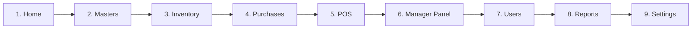

# Desktop Navigation & Information Architecture

This document defines the Information Architecture, Ribbon Navigation Hierarchy, Layout Standards, and High-DPI strategy for Clovent Business Operating System (CBOS) Desktop Presentation.

---

## 1. Information Architecture & Ribbon Taxonomy

The Ribbon Navigation taxonomy replaces the fragmented legacy navigation model (`Restaurant`, `Catalog`, `Administration`) with a standardized 9-page Enterprise ERP structure.

### 1.1 Strict Page Order

Every ribbon page appears in the exact order below:

1. **Home**: Executive overview, quick actions, and business dashboards.
2. **Masters**: Master data configuration (Product categories, brands, units, dining areas, tables, customer master accounts).
3. **Inventory**: Warehouse stock control, stock adjustments, transfers, and stock movements.
4. **Purchases**: Module-ready clean placeholder group for future procurement workflows (Purchase Orders, Goods Receipt, Vendor Bills). No fabricated mock actions.
5. **POS**: Front-of-house operational point of sale (Touch POS, Running Orders, Kitchen Tickets, Shift Open/Close, Cash Movements).
6. **Manager Panel**: Supervisory functions (Sales summary, daily closing, quick order templates, recommendation rules, smart combo deals).
7. **Users**: Security and identity governance (User accounts, roles & permissions, branch access, audit trail).
8. **Reports**: Operational, analytical, and financial reports (Sales analysis, customer receivables aging, shift reconciliation, inventory valuation).
9. **Settings**: System and peripheral configuration (Business profile, POS terminals, printer setup, appearance skins, mode switcher).

---

## 2. Central Navigation Registry

To prevent fragmentation and duplicate hardcoded dictionaries across `Program.cs`, `MainForm.cs`, and `NavigationMenuBuilder`, navigation metadata is centralized in `Clovent.Desktop.Navigation`.

### 2.1 NavigationPage (`NavigationPage.cs`)

Defines canonical page constant strings and page collections:
- `OrderedPages`: Ordered sequence of the 9 official pages.
- `PermissionGatedPages`: Pages requiring explicit role-based access control (RBAC). `Home` and `Purchases` are ungated.

### 2.2 NavigationItemDefinition (`NavigationItemDefinition.cs`)

Authoritative metadata record representing a feature:
- `Key`: Unique navigation route key (e.g. `"customers"`, `"pos"`).
- `Caption`: Human-readable button label.
- `RibbonPage`: Canonical parent page name.
- `RibbonGroup`: Ribbon group container name.
- `IconUri`: DevExpress SVG vector asset path.
- `Permission`: Identity RBAC permission string.
- `Order`: Sort order within the group.
- `IsPrimaryAction`: Prominence flag (`true` renders `RibbonItemStyles.Large`; `false` renders `SmallWithText`).
- `IsShortcut`: Flag indicating whether the button is a shortcut to a view belonging primarily to another domain.
- `Description`: Tooltip context and capability description.

### 2.3 NavigationRegistry (`NavigationRegistry.cs`)

- Single registry containing all 43 desktop view mappings.
- Provides `GetIconUri(key)` and `GetCanonicalPageForKey(key)`.
- Implements `RegisterAllViews(INavigationService, IServiceProvider)` used directly during application bootstrap in `Program.cs`.

---

## 3. Desktop Layout Metrics & DPI Strategy

The application is targeted for **1920 × 1080** displays running at approximately **250% Windows scaling** (~240 DPI).

### 3.1 Layout Metrics (`DesktopLayoutMetrics.cs`)

Centralized design metrics enforce uniform visual spacing across all dialogs and views:

| Constant | Logical Px | Purpose |
|---|---|---|
| `DialogPadding` | 16 | Outer boundary padding for forms and dialogs |
| `SectionSpacing` | 16 | Vertical space separating distinct conceptual sections |
| `RowSpacing` | 8 | Vertical gap between adjacent input rows |
| `EditorHeight` | 28 | Standard height for TextEdit, DateEdit, ComboBoxEdit |
| `StandardMemoHeight` | 110 | Default height for multi-line notes |
| `ButtonHeight` | 30 | Standard action button height |
| `ButtonMinWidth` | 85 | Minimum width for secondary buttons (Cancel, Clear, Close) |
| `ProminentButtonMinWidth` | 110 | Minimum width for primary actions (Save, Submit, Record) |
| `FooterSpacing` | 12 | Top margin separating content from dialog footer actions |
| `StandardLabelWidth` | 140 | Consistent left-column label alignment |

### 3.2 High-DPI Dialog Layout Architecture

In high-DPI environments, nesting multiple `AutoSize` containers inside TableLayoutPanels can cause row heights to collapse or overlap labels (as occurred previously in the Customer Ledger). The established architectural solution:

1. **Explicit Dedicated Rows**: Complex forms must structure their root container with discrete, dedicated rows rather than placing controls and labels into nested auto-sizing strips.
2. **DPI-Scaled Fixed Heights**: Fixed-height elements (titles, summary card decks, filter rows, action toolbars, footers) use `DesktopDpi.Scale(logicalPx, this)` in `ScaleLayoutAtRuntime()`.
3. **Elastic Data Container**: The primary data grid or viewport occupies the single `SizeType.Percent = 100F` row to absorb available vertical space dynamically.

---

## 4. Customer & Receivables Subsystem Refinements

### 4.1 CustomerEditForm

- Visual structure segmented into 4 clear section banners spanning all columns:
  - `[ CUSTOMER DETAILS ]`: Code, Name, Mobile, Mobile 2, Phone, Shop / Office No, Address, Email.
  - `[ ACCOUNT OPENING ]`: Opening Balance.
  - `[ CREDIT / ACCOUNT SETTINGS ]`: Credit Limit, Credit Allowed check, Default Customer check.
  - `[ NOTES ]`: Notes memo editor.
- **Balanced 4-Column High-DPI Layout**:
  - Column 0: Fixed 140px (scaled at runtime) for primary labels.
  - Column 1: 50% flexible column for left-side inputs.
  - Column 2: Fixed 140px (scaled at runtime) for secondary labels.
  - Column 3: 50% flexible column for right-side inputs.
- **Scrollbar Elimination**: `_contentPanel.AutoSize` is explicitly set to `false`. Combined with `DesktopDialogSizing.Apply(this, 800, 560, 720, 480, ...)`, this completely eliminates unnecessary vertical scrollbars on 1080p displays at 250% scale (~240 DPI).
- Action buttons (`"Save Changes"` and `"Cancel"`) remain fully pinned and visible in the footer without any scrolling.

### 4.2 Delivery Details Dialog

- **Customer Search Grid**: Fully wired to `IMediator` (with fallback to application service provider) to ensure customer search results populate reliably. Popup grid constrained to 500 × 260 logical pixels.
- **Rider & Driver Contact**: Added dedicated Rider Phone input (`_txtRiderPhone`) alongside Rider Name. Encoded into order metadata without requiring database schema changes.
- **Special Notes**: Multiline `MemoEdit` with a constrained height (52 logical pixels) and vertical scrollbars, preserving address row compactness.
- **Keyboard Ergonomics**: `Escape` cancels the dialog and `Enter` confirms across all standard text edits and memo fields.

### 4.3 BulkCustomerPaymentForm

- Header configuration partitioned into clean dedicated input slots: `Payment Method *`, `Batch Reference / Cheque #`, `Batch Notes / Memo`.
- Code column minimum width expanded to `130px` to prevent clipping identifiers (e.g. `CUST-OFFICE-01`).
- Checkbox edits auto-commit via `_gridView.PostEditor()` to maintain synchronized row states immediately.
- Footer summary accurately tracks selected row count versus actively paying row sums.

### 4.4 CustomerLedgerDialog

- Reconstructed into 8 dedicated rows:
  - Row 0: Title strip (`CUSTOMER LEDGER STATEMENT` + Customer name/code)
  - Row 1: Subtitle description
  - Row 2: KPI dashboard cards (Outstanding balance, credit limit, available credit, purchases, payments)
  - Row 3: Report period & date filter strip (Period, From, To, Transaction Type)
  - Row 4: Dedicated search label row
  - Row 5: Reference search editor & action tools toolbar (`Load Ledger`, `Clear`, `Print`, `PDF`, `Excel`)
  - Row 6: Ledger transaction grid (`100%` height)
  - Row 7: Footer status feedback and `Close` button
- Prevents any tool collapse or label overlap at 250% display scaling.

---

## 5. POS Order Modes & Configurable Defaults

### 5.1 Front-of-House Order Mode Selection

- In `RestaurantPosForm`, order mode buttons are organized into a uniform 3-mode strip:
  - `[ + Dining ]`: Opens table picker if no table is selected or begins a dine-in order.
  - `[ + Take Away ]`: Switches active mode to Take Away.
  - `[ + Delivery ]`: Prompts for delivery details and switches active mode to Delivery.
- **Selected State Prominence**: The actively selected mode is prominently highlighted in solid Teal-600 background with bold white text, while unselected modes remain neutral Slate-100 with dark text.

### 5.2 Configurable Default Order Mode

- **Restaurant / POS Setup View**: Provides a mutually exclusive radio group (`Dining`, `Take Away`, `Delivery`) in POS Setup.
- **Persistence**: Persisted in `PosSettingsStore` (`DefaultOrderMode`).
- **Operational Lifecycle**:
  - The POS initializes with the configured default order mode on startup.
  - Clearing, completing, or voiding an order automatically restores the default order mode.
  - Cashier overrides apply strictly to the current active order and never overwrite the saved station default.

---

## 6. Shell State & Workspace Consistency

1. **Workspace Document Closed**: When all tabbed documents are closed, `TabbedView_DocumentClosed` detects active count reaching zero and resets the status bar text to `"Ready"`, preventing stale viewing labels.
2. **Document Activated Synchronization**: When switching documents, `TabbedView_DocumentActivated` queries `NavigationRegistry.GetCanonicalPageForKey(key)` and synchronizes `RibbonControl.SelectedPage` seamlessly without triggering re-navigation loops.
3. **Canonical Feature Placement**:
   - `Masters`: `Categories` (Order: 110) strictly precedes `Menu Items` (Order: 120).
   - `Reports`: Canonical home for `Customer Receivables` (Financial & A/R group) and `Sales Summary` (Sales group). No duplicate shortcuts in Manager Panel or Masters.
   - `Punch Out`: Standalone ribbon action in Session group; removed from Administrator profile dropdown.
4. **Visual Studio Designer Safety**: All business forms and dialogs implement design-time guards (`DesignModeHelper.IsInDesignMode`), ensuring parameterless constructors operate without invoking MediatR, Entity Framework Core, or runtime dependency injection services.
