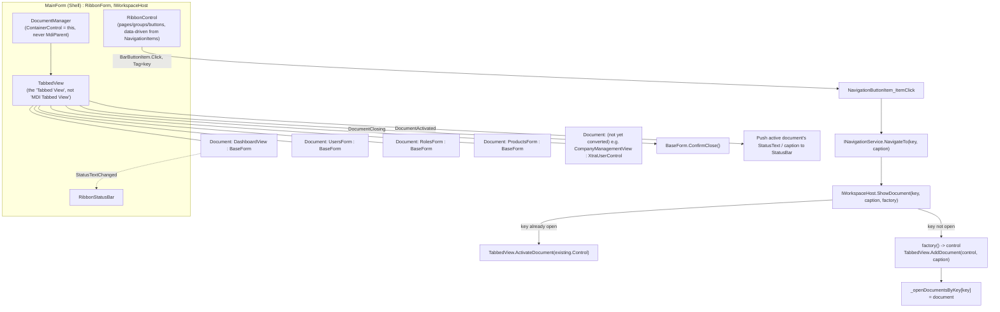

# Desktop Shell & Document Architecture

This document describes the Desktop shell rebuild that replaces the old "ribbon injects a form into one swappable panel" model with a proper, non-MDI, multi-document Enterprise ERP shell: `MainForm` + DevExpress `DocumentManager`/`TabbedView`, plus `BaseForm` as the base class every document-hosted business screen inherits. It also documents the folder structure, coding standard, and conversion recipe every new or migrated screen must follow, and the backlog of screens still pending conversion.

---

## 1. Why this changed

The previous `ShellForm` had **no MDI** (that part was already correct) but also **no real multi-document capability**: `IWorkspaceHost.SetContent(Control)` cleared one `PanelControl` and dropped a new control into it. Exactly one screen could ever be visible, and every navigation destroyed whatever was open before - there was no way to have Users and Products open side by side, no tab strip, no "switch back to what I had open a minute ago." That is the specific problem this rebuild solves, using DevExpress's own non-MDI document component rather than a hand-rolled tab system.

Separately, only 2 of 119 Desktop screens (`LoginForm`, `DashboardView`) were genuine, hand-authored Visual Studio Designer forms; everything else built its UI at runtime (object initializers, `Build*()` helper methods, or constructor `Controls.Add` calls). This document also establishes the standard every screen must eventually meet, and the recipe for getting there.

---

## 2. Why MDI was rejected

`IsMdiContainer`, `MdiParent`, `MdiChild`, and opening a business screen via `Form.Show()`/`Form.ShowDialog()` are not used anywhere in this codebase, and must not be reintroduced. Classic WinForms MDI ties every "document" to an actual child `Form` living inside an MDI client area - it is the oldest, least flexible multi-window model .NET offers (no true tabs without a third-party add-on, awkward focus/menu-merging semantics, poor high-DPI/multi-monitor behavior) and every modern DevExpress/Visual-Studio-style application has moved away from it in favor of a document/tab host that manages plain `Control`s instead of child `Form`s.

DevExpress itself offers three "views" for its `DocumentManager` component: **Tabbed View** (no MDI at all - a `Control` is hosted directly in a tab), **MDI Tabbed View**, and **Native MDI Tabbed View** (the latter two both wrap a real MDI parent/child relationship under the hood). This rebuild uses **only Tabbed View** (`DevExpress.XtraBars.Docking2010.Views.Tabbed.TabbedView`) - see Section 4.

Small modal popups (New/Edit dialogs on `MasterDataEditFormBase`, password prompts, confirmations, the re-login dialog on sign-out) still use `Form.ShowDialog()`. This is ordinary, unrelated-to-MDI modal dialog usage - every real ERP (Visual Studio, SSMS, DevExpress's own demos) pops a modal "New Customer" or "Confirm Delete" dialog over a tabbed document area; the MDI ban is about how *documents* open, not about small blocking dialogs.

---

## 3. Why runtime-constructed UI is prohibited (for converted screens)

A screen whose entire control tree is built by executing C# statements at runtime (`new TextEdit()`, `Controls.Add(...)`, helper methods like `BuildTopBar()`) cannot be opened in a WinForms designer surface, cannot be dragged/resized/anchored visually, and hides its layout inside behavior code where a reviewer has to mentally execute the constructor to know what the screen looks like. Genuine Designer forms - `FormName.cs` (behavior only) + `FormName.Designer.cs` (`InitializeComponent()`, fields, literal `Location`/`Size`, event *subscriptions* only) + `FormName.resx` - are the standard this project now holds every **converted** screen to, authored in exactly the literal-coordinate style Visual Studio's own WinForms Designer emits (there is no interactive designer surface available in this environment to verify against visually, so every `.Designer.cs` in this codebase, including this rebuild's, is hand-written to match that codegen convention and awaits human visual verification - see `DesktopBootstrap.md` Section 6/8.6 for the same caveat already on record for `LoginForm`/`DashboardView`).

**This is enforced going forward for every new screen and every screen migrated per Section 8's recipe.** It does not retroactively apply to the ~114 screens listed in Section 9 that have not been migrated yet - those keep working exactly as they do today (runtime-constructed `XtraUserControl`s embedding the shared `MasterDataListView<TDto>`/`MasterDataEditFormBase` framework), hosted as documents unchanged, until each is migrated.

---

## 4. Shell architecture



**Key wiring** (`Forms/Shell/MainForm.cs` / `MainForm.Designer.cs`):

- `MainForm : RibbonForm, IWorkspaceHost` - same base as before (`RibbonForm` is required to host a `RibbonControl`/`RibbonStatusBar` and has nothing to do with MDI).
- `DocumentManager.ContainerControl = this;` and `DocumentManager.View = tabbedView;` - **`DocumentManager.MdiParent` is never set anywhere.** This is the load-bearing line: it is what lets the DocumentManager render tabs directly inside `MainForm` with no MDI parent/child relationship at all.
- `Dictionary<string, BaseDocument> _openDocumentsByKey` replaces the old single-`CurrentKey` guard. `IWorkspaceHost.ShowDocument(key, caption, factory, allowMultipleInstances)`: if a document for `key` is already open (and duplicates aren't explicitly allowed) it activates the existing tab and **never re-invokes the factory**; otherwise it builds the content once, adds it as a new document, and tracks it. This is a genuine behavior upgrade the tabbed model requires - the old model only ever had one thing open, so "already open" was trivially true; a multi-tab shell has to track it per key.
- `TabbedView.DocumentClosing`: if the closing document's `Control` is a `BaseForm` that declines to close (`ConfirmClose()` returns `false`, e.g. unsaved changes), the close is cancelled.
- `TabbedView.DocumentActivated`: subscribes to the newly-active document's `BaseForm.StatusTextChanged` (unsubscribing from the previous one) and pushes its `StatusText` to the status bar; non-`BaseForm` documents fall back to `"Viewing: {tab caption}"`.
- `MainForm.ProcessCmdKey` intercepts **Ctrl+S** (`BaseForm.SaveAsync()`) and **F5** (`BaseForm.RefreshAsync()`) for whichever document is active - centralized in the Shell because a hosted `UserControl` doesn't get its own command-key routing the way a top-level `Form` does.
- The Ribbon's ~30 navigation buttons remain built from `MainForm.Designer.cs`'s `NavigationItems` data table (`(Key, Page, Group, Caption)` per row) - this is Shell chrome, not a business screen, and is inherently permission-gated per signed-in user (`RefreshNavigationAsync`); re-declaring 30 static Designer fields would be pure churn with zero benefit. This is a deliberate, bounded exception to Section 3's "no runtime construction" rule, scoped to the Shell's own navigation chrome only.

---

## 5. `BaseForm`

`Forms/Base/BaseForm.cs` / `BaseForm.Designer.cs` / `BaseForm.resx` - the base class every document-hosted business screen inherits.

**Inherits `XtraUserControl`, not `XtraForm`/`Form`.** DevExpress's non-MDI `TabbedView.AddDocument` hosts a `Control`; hosting an actual child `Form` inside a tab would itself be the MDI-child pattern this application rejects (Section 2). Every list/management screen in this codebase was already an `XtraUserControl` for the same underlying reason.

Reserved layout (`BaseForm.Designer.cs`, literal-coordinate, matching VS codegen style):

| Member | Purpose |
|---|---|
| `ToolbarPanel` (`PanelControl`, Dock=Top) | Subclasses add their own `SimpleButton`s/search box here. |
| `ContentPanel` (`PanelControl`, Dock=Fill) | Subclasses add their own grid/controls here. |
| `BusyOverlayPanel` (+ `BusyProgressBar`/`BusyStatusLabel`) | Shown/hidden by `SetBusy`/`RunBusyAsync`, brought to front over `ContentPanel`. |

Behavior (`BaseForm.cs`):

- `PermissionKey` (virtual, default `null`) - documents a screen's permission/feature key; **informational only today** - actual gating still happens exactly where it always has, at the Ribbon-button-visibility layer (`NavigationMenuBuilder`). This is an extension point for a future enforcement-at-document-open layer, not a behavior change in this pass.
- `IsDirty` (+ `DirtyChanged`), `StatusText` (+ `StatusTextChanged`) - drive `ConfirmClose()`'s default prompt and the Shell's status bar, respectively.
- `SetBusy(bool, message?)` / `RunBusyAsync(Func<Task>, message?)` - the busy overlay.
- `virtual Task<bool> SaveAsync()` / `virtual Task RefreshAsync()` - no-ops by default; hooked to Ctrl+S/F5 by `MainForm`. `RefreshAsync()` is also what `MainForm` calls once, automatically, right after a document is first created - replacing the old per-screen `Load += async (_,_) => await RefreshAsync();` pattern.
- `virtual bool ConfirmClose()` - default: if `IsDirty`, a synchronous Yes/No/Cancel prompt (synchronous because `TabbedView.DocumentClosing` is itself a synchronous WinForms event - the same accepted sync-over-async tradeoff `Program.cs` already takes during startup).

**Why no `BarManager` on `BaseForm`.** `BarManager.Form` is strictly typed to `Form` - it cannot self-host inside a `UserControl` embedded in a DocumentManager tab. `BarManager`/`RibbonControl` are used at the Shell level only (`MainForm`, a real `Form`); each document's own toolbar is a plain docked-top `PanelControl` + `SimpleButton`s, consistent with this codebase's existing convention (`MasterDataListView<TDto>`'s own toolbar row).

### Inheritance hierarchy

```
XtraUserControl (DevExpress)
  └── BaseForm                          Forms/Base/BaseForm.cs
        ├── DashboardView               Forms/Dashboard/DashboardView.cs
        ├── UsersForm                   Forms/Identity/Users/UsersForm.cs
        ├── RolesForm                   Forms/Identity/Roles/RolesForm.cs
        ├── ProductsForm                Forms/Catalog/Products/ProductsForm.cs
        └── (every future/migrated business screen)

XtraForm (DevExpress)                   -- pre-Shell / modal dialogs only, NOT documents
  └── LoginForm                         Forms/Identity/LoginForm.cs   (shown before MainForm exists)
  └── MasterDataEditFormBase            MasterData/MasterDataEditFormBase.cs  (New/Edit popups, ShowDialog)
        ├── UserEditForm, RoleEditForm, ProductEditForm, ... (27 dialogs, unchanged)

RibbonForm (DevExpress)
  └── MainForm                          Forms/Shell/MainForm.cs
```

---

## 6. Navigation flow

```
Ribbon BarButtonItem (Tag = key, Caption = tab title)
    -> ItemClick
        -> MainForm.NavigationButtonItem_ItemClick(key, caption)
            -> INavigationService.NavigateTo(key, caption)
                -> [looks up the Func<Control> factory registered for key]
                -> IWorkspaceHost.ShowDocument(key, caption, factory)
                    -> already open?  TabbedView.ActivateDocument(existingDocument.Control)
                    -> not open?      content = factory()
                                      TabbedView.AddDocument(content, caption)
                                      _openDocumentsByKey[key] = document
                                      TabbedView.ActivateDocument(document.Control)
                                      if content is BaseForm: content.RefreshAsync()
```

`INavigationService.Register(key, factory)` (unchanged registration API - see `Program.cs`) still registers one `Func<Control>` factory per key; only what happens after the factory runs changed. Duplicate documents are not opened unless a caller explicitly passes `allowMultipleInstances: true` to `ShowDocument` (no registered screen does today - the parameter exists for a future screen that legitimately wants more than one instance open, e.g. comparing two records side by side).

---

## 7. Folder structure

```
Desktop/
  Forms/
    Base/
      BaseForm.cs / .Designer.cs / .resx
    Shell/
      MainForm.cs / .Designer.cs           (the Shell window)
      IWorkspaceHost.cs
    Dashboard/
      DashboardView.cs / .Designer.cs / .resx
    Identity/
      LoginForm.cs / .Designer.cs / .resx  (not a document - shown pre-Shell)
      Users/
        UsersForm.cs / .Designer.cs / .resx
        UserEditForm.cs                    (modal dialog, MasterDataEditFormBase, unchanged)
      Roles/
        RolesForm.cs / .Designer.cs / .resx
        RoleEditForm.cs
    Catalog/
      Products/
        ProductsForm.cs / .Designer.cs / .resx
        ProductEditForm.cs
    (Inventory/, Sales/, Purchasing/, Reports/, Restaurant/ - reserved for future migrated screens)

Navigation/            -- services, not screens; stays where it is
  INavigationService.cs, NavigationService.cs, NavigationMenuBuilder.cs

MasterData/, Catalog/{Categories,Brands,UnitsOfMeasure,Variants,Barcodes,Prices}/,
Inventory/, Restaurant/, Identity/Users/PasswordPromptForm.cs, Login/{ILoginService,LoginService}.cs
                        -- untouched this pass; still hosted fine as documents (Section 9)
```

**Rule for every new screen going forward:** it lives under `Forms/<Module>/[<SubModule>/]ScreenNameForm.cs` (+ `.Designer.cs` + `.resx`), inherits `BaseForm`, and follows the recipe in Section 8. `<Module>` mirrors the actual bounded context the screen belongs to (`Identity`, `Catalog`, `Inventory`, `Restaurant`, `MasterData`) - `Sales`/`Purchasing`/`Reports` are reserved names for modules that don't exist yet in this solution and should only be created once a real bounded context backs them.

---

## 8. Conversion recipe (how to migrate or build a screen)

This is exactly the recipe used for Users/Roles/Products in this pass - follow it for every remaining screen in Section 9's backlog.

1. **Create `Forms/<Module>/[<SubModule>/]XxxForm.cs` inheriting `BaseForm`.** Port the existing screen's constructor (same DI dependencies), fields (`_scope`/`_mediator`/`_featurePolicy`/etc.), and every handler method body **verbatim** - no business logic changes. Override `RefreshAsync()` with what used to be the `Load` handler's body (minus any `DesignMode` guard, which is no longer needed since `RefreshAsync()` is never called by a designer). Set `PermissionKey` to the screen's feature code.
2. **Create `XxxForm.Designer.cs`** with a hand-authored `GridControl`+`GridView` (explicit `GridColumn`s, `OptionsBehavior.AutoPopulateColumns = false`, matching the old screen's column list) and `SimpleButton`s/search `TextEdit` added to the inherited `ToolbarPanel`/`ContentPanel` - literal `Location`/`Size`, no helper methods that construct controls. This replaces the generic `MasterDataListView<TDto>` embedding (a generic UserControl can't be hand-authored as a closed per-screen Designer form) - wire the buttons directly to the ported handler methods instead of `MasterDataListView`'s delegate properties.
3. **Reuse `MasterDataFilter.Apply`/`CanEdit`/`CanActivate`/`CanDeactivate`** (`MasterData/MasterDataFilter.cs`) for search filtering and button-enablement - it is UI-free and framework-agnostic, unaffected by this migration.
4. **Leave the paired edit dialog alone.** `XxxEditForm`/`MasterDataEditFormBase`-derived dialogs keep working exactly as they do today, still opened via `ShowDialog(this)` - only the list/document screen converts.
5. **Create `XxxForm.resx`** (copy `Forms/Base/BaseForm.resx`'s stub - no `<data>` entries needed unless the screen embeds an image resource).
6. **Update `Program.cs`'s `navigationService.Register(...)`** and `DesktopServiceCollectionExtensions.cs`'s DI registration to the new type; delete the old file(s).
7. **Build** (`dotnet build src/Clovent.Desktop/Clovent.Desktop.csproj`) and run `Clovent.Desktop.Tests` - this environment has no interactive designer to visually verify the new `.Designer.cs`, so a clean build/test run is the only automated check available; flag the screen for human visual verification afterward (per `DesktopBootstrap.md` Section 6/8.6's standing caveat).

---

## 9. Remaining work: screens not yet converted

These continue to work completely unchanged - still runtime-constructed `XtraUserControl`s embedding `MasterDataListView<TDto>`, still opened as documents via the new `ShowDocument` (which accepts any `Control`, converted or not) - until migrated one at a time via Section 8's recipe.

| Module | Screens (list view + its edit dialog, unless noted) |
|---|---|
| **MasterData** | Organizations, Companies, Branches, Departments, Warehouses, Terminals, Fiscal Years, Currencies, Business Settings (single-record, no separate dialog) - 9 screens |
| **Catalog** | Categories, Brands, Units of Measure, Product Variants, Barcodes, Prices - 6 screens |
| **Inventory** | Warehouse Stocks (+ Receive Inventory dialog), Stock Adjustments, Stock Transfers, Inventory Transactions (read-only) - 4 screens |
| **Restaurant** | Dining Areas, Tables, Restaurant POS (+ Payment, Discount, Service Charge, Table Transfer, Merge Tables, Bill Split, Receipt Preview, Text/Selection Prompt dialogs), Running Orders, Held Orders, Kitchen Tickets, End of Day - 7 screens + 8 shared dialogs |

Shared framework left as-is (depended on by every screen above): `MasterData/MasterDataListView.cs`, `MasterData/MasterDataEditFormBase.cs`, `MasterData/EntityPicker.cs`, `MasterData/OrganizationHierarchySelector.cs`, `MasterData/ComboBoxBinder.cs`.

**Cleanup candidates:** the five empty, `.Designer.cs`-less `.resx` stub files left over from earlier partial attempts (`EntityPicker.resx`, `MasterData/Departments/DepartmentEditForm.resx`, `MasterData/Settings/BusinessSettingsManagementView.resx`, `Inventory/.../QuantityPromptForm.resx`, `Inventory/.../StockTransferCreateForm.resx`) were deleted in the verification pass documented in `DesktopUILayout.md` - each was confirmed dead (no matching Designer.cs, nothing referencing it) before removal.

**Small modal dialogs deliberately never converted:** `Notifications/NotificationsForm.cs`, `Startup/ErrorDialogForm.cs`, and every `MasterDataEditFormBase`-derived New/Edit/confirmation dialog stay `XtraForm`-based, opened via `ShowDialog()` - they are not documents (Section 2) and are out of scope for `BaseForm` conversion by design.
