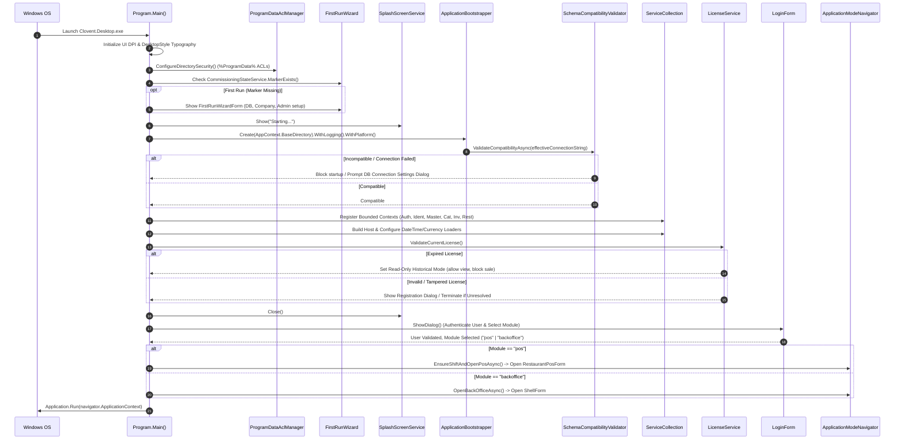

# CBOS Application Startup Lifecycle

| Attribute | Details |
| :--- | :--- |
| **Area** | Workstation Bootstrapping & Lifecycle |
| **Audience** | Desktop Developers, Systems Architects, Support Technicians |
| **Last Reviewed Version** | CBOS 1.2.2 |
| **Status** | **IMPLEMENTED** |
| **Classification** | **PUBLIC-SAFE** |

---

## 1. Startup Overview

The desktop bootstrapping sequence in Clovent Business Operating System (CBOS) is designed to guarantee security, verify database schema compatibility, enforce licensing terms, and prevent application crashes prior to displaying interactive forms. Located in `src/Clovent.Desktop/Program.cs`, the startup sequence executes 18 deterministic phases from invocation to the main message loop.

---

## 2. Detailed Startup Phases

### Phase 1: High-DPI & Desktop Typography Initialization
- `ApplicationConfiguration.Initialize()` establishes Windows PerMonitorV2 High-DPI mode.
- `DesktopStyle.ApplyGlobalTypography()` applies centralized Segoe UI font metrics across standard control hierarchies, ensuring consistent scaling before any control handle is created.

### Phase 2: Unhandled Exception & Diagnostics CLI Switch
- `Application.SetUnhandledExceptionMode(UnhandledExceptionMode.CatchException)` attaches global WinForms crash handlers.
- Command-line arguments are inspected for `--diagnostics` / `-diagnostics`. If present, `SupportDiagnosticsForm` launches immediately for field inspection without booting the full shell.

### Phase 3: Directory Security & ACL Enforcement
- `ProgramDataAclManager.ConfigureDirectorySecurity()` creates `%ProgramData%\Clovent\BusinessOperatingSystem\` with strict Windows ACLs:
  - Local Administrators: Full Control
  - Authenticated Users: Read/Execute
  - Anonymous / Network: No Access

### Phase 4: First-Run Commissioning Check
- `CommissioningStateService.MarkerExists()` inspects `%ProgramData%\Clovent\BusinessOperatingSystem\commissioned.json`.
- If missing, `FirstRunWizardForm` launches interactively, walking the administrator through database creation, EF Core schema migration, legal company onboarding, branch/terminal definition, administrator creation, and initial trial enrollment.

### Phase 5: Splash Screen & Bootstrapper Initialization
- `SplashScreenService` renders a lightweight startup splash.
- `ApplicationBootstrapper.Create(AppContext.BaseDirectory).WithLogging().WithPlatform()` initializes configuration providers (`appsettings.json`, environment variables).
- `DatabaseSecretStore.ResolveConnectionString()` decrypts DPAPI-protected credentials from `database.config.json` and injects them into `ConnectionStrings:Default`.

### Phase 6: Schema Compatibility Verification
- `DatabaseSchemaCompatibilityValidator.ValidateCompatibilityAsync()` executes a non-destructive schema inspection before Entity Framework builds its models:
  - `Compatible`: Startup proceeds.
  - `DatabaseTooOld`: Startup is halted; a warning dialog directs the user to run the database upgrade utility or provisioner.
  - `DatabaseNewer`: Startup is halted; prevents outdated client versions from corrupting newer schemas.
  - `ConnectionFailed`: Startup offers an interactive `DatabaseConnectionDialog` to adjust server names or credentials, restarting upon save.

### Phase 7: Persistent Logging Registration
- `FileLoggerProvider` is registered on the logging builder, establishing daily rolling diagnostic log files in `%LOCALAPPDATA%\Clovent\Logs\cbos-*.log`.

### Phase 8: Dependency Injection & Bounded Context Composition Root
The 6 bounded contexts are registered into the service container using the canonical extensions:
- `AddApplication(configuration)`
- `AddInfrastructure(configuration)`
- `AddPersistence(configuration)`
Registered contexts: Authentication, Identity, MasterData, Catalog, Inventory, Restaurant, and Desktop Host.

### Phase 9: Host Construction & Static Display Loaders
- `bootstrapper.BuildAndInitializeAsync()` builds the `IHost`.
- Startup mediator commands load company-wide settings:
  - `DateTimeDisplayLoader.ConfigureAsync()` queries company date/time preferences and timezone, configuring `BusinessDateFormatter`.
  - `CurrencyDisplayLoader.ConfigureAsync()` queries active base currency, configuring `CurrencyDisplay`.

### Phase 10: Cryptographic Software Licensing Check
- `LicenseService.ValidateCurrentLicense()` evaluates the installed license:
  - Validates RSA-2048 SHA-256 signature against the embedded vendor public key.
  - Validates hardware binding via `MachineFingerprint.GetCurrentMachineId()`.
  - Validates system clock monotonicity via `LicenseTamperGuard.VerifyAndUpdateClock()`.
  - **Expired License:** Enters **Read-Only Historical Mode**, allowing back-office reporting and historical sales audits while disabling new operational checkout.
  - **Invalid / Tampered License:** Displays `SoftwareRegistrationForm`. If valid licensing is not provided, the application safely terminates.

### Phase 11: Navigation View Factory Registration
- `NavigationRegistry.RegisterAllViews(navigationService, host.Services)` registers factories for all back-office management views, ribbons, and dialogs.

### Phase 12: Operator Sign-In (`LoginForm`)
- `splash.Close()` hides the splash screen.
- `LoginForm.ShowDialog()` prompts for operator credentials (username/password or cashier PIN).
- The operator selects their working mode: **Restaurant POS** (`pos`) or **Back Office** (`backoffice`).

### Phase 13: Localization & Culture Setup
- `LanguagePreferenceStore.Load()` retrieves the preferred language code and configures `Thread.CurrentThread.CurrentUICulture` and `CultureInfo.DefaultThreadCurrentUICulture`.

### Phase 14: Navigation & Main Shell Launch
- `IApplicationModeNavigator` takes control of the UI thread:
  - If `pos` is selected: `IPosEntryGateCoordinator.EnsureShiftAndOpenPosAsync()` verifies an active shift session or prompts for starting float, then opens `RestaurantPosForm`.
  - If `backoffice` is selected (or shift gate fails): `OpenBackOfficeAsync()` opens `ShellForm`.
- `Application.Run(navigator.ApplicationContext)` begins the main Windows Forms message loop.

---

## 3. Current Implementation vs. Planned Improvements

| Area | Current Implementation (CBOS 1.2.2) | Planned Future Evolution |
| :--- | :--- | :--- |
| **Startup Diagnostics** | Handled via `--diagnostics` CLI switch or Help menu. | Automated health check report exported to encrypted diagnostic archive. |
| **Terminal Resolution** | 5-tier resolution in `TerminalResolutionService` evaluated upon POS entry. | Terminal identity resolved during Phase 5 before sign-in to display register code on login form. |
| **Module Switching** | Requires logout and re-authentication to switch between POS and Back Office. | Seamless in-session module switching via ribbon shortcut for authorized managers. |

---

## 4. Key Classes & Source Traceability

- **Entry Point:** `src/Clovent.Desktop/Program.cs`
- **ACL Manager:** `src/Clovent.Desktop/Commissioning/Security/ProgramDataAclManager.cs`
- **Commissioning Service:** `src/Clovent.Desktop/Commissioning/Services/CommissioningStateService.cs`
- **Schema Compatibility:** `src/Clovent.Desktop/Commissioning/Database/DatabaseSchemaCompatibilityValidator.cs`
- **Database Secrets:** `src/Clovent.Desktop/Configuration/DatabaseSecretStore.cs`
- **Licensing Service:** `src/Clovent.Desktop/Licensing/LicenseService.cs`
- **Navigation Registry:** `src/Clovent.Desktop/Navigation/NavigationRegistry.cs`
- **POS Entry Gate:** `src/Clovent.Desktop/Restaurant/Services/PosEntryGateCoordinator.cs`

---

## 5. Cross References
- [System Architecture](system-architecture.md)
- [Bounded Contexts](bounded-contexts.md)
- [First-Run Commissioning](../deployment/commissioning.md)
- [Licensing Architecture](../security/licensing.md)
- [Terminal Identity](../configuration/terminal-identity.md)
