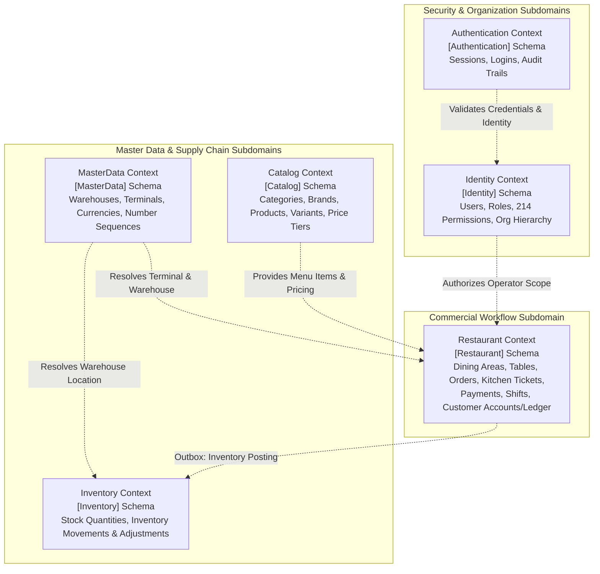

# CBOS Bounded Contexts Reference

| Attribute | Details |
| :--- | :--- |
| **Area** | Domain-Driven Design & Context Mapping |
| **Audience** | Software Architects, Domain Modelers, Application Developers |
| **Last Reviewed Version** | CBOS 1.2.2 |
| **Status** | **IMPLEMENTED** |
| **Classification** | **PUBLIC-SAFE** |

---

## 1. Domain-Driven Design Context Map

CBOS divides business capabilities into six autonomous bounded contexts. Each bounded context is isolated into its own layer hierarchy (`Clovent.<Context>`, `Clovent.<Context>.Application`, `Clovent.<Context>.Infrastructure`), maintains its own EF Core `DbContext`, and maps to its own dedicated SQL Server schema. Cross-context interactions occur exclusively through MediatR queries/commands or integration events; cross-context domain references and cross-schema SQL foreign keys are strictly prohibited.

---

## 2. Bounded Context Specifications

### 2.1 Authentication Bounded Context
- **Root Namespace:** `Clovent.Authentication`
- **SQL Schema:** `[Authentication]`
- **Dedicated DbContext:** `AuthenticationDbContext`
- **Migration History Table:** `[Authentication].[__EFMigrationsHistory]`
- **Purpose:** Secure identity verification, password validation, session lifecycle management, and security audit logging.
- **Key Responsibilities:**
  - Recording and evaluating user login attempts.
  - Generating and validating cryptographic session tokens (`SessionToken`).
  - Auditing authentication events (`AuthenticationAuditEvent`) with client IP and machine context.
  - Tracking failed login attempts and enforcing brute-force lockouts.
- **Key Aggregates & Entities:**
  - `LoginAttempt`, `SessionToken`, `AuthenticationAuditEvent`.
- **Application Layer (`Clovent.Authentication.Application`):**
  - Commands: `RecordLoginAttemptCommand`, `CreateSessionTokenCommand`, `RevokeSessionTokenCommand`.
  - Queries: `ValidateSessionTokenQuery`, `GetLoginHistoryQuery`.
- **Must NOT Own:** User profile fields, display names, roles, permission assignments, or organizational hierarchy (owned by Identity).

---

### 2.2 Identity Bounded Context
- **Root Namespace:** `Clovent.Identity`
- **SQL Schema:** `[Identity]`
- **Dedicated DbContext:** `IdentityDbContext`
- **Migration History Table:** `[Identity].[__EFMigrationsHistory]`
- **Purpose:** User management, role definitions, granular authorization permissions, and multi-tenant organizational structure.
- **Key Responsibilities:**
  - Maintaining user credentials, password hashes, and PIN codes.
  - Modeling the enterprise organization hierarchy: `Organization` -> `Company` -> `Branch`.
  - Managing roles (`Administrator`, `Manager`, `Cashier`, `Supervisor`) and assigning 214 granular permissions.
  - Providing in-memory permission caching (`MemoryPermissionCache`).
- **Key Aggregates & Entities:**
  - `User`, `Role`, `Permission`, `UserRole`, `Organization`, `Company`, `Branch`.
- **Application Layer (`Clovent.Identity.Application`):**
  - Commands: `CreateUserCommand`, `UpdateUserCommand`, `AssignRoleCommand`, `CreateBranchCommand`.
  - Queries: `GetUserByIdQuery`, `GetRolePermissionsQuery`, `GetBranchesByCompanyQuery`.
- **Must NOT Own:** Session tokens (owned by Authentication), physical register hardware bindings (owned by MasterData), or cash drawer sessions (owned by Restaurant).

---

### 2.3 MasterData Bounded Context
- **Root Namespace:** `Clovent.MasterData`
- **SQL Schema:** `[MasterData]`
- **Dedicated DbContext:** `MasterDataDbContext`
- **Migration History Table:** `[MasterData].[__EFMigrationsHistory]`
- **Purpose:** Foundational business entities, hardware workstations, fiscal parameters, and shared measurement systems.
- **Key Responsibilities:**
  - Registering POS workstations (`Terminal`) and linking them to branches.
  - Defining inventory storage facilities (`Warehouse`).
  - Configuring ISO currencies (`Currency`), exchange rates, and fractional display precision.
  - Maintaining units of measure (`UnitOfMeasure`) and conversion rates.
  - Allocating sequential business identifiers (`NumberSequence`).
- **Key Aggregates & Entities:**
  - `Terminal`, `Warehouse`, `Currency`, `UnitOfMeasure`, `NumberSequence`, `Department`, `FiscalYear`.
- **Application Layer (`Clovent.MasterData.Application`):**
  - Commands: `CreateTerminalCommand`, `CreateWarehouseCommand`, `UpdateCurrencyCommand`.
  - Queries: `GetTerminalsByBranchQuery`, `GetActiveCurrenciesQuery`, `GetWarehousesQuery`.
- **Must NOT Own:** Stock-on-hand quantities (owned by Inventory), product pricing (owned by Catalog), or cashier drawer shifts (owned by Restaurant).

---

### 2.4 Catalog Bounded Context
- **Root Namespace:** `Clovent.Catalog`
- **SQL Schema:** `[Catalog]`
- **Dedicated DbContext:** `CatalogDbContext`
- **Migration History Table:** `[Catalog].[__EFMigrationsHistory]`
- **Purpose:** Product classification, variants, barcode mapping, and pricing tier structures.
- **Key Responsibilities:**
  - Maintaining hierarchical categories (`Category`) and product groups (`ProductGroup`).
  - Managing brands (`Brand`), parent products (`Product`), and concrete sellable SKUs (`ProductVariant`).
  - Associating multiple barcodes (`Barcode`) with product variants.
  - Managing pricing tiers (`PricingTier`) and variant prices (`ProductPrice`) across customer segments or order types.
- **Key Aggregates & Entities:**
  - `Category`, `ProductGroup`, `Brand`, `Product`, `ProductVariant`, `Barcode`, `PricingTier`, `ProductPrice`.
- **Application Layer (`Clovent.Catalog.Application`):**
  - Commands: `CreateProductCommand`, `UpdateProductVariantCommand`, `AssignBarcodeCommand`, `SetProductPriceCommand`.
  - Queries: `GetProductsByCategoryQuery`, `GetVariantByBarcodeQuery`, `GetActivePriceListQuery`.
- **Must NOT Own:** Warehouse stock availability (owned by Inventory) or dining table layouts and kitchen routing (owned by Restaurant).

---

### 2.5 Inventory Bounded Context
- **Root Namespace:** `Clovent.Inventory`
- **SQL Schema:** `[Inventory]`
- **Dedicated DbContext:** `InventoryDbContext`
- **Migration History Table:** `[Inventory].[__EFMigrationsHistory]`
- **Purpose:** Warehouse stock levels, transactional stock ledger, physical stock counts, and stock allocations.
- **Key Responsibilities:**
  - Tracking stock-on-hand balances per variant per warehouse (`WarehouseStock`).
  - Recording immutable inventory movements (`InventoryTransaction`) across standard workflows:
    - `Receipt` (Goods received from supplier)
    - `Issue` (Goods dispatched or depleted)
    - `Transfer` (Stock transferred between warehouses)
    - `Adjustment` (Inventory count corrections)
    - `Reserve` / `Release` (Stock reserved for pending sales)
  - Enforcing strict workflow integrity: raw database mutations to force balance changes are strictly forbidden.
- **Key Aggregates & Entities:**
  - `WarehouseStock`, `InventoryTransaction`, `InventoryAdjustment`.
- **Application Layer (`Clovent.Inventory.Application`):**
  - Commands: `ReceiveStockCommand`, `IssueStockCommand`, `TransferStockCommand`, `AdjustStockCommand`.
  - Queries: `GetStockByWarehouseQuery`, `GetStockLedgerQuery`, `GetLowStockAlertsQuery`.
- **Must NOT Own:** Product definitions and barcodes (owned by Catalog) or customer order statuses (owned by Restaurant).

---

### 2.6 Restaurant Bounded Context
- **Root Namespace:** `Clovent.Restaurant`
- **SQL Schema:** `[Restaurant]`
- **Dedicated DbContext:** `RestaurantDbContext`
- **Migration History Table:** `[Restaurant].[__EFMigrationsHistory]`
- **Purpose:** End-to-end front-of-house hospitality operations, order workflows, bill settlement, kitchen production, cashier shifts, customer credit ledger, and recommendation engines.
- **Key Responsibilities:**
  - Managing dining areas (`DiningArea`) and physical tables (`Table`).
  - Full order lifecycle (`Order`, `OrderLine`) across Dine-In, Take Away, and Delivery modes.
  - Kitchen ticket routing (`KitchenTicket`) and course dispatching.
  - Payment settlement (`Payment`, `PaymentMethod`), split tender, and customer advance credit management.
  - Cashier till sessions (`Shift`), starting floats, cash-in / cash-out drawer adjustments (`CashMovement`), and shift closing variance calculations.
  - Customer accounts receivable (`Customer`, `CustomerLedgerEntry`, `CustomerPaymentAllocation`).
  - Quick order templates (`QuickOrderTemplate`) and smart combo recommendations.
  - Resilience infrastructure: Transactional Outbox (`OutboxMessage`), Local Operational Cache (`ProtectedOperationalCacheStore`), and Emergency Cash Journal (`ProtectedContinuityJournalStore`).
- **Key Aggregates & Entities:**
  - `Order`, `OrderLine`, `Payment`, `PaymentMethod`, `Shift`, `CashMovement`, `Customer`, `CustomerLedgerEntry`, `CustomerPaymentAllocation`, `DiningArea`, `Table`, `KitchenTicket`, `QuickOrderTemplate`, `OutboxMessage`.
- **Application Layer (`Clovent.Restaurant.Application`):**
  - Commands: `CreateOrderCommand`, `AddOrderLineCommand`, `RecordPaymentCommand`, `CompleteOrderCommand`, `OpenShiftCommand`, `CloseShiftCommand`, `AddCashMovementCommand`.
  - Queries: `GetActiveOrdersQuery`, `GetTableLayoutQuery`, `GetShiftSummaryQuery`, `GetCustomerLedgerStatementQuery`.
- **Must NOT Own:** Warehouse master data (owned by MasterData), direct warehouse stock recalculation (delegated to Inventory via Outbox), or user credential hashing (owned by Identity).

---

## 3. Cross References
- [System Architecture](system-architecture.md)
- [Application Startup Lifecycle](application-startup.md)
- [Transactional Outbox Architecture](transactional-outbox.md)
- [Database Persistence Architecture](../database/database-architecture.md)
- [Domain Data Model](../database/domain-data-model.md)
