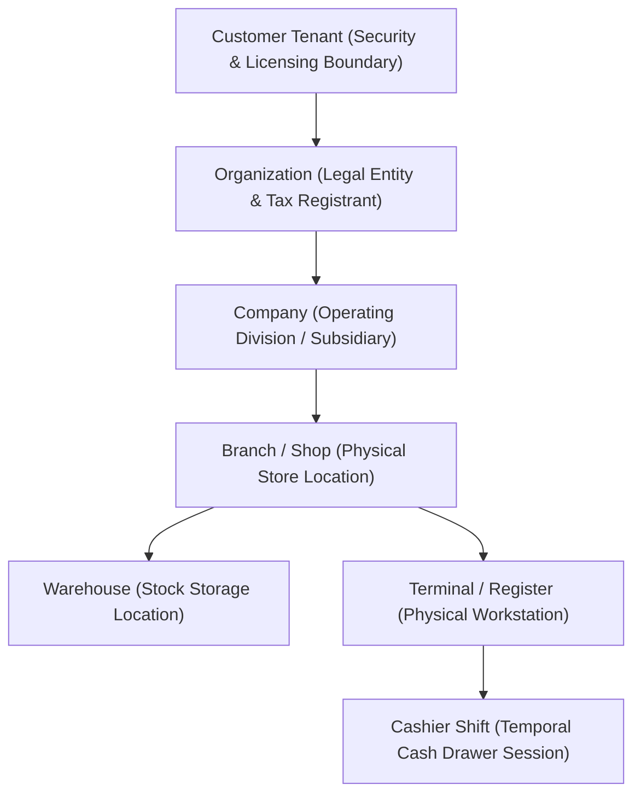
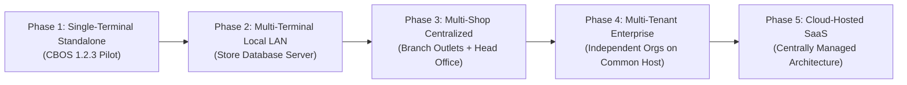
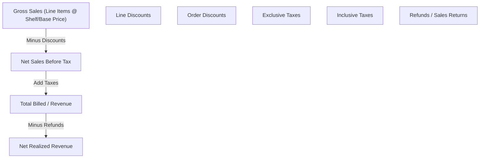
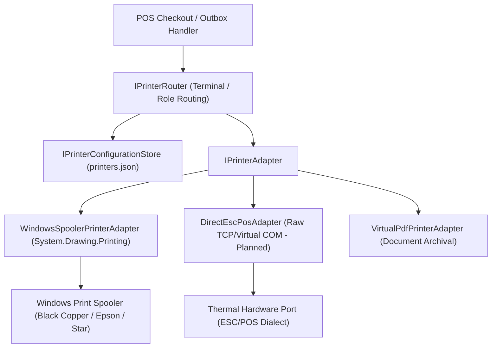
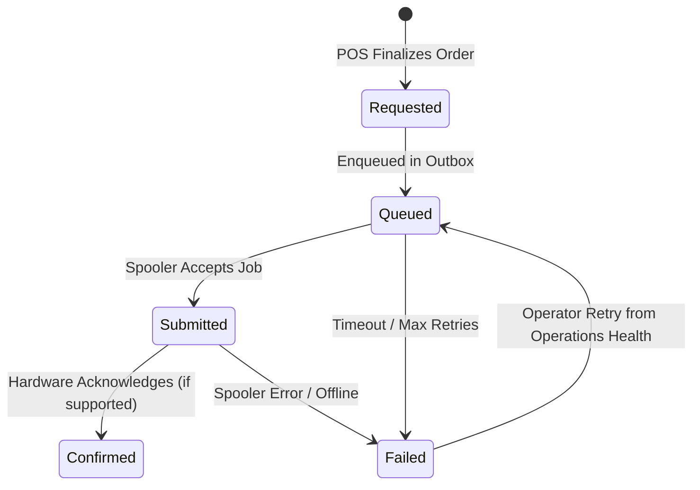

# CBOS Platform Architecture Specification & Capability Matrix

| Attribute | Details |
| :--- | :--- |
| **Document Version** | 1.0.0 — CBOS Platform Foundation & Architecture Roadmap |
| **Target Baseline** | CBOS 1.2.3 Pilot Baseline to CBOS 2.0 Enterprise Baseline |
| **Architectural Role** | Platform Architect & Core Infrastructure Engineering |
| **Coordinating Streams** | Stream A (Tax & Financial Integrity), Stream UI (DPI & Form Layout) |
| **Classification** | **PUBLIC-SAFE / CORE PLATFORM GOVERNANCE** |

---

## 1. Executive Summary & Document Scope

This document establishes the authoritative architectural blueprint and delivery roadmap for the Clovent Business Operating System (CBOS) platform. CBOS is engineered as a dependable, offline-resilient, Pakistan-first point of sale and enterprise retail management system, architected to scale from single-terminal deployments to multi-shop, multi-organization enterprises across international jurisdictions.

Two specialized implementation agents operate concurrently on dedicated worktrees:
1. **Stream UI (`fix/ui-layout-readability`):** POS and back-office form layout, high-DPI scaling (`PerMonitorV2`), Visual Studio Designer compliance, and visual hierarchy.
2. **Stream Tax/Finance (`feature/pakistan-sales-taxes-and-refunds`):** FBR/provincial sales tax calculation contracts, order totals, discount allocation, partial/full refunds, and financial report reconciliations.

This workstream establishes the foundational platform capabilities: multi-tenant and multi-shop domain boundaries, chart of accounts and general ledger architecture, explainable reporting metrics, hardware and printer management abstractions, external integration contracts, and internationalization extension points.

---

## 2. Prioritized Platform Capability Matrix

The following matrix provides a complete inventory of CBOS platform capabilities, establishing verified baselines, active stream ownership, and dependency-linked deferred items.

| Capability Area | Specific Capability / Component | Current State | Active Owner / Origin | Dependencies & Architectural Preconditions |
| :--- | :--- | :--- | :--- | :--- |
| **Core Architecture** | Modular Monolith & Bounded Schemas | **Implemented & Verified** | Architecture Baseline | 6 physical schemas on `Clovent_BusinessOperatingSystem`. |
| **Core Architecture** | Transactional Outbox Pattern | **Implemented & Verified** | Platform Foundation | `OutboxProcessor`, `ICircuitBreakerRegistry`. |
| **Security & Auth** | PBKDF2 Password Hashing & Machine DPAPI | **Implemented & Verified** | Platform Security | `ProtectedData`, `ProtectedOperationalCacheStore`. |
| **Security & Auth** | RBAC Fail-Closed Privileges (TASK-01) | **In Progress** | Stream Tax/Finance | Eliminates hardcoded "admin" username checks. |
| **Security & Auth** | Terminal PIN Throttling & Lockout (TASK-02) | **In Progress** | Stream Tax/Finance | Service boundary rate limiting; zero database migrations. |
| **Financial Integrity**| Centralized Rounding Policy (TASK-03) | **In Progress** | Stream Tax/Finance | `MidpointRounding.AwayFromZero`; Largest Remainder Method. |
| **Financial Integrity**| Zero Balance Settlement & Void Guard (TASK-04)| **In Progress** | Stream Tax/Finance | `BalanceEpsilon` eliminated; immutable financial history. |
| **Financial Integrity**| Payment Idempotency & Concurrency (TASK-05) | **In Progress** | Stream Tax/Finance | `IX_Payments_IdempotencyKey` unique conflict recovery. |
| **Financial Integrity**| Day Close Tax & Discount Aggregation (TASK-06)| **In Progress** | Stream Tax/Finance | Aggregates non-zero order tax/discount totals. |
| **Offline Resilience** | Cash-Only Continuity Mode (PDR-0001) | **Implemented & Verified** | Platform Architecture | DPAPI/HMAC local journal, operational catalog cache. |
| **Offline Resilience** | Continuity Replay & Snapshot Capture (TASK-08)| **In Progress** | Stream Tax/Finance | `ReceiptSnapshot` persistence; typed outbox payloads. |
| **Host Lifecycle** | Background Outbox Startup (TASK-07) | **In Progress** | Stream Tax/Finance | Hosted service startup in `Clovent.Desktop/Program.cs`. |
| **Configuration** | Machine ProgramData Precedence (TASK-09) | **In Progress** | Stream Tax/Finance | `%ProgramData%` precedence over `%LocalAppData%`. |
| **Configuration** | Atomic Critical File Writes (`AtomicFileWriter`)| **Implemented (This Stream)**| Platform Architecture | Write-temp-flush-replace atomic pattern. |
| **UI & Layout** | DevExpress High-DPI PerMonitorV2 (250%) | **In Progress** | Stream UI | `DesktopDpi.Scale()`, AutoScaleMode.None enforcement. |
| **UI & Layout** | Designer Safety & No Runtime Calls | **In Progress** | Stream UI | Parameterless constructors, `DesignModeHelper` checks. |
| **Device / Printing**| Windows Spooler Queue Enumeration | **Implemented (This Stream)**| Platform Architecture | `IWindowsPrinterQueueProvider`, installed queue probing. |
| **Device / Printing**| Logical Printer Profiles & Hardware Routing | **Implemented (This Stream)**| Platform Architecture | Multi-role (Receipt, Kitchen, Invoice), terminal scoping. |
| **Device / Printing**| 58mm / 80mm / A4 Receipt Snapshot Formatting | **Implemented (This Stream)**| Platform Architecture | Column wrapping (32/42/48 col), immutable snapshot consumption. |
| **Device / Printing**| Urdu / Multilingual Raster Fallback | **Implemented (This Stream)**| Platform Architecture | Unicode detection with GDI+ raster rendering fallback. |
| **Device / Printing**| Print Job State Machine & Ambiguity Recovery | **Implemented (This Stream)**| Platform Architecture | Requested → Queued → Submitted → Confirmed/Failed states. |
| **Device / Printing**| Standalone Printer Settings & Test Print UI | **Implemented (This Stream)**| Platform Architecture | Non-conflicting DevExpress settings form with preview. |
| **Multi-Tenancy** | Multi-Terminal Shop LAN Support | **Designed (This Stream)** | Platform Architecture | Network synchronization; distributed locking. |
| **Multi-Tenancy** | Multi-Shop Single Organization | **Designed (This Stream)** | Platform Architecture | Branch-scoped catalog, stock, and ledger routing. |
| **Multi-Tenancy** | Multi-Organization Independent Tenants | **Designed (This Stream)** | Platform Architecture | Security boundary isolation, tenant query interceptors. |
| **Accounting** | Configurable Chart of Accounts & Hierarchy | **Designed (This Stream)** | Platform Architecture | Post-1.2.3 general ledger extension; balanced journals. |
| **Accounting** | Default Posting Mappings (Sales, Tax, COGS) | **Designed (This Stream)** | Platform Architecture | Double-entry journal generation from order snapshots. |
| **Accounting** | External Accounting Sync (QuickBooks Desktop/Online)| **Designed (This Stream)** | Platform Architecture | Versioned Outbox adapter; explicit mapping validation. |
| **Reporting** | Reusable Metrics & Provenance Formulas | **Designed (This Stream)** | Platform Architecture | Net sales, cash variance, inventory valuation, COGS. |
| **Reporting** | Summary-to-Document Drill-Through | **Deferred** | Platform Architecture | Requires general ledger and immutable audit trails. |
| **Integrations** | Pakistan Fiscal E-Invoicing (FBR POS Integration)| **Designed (This Stream)** | Platform Architecture | Cryptographic fiscal signature, offline buffering, sync. |
| **Integrations** | Integrated Payment Terminals (EMV/Card) | **Deferred** | Platform Architecture | PCI-PTS terminal adapters, acquirer API onboarding. |
| **Inventory** | Retail Stock Movements & Branch Transfers | **Deferred** | Platform Architecture | In-transit stock state, goods receipt matching. |
| **International** | Multi-Currency Decimal Precision Engine | **Designed (This Stream)** | Platform Architecture | PDR-0004 compliance; ISO 4217 non-inferential currencies. |

---

## 3. Multiple Organizations, Shops, and Terminals Architecture

### 3.1 Taxonomy of Organizational & Physical Boundaries

To eliminate ambiguity across commercial, physical, and technical domains, CBOS defines strict, non-interchangeable entities:

1. **Customer Tenant (`TenantId`):**
   - The root security, cryptographic isolation, and billing boundary. Represents the paying licensee or corporate group.
   - Cross-tenant data access is strictly impossible at the query, cache, and filesystem boundaries.
2. **Organization / Legal Entity (`OrganizationId`):**
   - A legally recognized company registered with government authorities (e.g. FBR STRN/NTN in Pakistan, IRS EIN in the US).
   - Holds the primary Chart of Accounts, fiscal year definitions, tax registrations, and legal financial statements.
3. **Company (`CompanyId`):**
   - An operating division or subsidiary operating under the parent Organization. Allows independent operational accounting under consolidated legal ownership.
4. **Branch / Shop (`BranchId`):**
   - A distinct physical commercial premises (store, restaurant outlet, kiosk).
   - Manages physical cash drawers, local printer hardware, operational hours, local tax jurisdiction rules (e.g. PRA in Punjab vs. SRB in Sindh), and branch price books.
5. **Warehouse / Stock Location (`WarehouseId`):**
   - A physical or logical repository where sellable inventory is received, stored, and deducted. A Branch is typically associated with one primary retail warehouse, plus optional secondary storage (e.g. cold storage, bar cellar).
6. **Terminal / Register (`TerminalId`):**
   - A physical computer running the CBOS Desktop client. Bound to a unique hardware fingerprint, installed Windows print queues, and attached peripherals (scanners, cash drawers, EFTPOS).
7. **Cashier Shift (`ShiftId`) and Business Date:**
   - A temporal financial container representing an active cashier session on a specific terminal.
   - Enforces blind cash drops, mid-shift payouts, and day close reconciliation.
   - **Business Date:** The operating accounting date (which may span across midnight for late-night venues) distinct from the UTC server clock.

### 3.2 Incremental Deployment Model

1. **Phase 1: Current Single-Terminal Standalone (CBOS 1.2.3 Pilot):**
   - Co-located SQL Server instance and CBOS Desktop client on the same physical workstation.
   - Cashier, database, and hardware adapters reside locally. Isolated, zero network dependencies during transactions.
2. **Phase 2: Multiple Terminals within One Shop (Local LAN):**
   - One machine hosts the primary SQL Server database instance.
   - Secondary POS terminals connect via encrypted TDS (TLS) on the local store network.
   - Terminal-specific configuration (printers, cash drawers) persists locally; transactional records commit to the central store database.
3. **Phase 3: Multiple Shops within One Organization (Store-and-Forward / Central DB):**
   - Each Branch operates an autonomous local operational database (or edge cache) with Continuity Mode, replicating transactions to the Organization Head Office via Transactional Outbox synchronization.
4. **Phase 4: Multiple Independent Organizations:**
   - Single shared enterprise database cluster serving multiple independent corporate tenants.
   - Rigid application and persistence isolation guarantees prevent cross-tenant exposure.
5. **Phase 5: Centrally Hosted Administration:**
   - Web/desktop head-office portals providing centralized catalog distribution, consolidated financial reporting, and remote terminal provisioning.

### 3.3 Persistence & Isolation Boundaries

**Architecture Invariant:** CBOS maintains **exactly one physical database** (`Clovent_BusinessOperatingSystem`) per deployed instance. Multi-tenancy is enforced via row-level security boundaries, EF Core query interceptors, and strict application validation:

- **Command & Query Boundaries:** Every repository query and MediatR command must resolve `TenantId` and `OrganizationId` from `IExecutionContextAccessor`. Caller-provided tenant/organization IDs must match the authenticated session; mismatch throws `SecurityException`.
- **EF Core Global Query Filters:** Enforce `builder.Entity<T>().HasQueryFilter(e => e.TenantId == CurrentTenantId)` across all tenant-scoped tables.
- **Cache Isolation:** All in-memory, SQLite, and file-based cache keys must be composite: `{TenantId}:{OrganizationId}:{EntityType}:{EntityId}`.
- **Background Jobs & Outbox:** Background workers must deserialize message execution contexts and set `ExecutionContextScope` prior to dispatching handlers.
- **Print Queue Isolation:** Print jobs and profiles are explicitly scoped to `(OrganizationId, BranchId, TerminalId)`. Cross-organization print dispatch is rejected at the domain boundary.
- **Credential Storage:** Integration credentials (FBR API keys, QBO OAuth tokens) are encrypted via DPAPI with tenant-unique salt entropy.

### 3.4 Negative Isolation Test Plan

To prove that multi-organization isolation is mathematically watertight, the test suite must execute negative isolation verification against two independent organizations (`Org-Alpha` and `Org-Beta`) with intentionally identical business identifiers:

| Entity / Dimension | Org-Alpha Value | Org-Beta Value | Isolation Assertion |
| :--- | :--- | :--- | :--- |
| **Customer Code** | `CUST-001` (Alpha VIP) | `CUST-001` (Beta Standard) | Queries for Alpha never return Beta customer; balances remain strictly isolated. |
| **Item SKU** | `SKU-1001` (Gourmet Burger) | `SKU-1001` (Auto Battery) | Catalog and pricing lookups return strictly organization-scoped entities. |
| **Document Number** | `ORD-2026-0001` | `ORD-2026-0001` | Order completion, receipt reprint, and payment records never collide or cross-read. |
| **Cashier PIN** | `1234` (Manager Alpha) | `1234` (Cashier Beta) | Elevation on Alpha terminal cannot elevate using Beta credentials. |
| **Printer Queue** | `POS-Receipt-Primary` | `POS-Receipt-Primary` | Routing resolves profile assigned to caller's organization and terminal only. |

---

## 4. Accounting Foundation and Chart of Accounts (COA)

### 4.1 Existing Financial Records & Ledger Analysis

CBOS currently maintains customer credit account history via `CustomerLedgerEntry` in the `[Restaurant]` schema, capturing debits (credit sales), credits (payments received), and running customer balances. Completed orders capture total amounts, taxes, discounts, and payments.

To transition from specialized sub-ledgers into a true, verifiable financial operating system, CBOS defines a generalized **Double-Entry General Ledger (GL)** model.

### 4.2 Chart of Accounts Design & Hierarchy

```mermaid
graph TD
    COA["Chart of Accounts Root"]
    Assets["1000 - Assets"]
    Liabilities["2000 - Liabilities"]
    Equity["3000 - Equity"]
    Revenue["4000 - Revenue"]
    Expenses["5000 - Expenses"]

    Assets --> Cash["1010 - Cash on Hand (Till)"]
    Assets --> Bank["1020 - Bank Accounts"]
    Assets --> CardClearing["1030 - Card Clearing / Undeposited Funds"]
    Assets --> AR["1100 - Accounts Receivable (Customers)"]
    Assets --> Inventory["1200 - Inventory (Stock on Hand)"]

    Liabilities --> AP["2010 - Accounts Payable (Suppliers)"]
    Liabilities --> SalesTaxPub["2110 - FBR / Provincial Sales Tax Payable"]
    Liabilities --> GiftCardLiab["2200 - Gift Card & Customer Credit Liability"]

    Revenue --> SalesRev["4010 - Gross Sales (Food / Beverage)"]
    Revenue --> SalesDisc["4090 - Sales Discounts (Contra-Revenue)"]

    Expenses --> COGS["5010 - Cost of Goods Sold"]
    Expenses --> CashOverShort["5090 - Cash Over / Short"]
```

Each account is modeled with:
- `AccountId` (Guid) and `OrganizationId` (Guid).
- `AccountCode` (string, e.g. "1010", structured hierarchical numeric code).
- `AccountName` (string, e.g. "Cash Drawer 1").
- `AccountType` (Enum: `Asset`, `Liability`, `Equity`, `Revenue`, `Expense`).
- `NormalBalance` (Enum: `Debit`, `Credit`).
- `ParentAccountId` (Guid?, supporting unlimited nesting).
- `IsActive` (bool) and `IsSystemAccount` (bool).

### 4.3 Default Transaction Posting Mappings

Every completed operational transaction generates balanced, immutable journal entries:

| Operational Event | Debit Account | Credit Account | Idempotency & Source Document |
| :--- | :--- | :--- | :--- |
| **Cash Sale with Tax** | `1010 - Cash on Hand` (Gross) | `4010 - Gross Sales` (Net) `2110 - Sales Tax Payable` (Tax) | Source: `OrderId` Key: `GL-ORDER-{OrderId}` |
| **Sale with Discount** | `1010 - Cash on Hand` (Net Paid) `4090 - Sales Discounts` (Discount) | `4010 - Gross Sales` (Gross Base) | Source: `OrderId` Key: `GL-ORDER-{OrderId}` |
| **Card / Digital Payment**| `1030 - Card Clearing` | `4010 - Gross Sales` `2110 - Sales Tax Payable` | Source: `PaymentId` Key: `GL-PAY-{PaymentAttemptId}` |
| **Credit Sale (On Account)**| `1100 - Accounts Receivable` | `4010 - Gross Sales` `2110 - Sales Tax Payable` | Source: `OrderId` Key: `GL-ORDER-{OrderId}` |
| **AR Settlement Payment** | `1010 - Cash on Hand` | `1100 - Accounts Receivable` | Source: `CustomerPaymentId` Key: `GL-AR-{PaymentId}` |
| **Cost of Goods Deduction**| `5010 - Cost of Goods Sold` | `1200 - Inventory Asset` | Source: `OrderId` Triggered on inventory deduction |
| **Till Shortage at Close**| `5090 - Cash Over / Short` | `1010 - Cash on Hand` | Source: `ShiftId` Key: `GL-SHIFT-{ShiftId}` |
| **Gift Card Issuance** | `1010 - Cash on Hand` | `2200 - Customer Credit Liability` | Source: `GiftCardIssueId` |
| **Compensating Refund** | `4015 - Sales Returns` (Contra) `2110 - Sales Tax Payable` (Reversal) | `1010 - Cash on Hand` (Refunded Cash) | Source: `RefundDocumentId` Key: `GL-REFUND-{RefundId}` |

### 4.4 Financial Invariants & Dual Accounting Mode

1. **Balancing Invariant:**
   $$\sum \text{Debits} == \sum \text{Credits}$$
   Every journal transaction must balance to the exact fractional cent (zero tolerance: $\epsilon = 0.00$). Any out-of-balance entry is rejected at the domain boundary.
2. **Immutable Journal History:** Posted journal entries can never be modified or deleted. Errors are corrected exclusively via signed compensating reversal entries.
3. **Dual Accounting Modes:**
   - **Mode A (Built-in GL):** Transactions post to internal `[Accounting].[JournalEntries]` and `[Accounting].[JournalLines]`.
   - **Mode B (External Accounting Integration):** Transactions enqueue Outbox payloads to external systems (e.g. QuickBooks).
   - *Governance Rule:* Modes cannot both be active without an explicit synchronization reconciliation bridge, preventing duplicate double-counting.

---

## 5. Intelligent, Explainable Reporting Architecture

### 5.1 Reusable Metrics & Provenance Formulas

Every figure displayed in CBOS financial reports must be derived deterministically from immutable transactional snapshots:

1. **Sales Excluding Tax ($\text{Sales}_{\text{ex-tax}}$):**
   $$\text{Sales}_{\text{ex-tax}} = \sum (\text{Line Net Amount}) - \text{Order Level Discounts}$$
2. **Tax Charged ($\text{Tax}_{\text{charged}}$):**
   $$\text{Tax}_{\text{charged}} = \sum \text{Exclusive Tax} + \sum \text{Inclusive Tax}$$
3. **Discounts ($\text{Discounts}_{\text{total}}$):**
   $$\text{Discounts}_{\text{total}} = \sum \text{Line Discounts} + \sum \text{Order Discounts}$$
4. **Refunds ($\text{Refunds}_{\text{total}}$):**
   $$\text{Refunds}_{\text{total}} = \sum \text{Approved Refund Items} + \sum \text{Reversed Taxes}$$
5. **Net Sales ($\text{NetSales}$):**
   $$\text{NetSales} = \text{Sales}_{\text{ex-tax}} - \text{Refunds}_{\text{ex-tax}}$$
6. **Cash Drawer Variance ($\Delta_{\text{cash}}$):**
   $$\Delta_{\text{cash}} = \text{Actual Blind Count} - (\text{Opening Float} + \text{Cash Sales} + \text{Paid Ins} - \text{Paid Outs} - \text{Cash Refunds})$$
7. **Cost of Goods Sold ($\text{COGS}$):**
   $$\text{COGS} = \sum (\text{Deducted Quantity} \times \text{Weighted Average Unit Cost})$$
   *Governance Rule:* Never calculate Gross Margin or Profit as `Sales - Purchases`. Purchases increase inventory asset valuation; COGS is recognized exclusively upon verified sale deduction.

### 5.2 Reporting Roadmap & Exception Indicators

- **Provenance Badges:** Every report metric displays its originating document count and formula tooltip.
- **Incomplete / Offline Indicators:** If un-reconciled Continuity transactions exist in the local journal, reports prominently display: `[!] UNRECONCILED CONTINUITY TRANSACTIONS PENDING REPLAY`.
- **Currency Invariant:** Values of different currencies (e.g. PKR and USD) are never summed together. Multi-currency aggregation requires an explicit conversion ledger with recorded exchange rates.

---

## 6. Printer and Device Management Architecture (First Implementation Priority)

### 6.1 Adapter Hierarchy & Device Model Strategy

Printing in retail and hospitality must never lock the point of sale, crash on spooler errors, or print unformatted garbage when handling regional scripts. CBOS establishes a clean adapter architecture:

1. **Target Hardware Families:**
   - **Black Copper (BC-85AC, BC-95AC, BC-P80):** Standard Pakistan retail thermal printers utilizing standard Windows ESC/POS spooler drivers.
   - **Epson (TM-T88, TM-T20):** Industry benchmark ESC/POS thermal printers.
   - **Generic POS-58 / POS-80:** Low-cost 58mm and 80mm USB receipt printers.
2. **Adapter Boundary:**
   - **Windows Driver Spooler (`WindowsSpoolerPrinterAdapter`):** Primary, rock-solid printing path. Uses Windows GDI+ print spooler. Handles USB, network, and virtual queues transparently without port-level conflicts.
   - **Direct ESC/POS (`DirectEscPosAdapter`):** Reserved for hardware-certified direct network/serial streaming where Windows drivers are absent.

### 6.2 Logical Profiles, Roles, and Routing Policy

Printers are decoupled from hardcoded device strings. Users configure **Logical Printer Profiles**:
- **Role Assignment:**
  - `Receipt`: Customer payment receipt and tender breakdown.
  - `Invoice`: Full A4/Letter tax invoice for corporate or wholesale clients.
  - `Kitchen`: Food order production tickets grouped by kitchen prep station.
  - `Bar`: Beverage order production tickets.
  - `Label`: Barcode and shelf-edge label printing.
- **Terminal Scoping:**
  The `PrinterRouter` resolves printer profiles using deterministic hierarchy:
  1. Terminal-specific assignment matching requested Role.
  2. Branch-specific assignment matching requested Role.
  3. Organization-specific assignment matching requested Role.
  4. Global Default Receipt Printer fallback.
  *Negative Isolation Invariant:* The router strictly rejects cross-organization printer fallback.

### 6.3 Receipt Formatting, Paper Widths & Urdu Raster Fallback

Receipts consume immutable `ReceiptSnapshot` records produced upon transaction completion:
- **Paper Width Profiles:**
  - `58 mm (Width58mm)`: Formatted to 32 characters per line. Compact layouts, indented multi-line item names, consolidated tax totals.
  - `80 mm (Width80mm)`: Formatted to 42–48 characters per line. Standard POS receipt layout with tabular columns (`Item`, `Qty`, `Price`, `Total`).
  - `A4 (A4Custom)`: Standard 80+ column printable page.
- **Reprint Integrity:**
  - Reprints render the original immutable transaction values without recalculating prices or taxes.
  - Reprints prominently feature an audit banner: `*** REPRINT (COPY #N) ***` along with the reprint timestamp and operator name.
- **Urdu & Complex Unicode Typography (Direct Raster Fallback):**
  - Standard thermal printer firmware does not include Arabic/Nastaliq font ROMs. Sending raw Unicode bytes to ESC/POS produces corrupted characters.
  - *CBOS Solution:* The formatter inspects receipt text for Unicode script ranges (`\u0600` to `\u06FF`). If Arabic/Urdu characters are detected, the document renders via GDI+ graphics bitmap font rendering, transmitting raster glyphs directly to the Windows Spooler. This guarantees 100% accurate Urdu typography on any standard printer.

### 6.4 Print Job State Machine & Ambiguity Recovery

Print jobs maintain an explicit state lifecycle:

- **Spooler Acceptance != Physical Delivery:** The Windows Spooler returning success confirms only that the byte stream was buffered by the operating system, not that paper exited the cutter. Jobs transition from `Submitted` to `Confirmed` only if bi-directional device telemetry exists.
- **Non-Destructive Failure:** A printer jam, power cutoff, or spooler failure **never rolls back a completed sale or reverses an accounting entry**. The sale remains completed; the print job marks `Failed`, alerting the operator through the Operations Health dashboard.

---

## 7. Future Integrations Architecture

CBOS defines small, explicit provider contracts for external platforms:

1. **Pakistan Fiscal / E-Invoicing (FBR & Provincial Authorities):**
   - Integration with FBR POS Invoicing (Digital Invoicing), Punjab Revenue Authority (PRA), and Sindh Revenue Authority (SRB).
   - Synchronous QR code generation with cryptographic invoice signature (`FbrInvoiceNumber`, `FbrQrCode`).
   - Resilient offline buffering: if the tax authority API times out, the sale completes locally with an offline pending fiscal flag, queuing an Outbox synchronization task.
2. **Accounting Systems (QuickBooks Desktop & Online):**
   - Map CBOS daily summaries or individual invoices to QuickBooks Journal Entries and Sales Receipts.
   - Outbox messages with deduplication keys (`QB-DAYCLOSE-{Date}-{BranchId}`) prevent duplicate GL entries.
3. **Payment Terminals (EFTPOS / EMV):**
   - Semi-integrated serial/Ethernet protocol. POS sends amount challenge; terminal returns authorization code and masked PAN.
   - **PCI DSS Invariant:** CBOS never stores, logs, or transmits Card Verification Values (CVV) or full primary account numbers (PAN).
4. **E-Commerce & Delivery Aggregators:**
   - Webhook ingress adapters for Shopify, WooCommerce, Foodpanda, and Careem.

---

## 8. International Expansion Blueprint

While CBOS 1.2.3 is optimized for Pakistan (PKR currency, two decimal places, Urdu support, provincial tax regimes), its platform architecture supports global expansion:
- **Currency Engine (PDR-0004):** Monetary amounts are bound to ISO 4217 currency codes with explicit minor-unit precision (e.g. 2 for PKR/USD, 0 for JPY, 3 for BHD). Currencies are persisted with transactions, never inferred from the host OS locale.
- **Timezone Governance:** Persistence is strictly in UTC (`DateTimeOffset`). Presentation converts to `Branch.TimeZoneInfo`. Business dates are governed by store operating hours rather than calendar midnight.
- **Localization:** UI strings utilize .NET resource files (`.resx`) with Right-to-Left (RTL) layout support.

---

## 9. Visual Studio Designer & UI Governance

In strict compliance with `AGENTS.md` and Stream UI conventions:
- Every new form must remain fully loadable in the Visual Studio Windows Forms Designer.
- Constructors must check `DesignModeHelper.IsInDesignMode` before executing logic.
- Zero runtime dependency injection or database calls in `InitializeComponent()`.
- Layouts must be DPI-aware, tested for 100% to 250% scaling at 1920×1080 resolution.
- Control minimum heights enforce touch-friendly accessibility (minimum 32px for editors, 40px for primary POS buttons).

---

## 10. Maintenance, Reliability & Security

- **Atomic Critical Writes (`AtomicFileWriter`):** Configuration files (printers, databases, licenses) are written to `.tmp`, flushed, validated, and atomically moved via `File.Replace`, eliminating 0-byte corruption.
- **Non-Destructive Licensing (PDR-0002):** Software license expiration never deletes, locks, or renders historical customer data inaccessible. Authorized users retain read-only export access.
- **Least-Privilege RBAC:** Elevation requires authenticated administrative credentials; hardcoded bypasses are eliminated.
