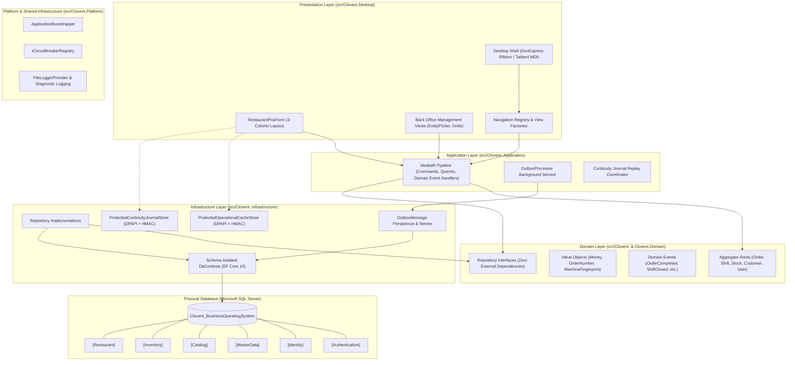

# CBOS System Architecture

| Attribute | Details |
| :--- | :--- |
| **Area** | Enterprise System Architecture |
| **Audience** | Software Architects, Engineering Leads, Senior Developers |
| **Last Reviewed Version** | CBOS 1.2.2 |
| **Status** | **IMPLEMENTED** |
| **Classification** | **PUBLIC-SAFE** |

---

## 1. Architectural Philosophy & Overview

Clovent Business Operating System (CBOS) is an enterprise application framework specifically engineered for hospitality, retail, point of sale, and back-office management. Designed for mission-critical operations where terminal downtime equates directly to lost revenue and customer dissatisfaction, CBOS combines **Domain-Driven Design (DDD)**, **Clean Architecture**, and an **Always-On Resilience Architecture**.

The system is deployed on Microsoft Windows desktop environments (.NET 10 / C# 13), utilizing Windows Forms and DevExpress 26.1 for high-performance, GPU-accelerated, high-DPI desktop presentation. Persistence is anchored in a single physical Microsoft SQL Server database, segmented by SQL schemas that correspond directly to autonomous bounded contexts.

---

## 2. Core Architectural Pillars

### 2.1 Clean Architecture
CBOS strictly enforces the dependency rule: inner layers have zero knowledge of outer layers:
- **Domain Layer (`src/Clovent.<Context>/`):** Encapsulates core business rules, entity state transitions, invariant validation, and repository abstractions. References only `Clovent.Domain`.
- **Application Layer (`src/Clovent.<Context>.Application/`):** Orchestrates business use cases via MediatR Commands (`IRequest<Result>`), Queries (`IRequest<Result<T>>`), handlers, DTOs, and pipeline behaviors. References the Domain layer.
- **Infrastructure Layer (`src/Clovent.<Context>.Infrastructure/`):** Implements repository contracts, EF Core entity type configurations, migrations, external file stores, and caching. References Domain and Application layers.
- **Presentation Layer (`src/Clovent.Desktop/`):** Composition root and WinForms UI. Binds controls, executes asynchronous queries, and hosts the DevExpress ribbon shell.

### 2.2 Command Query Responsibility Segregation (CQRS) with MediatR
All state alterations are formulated as discrete MediatR Commands executed transactionally against domain repositories. Read operations are formulated as Queries returning lightweight DTOs directly, avoiding overhead and preventing aggregate entity pollution.

### 2.3 Single Physical Database with Schema Isolation
Rather than scattering operations across multiple micro-databases that complicate backups and multi-table reporting, CBOS consolidates all contexts into **one** physical database (`Clovent_BusinessOperatingSystem`). Strict bounded-context autonomy is maintained through dedicated SQL schemas (`[Authentication]`, `[Identity]`, `[MasterData]`, `[Catalog]`, `[Inventory]`, `[Restaurant]`) and isolated migration histories (`[<Schema>].[__EFMigrationsHistory]`).

---

## 3. Resilience & Availability Engine

To maintain continuous point-of-sale operation in retail and restaurant environments where network partitions, server hardware failures, or database restarts occur, CBOS incorporates an enterprise resilience pipeline:

1. **Transactional Outbox (`src/Clovent.Restaurant/Outbox/`):**
   Secondary integration tasks (QuickBooks synchronization, receipt printing, analytics dispatch) are saved into the `[Restaurant].[OutboxMessages]` table within the exact same database transaction as the primary business operation (`Order.Complete()`). Asynchronous background workers (`OutboxProcessor`) dispatch messages with exponential backoff and circuit breaker protection (`ICircuitBreakerRegistry`).
2. **Emergency Continuity Mode (`src/Clovent.Desktop/Restaurant/Services/ContinuityCoordinator.cs`):**
   If SQL Server connectivity drops unexpectedly, POS terminals seamlessly transition to Continuity Mode. Cashiers can continue taking **Cash-Only** orders against a locally cached catalog without stalling the register queue.
3. **Protected Local Operational Cache (`ProtectedOperationalCacheStore.cs`):**
   Active menu hierarchies, products, variants, prices, and tax rates are mirrored to local encrypted files protected with Windows DPAPI and signed with HMAC-SHA256. Stale or tampered caches are safely rejected via strict time-to-live policies (`CacheFreshnessPolicy`).
4. **Append-Only Emergency Cash Journal (`ProtectedContinuityJournalStore.cs`):**
   Offline cash sales are written to an encrypted, append-only local journal (`continuity_journal.dat`). When database connectivity is restored, the `ContinuityCoordinator` automatically replays emergency orders into SQL Server with collision-safe receipt numbers (`LocalReceiptNumber`) and exactly-once execution safeguards.

---

## 4. Desktop Client Architecture

- **Host Framework:** Windows Forms targeting `.NET 10-windows` with C# 13 language features.
- **High-DPI Awareness:** Configured for `PerMonitorV2` High-DPI mode. WinForms `AutoScaleMode` is deliberately omitted on forms to prevent double-scaling coordinate corruption; DevExpress vector rendering engines handle screen DPI dynamically.
- **Visual Studio Designer Safety:** Forms implement parameterless constructors decorated with `[EditorBrowsable(EditorBrowsableState.Never)]` and guard design-time execution using `DesignModeHelper.IsInDesignMode`.
- **Typographic Standardization:** Unified UI styles across all forms via `DesktopStyle.cs` (30px toolbar controls, standardized button widths, 8px layout padding).

---

## 5. Security & Cryptographic Foundation

- **Least Privilege Runtime SQL Access:** Application services run under `cbos_app`, restricted to `db_datareader`, `db_datawriter`, and `EXECUTE`. Administrative roles (`sa`, `sysadmin`, `db_owner`) are prohibited at runtime.
- **DPAPI Credential Storage:** Database connection strings, SQL credentials, and licensing guard files are encrypted using Windows DPAPI (`DataProtectionScope.LocalMachine` or `CurrentUser`).
- **Cryptographic Offline Licensing:** Two-tier licensing (30-day evaluation trial and commercial license) validated via asymmetric RSA-2048 with SHA-256 (`clovent-2026-v2`). The public key is embedded in client code; private keys are held offline by the vendor.

---

## 6. Current Implementation vs. Planned Evolution

| Subsystem | CBOS 1.2.2 Current State | Planned Future Evolution |
| :--- | :--- | :--- |
| **Bounded Contexts** | 6 autonomous contexts fully modeled in EF Core. | Cross-context event streaming via Kafka / EventStore for enterprise cloud sync. |
| **Outbox Handlers** | QuickBooks, Print, Inventory, Analytics handlers implemented with circuit breakers. | Production OAuth2 QuickBooks Online gateway replacing simulated gateway. |
| **Continuity Mode** | Single-terminal local journal replay implemented and validated. | Multi-terminal LAN peer-to-peer failover replication. |
| **Receipt Printing** | GDI text rendering via .NET `PrintDocument` to Windows thermal queues. | Direct ESC/POS raw socket and USB hardware driver. |
| **Authorization** | UI gating fully implemented; pipeline behaviors partially implemented. | Uniform `IPipelineBehavior` mandatory command authorization across all contexts. |

---

## 7. Key Classes & Source Traceability

- **Composition Root:** `src/Clovent.Desktop/Program.cs`
- **Application Bootstrapper:** `src/Clovent.Platform/Bootstrap/ApplicationBootstrapper.cs`
- **Navigation Registry:** `src/Clovent.Desktop/Navigation/NavigationRegistry.cs`
- **Outbox Engine:** `src/Clovent.Restaurant.Infrastructure/Outbox/OutboxProcessor.cs`
- **Continuity Coordinator:** `src/Clovent.Desktop/Restaurant/Services/ContinuityCoordinator.cs`
- **Operational Cache:** `src/Clovent.Restaurant.Infrastructure/Continuity/ProtectedOperationalCacheStore.cs`
- **Circuit Breakers:** `src/Clovent.Platform/CircuitBreakers/CircuitBreakerRegistry.cs`

---

## 8. Cross References
- [Bounded Contexts Reference](bounded-contexts.md)
- [Application Startup Lifecycle](application-startup.md)
- [Transactional Outbox Architecture](transactional-outbox.md)
- [Database Persistence Architecture](../database/database-architecture.md)
- [Architecture Decision Records (ADRs)](../adr/README.md)
