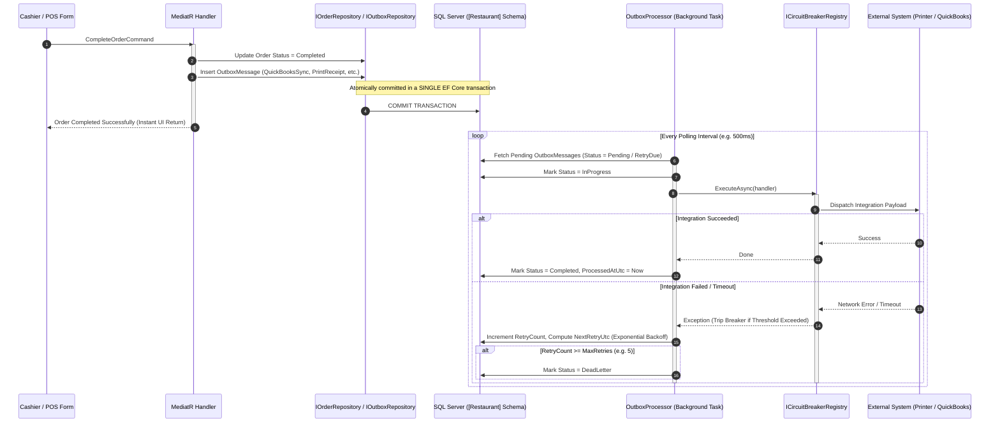

# CBOS Transactional Outbox Architecture

| Attribute | Details |
| :--- | :--- |
| **Area** | Asynchronous Messaging & Reliable Integration |
| **Audience** | Backend Engineers, Integration Developers, Systems Architects |
| **Last Reviewed Version** | CBOS 1.2.2 |
| **Status** | **IMPLEMENTED** |
| **Classification** | **PUBLIC-SAFE** |

---

## 1. Architectural Motivation & Problem Statement

In mission-critical retail and restaurant environments, completing a sale (`Order.Complete()`) triggers several essential secondary tasks:
- Synchronizing the invoice to an external accounting system (QuickBooks)
- Printing physical kitchen and customer receipts
- Posting inventory depletions to warehouse ledgers
- Publishing operational analytics and sales audit events

If the system attempts to perform these integrations synchronously within the cashier's checkout transaction:
- A slow network call or printer paper jam blocks the cashier and delays the line.
- A network failure or remote crash after credit card settlement can roll back or corrupt the database, causing discrepancies between payments and sales records.

To achieve **guaranteed eventual consistency** without sacrificing cashier responsiveness, CBOS implements the **Transactional Outbox Pattern** within the `Restaurant` bounded context.

---

## 2. OutboxMessage Domain Aggregate

The `OutboxMessage` aggregate root is defined in `src/Clovent.Restaurant/Outbox/OutboxMessage.cs`:

### 2.1 Key Properties & States
- **`Id` (`OutboxMessageId`):** Unique identifier for the message.
- **`MessageType` (`string`):** Discriminator identifying the target message handler (e.g., `QuickBooksSync`, `ReceiptPrint`, `InventoryPosting`, `AnalyticsEvent`).
- **`Payload` (`string`):** JSON-serialized immutable payload containing all domain context required to execute the integration.
- **`Status` (`OutboxMessageStatus`):**
  - `Pending`: Initial state awaiting background worker pickup.
  - `InProgress`: Currently being processed by a worker.
  - `Completed`: Successfully processed and acknowledged.
  - `Failed`: Encountered a transient error; scheduled for retry.
  - `DeadLetter`: Exceeded maximum retry attempts; requires administrator inspection.
- **`RetryCount` (`int`):** Number of failed attempts.
- **`NextRetryUtc` (`DateTimeOffset?`):** Scheduled instant for next retry attempt.
- **`CreatedAtUtc` (`DateTimeOffset`):** Creation timestamp.
- **`ProcessedAtUtc` (`DateTimeOffset?`):** Timestamp of successful completion.
- **`ErrorMessage` (`string?`):** Last recorded exception message.

---

## 3. Concrete Outbox Handlers in CBOS 1.2.2

All outbox message handlers implement `IOutboxMessageHandler` and reside in `src/Clovent.Restaurant.Application/Outbox/Handlers/`:

| Handler Class | `MessageType` | Purpose & Protection |
| :--- | :--- | :--- |
| **`QuickBooksSyncOutboxHandler`** | `QuickBooksSync` | Synchronizes completed sales to QuickBooks. Protected via `ICircuitBreakerRegistry.GetOrCreate("QuickBooks")` to prevent hammering offline accounting servers. |
| **`ReceiptPrintOutboxHandler`** | `ReceiptPrint` | Asynchronously spools receipts to physical POS thermal printers via `IReceiptPrintService`. Prevents printer paper jams from halting sales. |
| **`InventoryPostingOutboxHandler`**| `InventoryPosting` | Translates completed order line depletions into inventory issue transactions in the `Inventory` bounded context. |
| **`AnalyticsEventOutboxHandler`** | `AnalyticsEvent` | Publishes anonymized operational metrics, cashier velocity, and basket size events. |
| **`OtherOutboxHandlers`** | `CustomerNotification`, etc. | Extensible handlers for SMS/email receipt dispatch and loyalty updates. |

---

## 4. Resilience & Circuit Breaker Isolation

External integration calls are wrapped inside the platform circuit breaker abstraction (`Clovent.Platform.CircuitBreakers.ICircuitBreaker`):
- **Consecutive Failures Threshold:** 5 consecutive connection errors trip the circuit to `Open`.
- **Fast-Failing:** Once `Open`, calls immediately throw without waiting for timeouts, preserving local CPU and network resources.
- **Half-Open Probe:** After a 30-second cooldown, a trial message is dispatched. If successful, the circuit resets to `Closed`.
- **Dead-Letter Handling:** Messages that exceed their maximum retry ceiling (typically 5 attempts) transition to `DeadLetter`. They are visible on the **Operations Health Center** dashboard for administrative review.

---

## 5. Current Implementation vs. Production Status

- **Outbox Persistence & Worker Engine:** **FULLY IMPLEMENTED & VALIDATED**.
- **Receipt Printing via Outbox:** **FULLY IMPLEMENTED** (targets Windows thermal print queues via `ReceiptPrintDocument`).
- **QuickBooks Outbox Contract:** **IMPLEMENTED ARCHITECTURE**, currently utilizing `DefaultQuickBooksGateway` (simulated in-memory gateway with outage testing hooks). Direct production Intuit REST/OAuth2 communication is **PLANNED FOR FUTURE RELEASE**.

---

## 6. Key Classes & Source Traceability

- **Aggregate Root:** `src/Clovent.Restaurant/Outbox/OutboxMessage.cs`
- **Repository Interface:** `src/Clovent.Restaurant/Outbox/IOutboxRepository.cs`
- **EF Core Configuration:** `src/Clovent.Restaurant.Infrastructure/Persistence/Configurations/OutboxMessageConfiguration.cs`
- **Background Worker:** `src/Clovent.Restaurant.Infrastructure/Outbox/OutboxProcessor.cs`
- **Handler Abstraction:** `src/Clovent.Restaurant.Application/Outbox/IOutboxMessageHandler.cs`
- **Circuit Breaker Registry:** `src/Clovent.Platform/CircuitBreakers/CircuitBreakerRegistry.cs`

---

## 7. Cross References
- [System Architecture](system-architecture.md)
- [QuickBooks Integration Architecture](../integrations/quickbooks.md)
- [Printing Integration](../integrations/printing.md)
- [Operations Health Monitoring](../operations/operations-health.md)
- [Support Runbook: Outbox Stalled](../support/runbooks/outbox-stalled.md)
