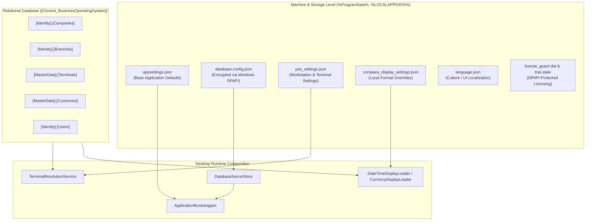

# CBOS Configuration Architecture

| Attribute | Details |
| :--- | :--- |
| **Area** | Configuration & Machine Environment |
| **Audience** | Systems Engineers, DevOps, Field Technicians, Architects |
| **Last Reviewed Version** | CBOS 1.2.2 |
| **Status** | **IMPLEMENTED** |
| **Classification** | **PUBLIC-SAFE** |

---

## 1. Architectural Overview

Clovent Business Operating System (CBOS) separates configuration across distinct lifecycle layers to support multi-tenant back-office management, multi-terminal branch setups, and local workstation autonomy during network disruptions.

CBOS classifies all configuration settings into five operational scopes:
1. **System & Security Scope:** Global application settings, connection strings, logging policies, and ACL definitions.
2. **Company & Legal Entity Scope:** Centralized business rules, financial years, base currencies, and company-wide display patterns.
3. **Branch Scope:** Physical store/outlet parameters, tax jurisdictions, dining areas, and default inventory warehouses.
4. **Terminal / Device Scope:** POS workstation bindings, receipt printer assignments, barcode reader ports, and cash drawer interfaces.
5. **User / Operator Scope:** UI layout preferences (grid vs. list), language preferences, and recent session state.

---

## 2. Configuration Sources and Storage Locations

CBOS utilizes isolated physical storage locations depending on whether the configuration is global, secret, workstation-specific, or user-specific:

| Configuration Store | Physical Path / Target | Encryption / Security | Scope & Purpose |
| :--- | :--- | :--- | :--- |
| **`appsettings.json`** | `<InstallationRoot>\appsettings.json` | Plaintext JSON (Read-Only) | Baseline application configuration, default log levels, connection string template. |
| **`database.config.json`** | `%ProgramData%\Clovent\BusinessOperatingSystem\database.config.json` | Windows DPAPI (`DataProtectionScope.LocalMachine`) | Encrypted SQL Server runtime connection credentials and server parameters. |
| **`pos_settings.json`** | `%LOCALAPPDATA%\Clovent\pos_settings.json` | Plaintext JSON (Per-User ACL) | Local POS terminal ID, branch ID, view mode, items-per-row, order health thresholds. |
| **`company_display_settings.json`** | `%LOCALAPPDATA%\Clovent\company_display_settings.json` | Plaintext JSON (Per-User ACL) | Local cached date format, time format, and numeric quantity precision. |
| **`language.json`** | `%LOCALAPPDATA%\Clovent\language.json` | Plaintext JSON (Per-User ACL) | Active UI culture code (e.g. `en-US`, `ur-PK`). |
| **`license_guard.dat`** | `%ProgramData%\Clovent\BusinessOperatingSystem\license_guard.dat` | Windows DPAPI + HMAC-SHA256 | Tamper-resistant clock monotonicity record and anti-rollback verification. |
| **`trial.state`** | `%ProgramData%\Clovent\BusinessOperatingSystem\trial.state` | Windows DPAPI (`LocalMachine`) | 30-day evaluation trial start date, machine signature, and installation state. |
| **SQL Master Data** | `Clovent_BusinessOperatingSystem` | SQL Server Permissions (`cbos_app`) | Authoritative branch, company, currency, and terminal entities. |

---

## 3. Configuration Precedence Model

When CBOS launches or performs a business workflow, configuration values are resolved using strict precedence to prevent ambiguous runtime state:

### 3.1 Connection String Resolution Precedence
1. **Encrypted DPAPI Store:** `%ProgramData%\Clovent\BusinessOperatingSystem\database.config.json` via `DatabaseSecretStore.ResolveConnectionString()`.
2. **Environment Variable:** `CBOS_CONNECTION_STRING` (if configured for containerized/headless diagnostics).
3. **Application Configuration:** `ConnectionStrings:Default` in `appsettings.json`.

### 3.2 Terminal Identity Precedence
1. **Environment Variable Override:** `CBOS_TERMINAL_ID` (accepts Terminal `Guid`, `Code`, or `Name`).
2. **Persisted Workstation Setting:** `TerminalId` in `%LOCALAPPDATA%\Clovent\pos_settings.json` (validated against active Master Data).
3. **Workstation Hostname Matching:** `Environment.MachineName` matching registered Terminal `Code` or `Name`.
4. **Single Active Terminal Auto-Bind:** If exactly one active terminal exists for the resolved branch, it is auto-bound.
5. **Ambiguity Gating:** If multiple terminals exist without an explicit match, POS entry is blocked until explicitly configured.

### 3.3 Display Format Precedence
1. **Database Master Data:** Formats and currency symbols loaded via `DateTimeDisplayLoader` and `CurrencyDisplayLoader` during startup.
2. **Local Workstation Override Cache:** `company_display_settings.json` loaded via `CompanyDisplaySettingsStore`.
3. **Hardcoded Fallback Defaults:** `dd-MMM-yyyy`, `12 Hour`, `PKR` / `Rs.`, and 2 decimal places.

---

## 4. Key Classes & Source Traceability

- **`Clovent.Desktop.Configuration.DatabaseSecretStore`**: Handles DPAPI encryption, decryption, and fallback resolution for database connection strings.
- **`Clovent.Desktop.Forms.Base.CompanyDisplaySettingsStore`**: Manages reading, writing, and test overrides for company display preferences.
- **`Clovent.Desktop.Forms.Base.PosSettingsStore`**: Manages workstation-level POS preferences with thread-safe file caching and disposable testing hooks.
- **`Clovent.Desktop.Restaurant.Services.TerminalResolutionService`**: Evaluates 5-tier deterministic terminal, branch, and warehouse resolution.
- **`Clovent.Platform.Bootstrap.ApplicationBootstrapper`**: Configures `IConfigurationRoot` with JSON providers, environment variables, and platform defaults.

---

## 5. Known Limitations & Configuration Drift Risks

1. **Per-User `%LOCALAPPDATA%` Storage for Workstation Identity:**
   - *Limitation:* Storing `pos_settings.json` under `%LOCALAPPDATA%\Clovent` ties terminal binding to the logged-in Windows user account. If multiple Windows accounts share the same physical POS PC, each Windows user must configure the terminal once.
   - *Planned Evolution:* Transition workstation-level hardware identity to machine-wide `%ProgramData%\Clovent\BusinessOperatingSystem\workstation.json` in a future release.
2. **Offline Configuration Immutability:**
   - *Behavior:* When operating in Continuity Mode (offline), master data settings (tax rates, terminal codes, branch configurations) cannot be edited. Only local UI layout preferences (such as grid vs. list view) are mutable.

---

## 6. Cross References
- [Display Settings Documentation](display-settings.md)
- [Terminal Identity Resolution](terminal-identity.md)
- [Database Configuration & Persistence Architecture](../database/database-architecture.md)
- [Software Licensing Architecture](../security/licensing.md)
