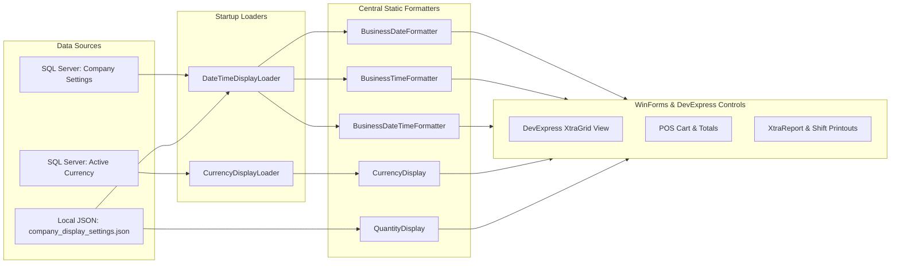

# CBOS Display Settings & Business Formatters

| Attribute | Details |
| :--- | :--- |
| **Area** | User Interface & Regional Formatting |
| **Audience** | Frontend Developers, QA Engineers, Support Engineers |
| **Last Reviewed Version** | CBOS 1.2.2 |
| **Status** | **IMPLEMENTED** |
| **Classification** | **PUBLIC-SAFE** |

---

## 1. Architectural Overview

To maintain accounting and operational accuracy across international markets and diverse hospitality environments, Clovent Business Operating System (CBOS) prohibits hardcoded formatting strings (such as `"yyyy-MM-dd"`, `"C"`, or `{0:F2}`) in forms, controls, and reports.

All user-visible dates, times, currencies, and numeric quantities are formatted through centralized static formatting engines located in `Clovent.Desktop.Forms.Base`. These formatters synchronize company display preferences loaded from master data with local workstation caching.



---

## 2. Central Formatters Reference

### 2.1 Date Formatting (`BusinessDateFormatter`)
Formats `DateOnly`, `DateTime`, and `DateTimeOffset` values according to the active company format pattern, converted to the configured business timezone.
- **Key Methods:**
  - `BusinessDateFormatter.Format(DateOnly? date)` -> e.g. `"14-Oct-2026"`
  - `BusinessDateFormatter.Format(DateTimeOffset? offset)` -> converts UTC instant to business timezone and formats date.
  - `BusinessDateFormatter.Pattern` -> returns active pattern string (e.g. `"dd-MMM-yyyy"`).
- **Supported Company Patterns:**
  - `dd-MMM-yyyy` (Default, e.g. `14-Oct-2026`)
  - `dd/MM/yyyy` (e.g. `14/10/2026`)
  - `MM/dd/yyyy` (e.g. `10/14/2026`)
  - `yyyy-MM-dd` (ISO standard, e.g. `2026-10-14`)

### 2.2 Time Formatting (`BusinessTimeFormatter`)
Formats `TimeOnly`, `DateTime`, and `DateTimeOffset` values in the configured business timezone using either 12-hour or 24-hour presentation.
- **Key Methods:**
  - `BusinessTimeFormatter.Format(TimeOnly? time)` -> e.g. `"08:30 PM"` or `"20:30"`
  - `BusinessTimeFormatter.Format(DateTimeOffset? offset)` -> converts UTC to business time and formats time string.
  - `BusinessTimeFormatter.Pattern` -> returns `"hh:mm tt"` (12-hour) or `"HH:mm"` (24-hour).

### 2.3 Combined Date & Time Formatting (`BusinessDateTimeFormatter`)
Formats complete timestamps containing both calendar date and clock time for audit trails, shift openings, kitchen tickets, and financial transaction headers.
- **Key Methods:**
  - `BusinessDateTimeFormatter.Format(DateTimeOffset? offset)` -> e.g. `"14-Oct-2026 08:30 PM"`
  - `BusinessDateTimeFormatter.Pattern` -> returns combined pattern (e.g. `"dd-MMM-yyyy hh:mm tt"`).

### 2.4 Currency Formatting (`CurrencyDisplay`)
Provides uniform formatting for all monetary amounts, respecting currency symbol placement, ISO codes, and fractional decimal places.
- **Key Methods:**
  - `CurrencyDisplay.Format(decimal amount)` -> e.g. `"Rs. 850.00"` or `"$850.00"`
  - `CurrencyDisplay.FormatPlain(decimal amount)` -> e.g. `"850.00"` (bare numeric representation for editable text boxes)
  - `CurrencyDisplay.Symbol` -> returns active currency symbol (e.g. `"Rs."`, `"$"`, `"€"`, `"£"`).
  - `CurrencyDisplay.CurrencyCode` -> returns ISO 4217 code (default: `"PKR"`).
  - `CurrencyDisplay.DecimalPlaces` -> configured decimal precision (clamped between 0 and 4, default: 2).
- **Symbol Placement Rule:**
  - Standard prefix symbols (`$`, `€`, `£`, `¥`) are attached directly: `$100.00`.
  - Textual symbols (e.g. `Rs.`, `AED`, `SAR`) include a trailing space: `Rs. 100.00`.

### 2.5 Quantity Formatting (`QuantityDisplay`)
Formats stock-on-hand, line item counts, and recipe quantities. **Strictly prohibits currency symbols or prefixes.**
- **Key Methods:**
  - `QuantityDisplay.Format(decimal quantity)` -> formats with thousands separators, e.g. `"1,250.00"`
  - `QuantityDisplay.Format(decimal? quantity)` -> returns `"-"` if null.
  - `QuantityDisplay.FormatPlain(decimal quantity)` -> bare decimal string without thousands separators.
  - `QuantityDisplay.Precision` -> company quantity precision (0 to 4 decimals, default: 2).

---

## 3. Storage & Configuration Persistence

Company display preferences are persisted locally on the workstation to allow offline Continuity Mode rendering when SQL Server is unreachable:

- **Path:** `%LOCALAPPDATA%\Clovent\company_display_settings.json`
- **Class:** `Clovent.Desktop.Forms.Base.CompanyDisplaySettingsStore`
- **JSON Structure:**
  ```json
  {
    "DateFormat": "dd-MMM-yyyy",
    "TimeFormat": "12 Hour",
    "QuantityPrecision": 2
  }
  ```
- **Test Isolation:** Supports `CompanyDisplaySettingsStore.SetTestingOverrides(customFilePath)` and `ResetTestingOverrides()` to guarantee test suites never touch host workstation settings.

---

## 4. Key Classes & Source Traceability

- **`Clovent.Desktop.Forms.Base.BusinessFormatters`**: Houses `BusinessDateFormatter`, `BusinessTimeFormatter`, and `BusinessDateTimeFormatter`.
- **`Clovent.Desktop.Forms.Base.DateTimeDisplay`**: Low-level timezone translation and parsing engine.
- **`Clovent.Desktop.Forms.Base.DateTimeDisplayLoader`**: Startup coordinator resolving date formats from MediatR queries into static formatters.
- **`Clovent.Desktop.Forms.Base.CurrencyDisplay`**: Global monetary formatting service.
- **`Clovent.Desktop.Forms.Base.CurrencyDisplayLoader`**: Startup coordinator querying active base currency from `MasterData`.
- **`Clovent.Desktop.Forms.Base.QuantityDisplay`**: Non-currency numeric stock display engine.
- **`Clovent.Desktop.Forms.Base.CompanyDisplaySettings`**: Local persistence DTO and store.

---

## 5. Coding Rules & Developer Compliance

1. **No String Interpolation Formatting Hacks:**
   - ❌ **Incorrect:** `labelTotal.Text = "$" + total.ToString("F2");`
   - ✅ **Correct:** `labelTotal.Text = CurrencyDisplay.Format(total);`
2. **No Raw DateTime Formatting in GridViews:**
   - ❌ **Incorrect:** `colCreated.DisplayFormat.FormatString = "yyyy-MM-dd";`
   - ✅ **Correct:** Use `BusinessDateFormatter.Pattern` or custom column display event using `BusinessDateTimeFormatter.Format()`.
3. **No Currency Symbols on Quantities:**
   - ❌ **Incorrect:** `labelQty.Text = "$" + qty.ToString();`
   - ✅ **Correct:** `labelQty.Text = QuantityDisplay.Format(qty);`

---

## 6. Cross References
- [Configuration Architecture](configuration-architecture.md)
- [Terminal Identity](terminal-identity.md)
- [UI & High-DPI Guidelines](../development/ui-high-dpi.md)
- [Coding Guidelines](../development/coding-guidelines.md)
