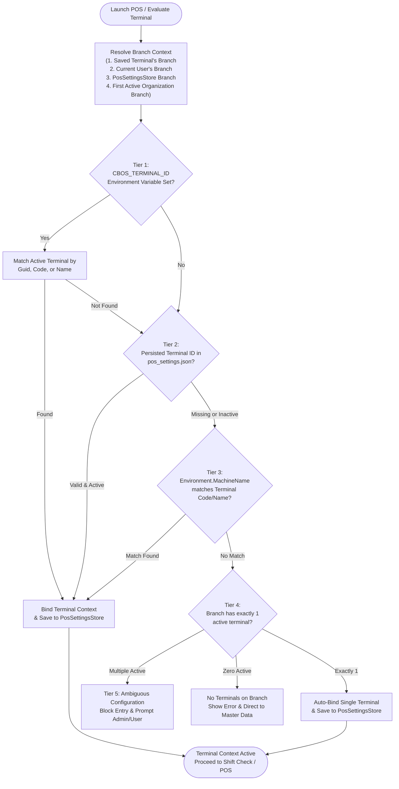

# CBOS Terminal Identity Resolution

| Attribute | Details |
| :--- | :--- |
| **Area** | Workstation Binding & Device Identity |
| **Audience** | POS Developers, Network Administrators, Systems Engineers |
| **Last Reviewed Version** | CBOS 1.2.2 |
| **Status** | **IMPLEMENTED** |
| **Classification** | **PUBLIC-SAFE** |

---

## 1. Architectural Overview

In a hospitality and retail operating system, every physical POS workstation must possess an unambiguous, deterministic identity linking it to:
- A specific **Branch / Outlet**
- A specific **Terminal Record** (code, machine identity, till number)
- A specific **Warehouse / Stock Location** (for inventory depletion upon sale)
- A specific **Cash Drawer / Shift Session**

If a workstation boots without a clear terminal identity, transactions cannot be attributed, inventory cannot be deducted, and cash shifts cannot open safely. CBOS implements a robust, 5-tier resolution engine via `TerminalResolutionService` in `src/Clovent.Desktop/Restaurant/Services/TerminalResolutionService.cs`.

---

## 2. Evaluation Precedence Tiers

The `TerminalResolutionService` evaluates terminal candidate matches in strict order:

### Tier 1: Explicit Environment Variable (`CBOS_TERMINAL_ID`)
- **Use Case:** Headless test execution, scripted deployment, multi-seat RDP sessions, or containerized workstations.
- **Evaluation:** Inspects `Environment.GetEnvironmentVariable("CBOS_TERMINAL_ID")`.
- **Match Criteria:** First attempts `Guid.TryParse` against `TerminalId`. If not a GUID, matches case-insensitively against `Terminal.Code` or `Terminal.Name`.
- **Action:** If an active terminal matches, it is bound immediately and saved to `PosSettingsStore` for persistence.

### Tier 2: Persisted Workstation Settings (`PosSettingsStore`)
- **Use Case:** Standard day-to-day operation where a terminal was configured during First-Run Commissioning or back-office setup.
- **Evaluation:** Reads `PosSettingsStore.LoadTerminalId()` from `%LOCALAPPDATA%\Clovent\pos_settings.json`.
- **Validation:** Must exist in `ITerminalRepository` and have `MasterDataStatus.Active`. If the record is inactive or missing, the stale setting is automatically cleared.

### Tier 3: Workstation Hostname (`Environment.MachineName`)
- **Use Case:** Zero-touch provisioning where network administrators name workstations after register codes (e.g., `POS-REG01`).
- **Evaluation:** Reads the Windows NetBIOS machine name.
- **Match Criteria:** Matches case-insensitively against active terminals' `Code` or `Name` within the resolved branch.

### Tier 4: Single Branch Terminal Auto-Bind
- **Use Case:** Small single-register locations (e.g. coffee shops, food trucks) with exactly one register configured on the branch.
- **Evaluation:** If all active terminals for the target branch total exactly 1, CBOS binds it automatically to eliminate manual configuration friction.

### Tier 5: Ambiguity Gating
- **Behavior:** If the branch has multiple active terminals (e.g., `REG-01`, `REG-02`, `REG-03`) and none of Tiers 1–3 resolved a binding, CBOS **does not guess**.
- **Action:** Returns `TerminalResolutionResult(IsConfigured: false)` with an error message:
  `"Multiple active terminals (N) found for branch '...'. Workstation terminal selection or configuration is required."`
  The user is directed to the Back Office or Terminal Configuration screen.

---

## 3. Branch Context Resolution

Before filtering terminals, `TerminalResolutionService` resolves the target branch using the following sequence:
1. **Saved Terminal's Branch:** If a valid terminal was previously persisted in `pos_settings.json`, its parent `BranchId` is utilized.
2. **Logged-in User's Assigned Branch:** If the active user session (`ICurrentSession`) has an assigned `BranchId` or `CompanyId`, it is used.
3. **Persisted Branch in Settings:** Reads `PosSettingsStore.LoadBranchId()`.
4. **First Active Branch Fallback:** Queries `IOrganizationRepository` and `ICompanyRepository` for the first active branch in the hierarchy.

---

## 4. Key Classes & Source Traceability

- **`Clovent.Desktop.Restaurant.Services.TerminalResolutionService`**: Authoritative resolution engine implementing `ITerminalResolutionService`.
- **`Clovent.Desktop.Restaurant.Services.TerminalResolutionResult`**: Immutable result record returning `IsConfigured`, `TerminalId`, `TerminalCode`, `TerminalName`, `BranchId`, `BranchName`, `WarehouseId`, `WarehouseName`, and `ResolutionSource`.
- **`Clovent.MasterData.Terminals.Terminal`**: Master data aggregate root (`Clovent.MasterData`) representing physical POS registers.
- **`Clovent.Desktop.Forms.Base.PosSettingsStore`**: Local JSON persistence for terminal and branch bindings.

---

## 5. Known Limitations & Architectural Notes

1. **Per-User `%LOCALAPPDATA%` Scope:**
   - *Issue:* Storing `TerminalId` in `%LOCALAPPDATA%\Clovent\pos_settings.json` scopes the terminal binding to the current Windows user profile. If multiple Windows accounts log into the same POS machine, each profile must resolve the terminal independently (or use machine-name matching).
   - *Status:* KNOWN LIMITATION.
   - *Planned Evolution:* Transition hardware terminal bindings to machine-wide `%ProgramData%\Clovent\BusinessOperatingSystem\terminal.json` in a future release.
2. **Terminal Inactivity Handling:**
   - If an administrator marks a terminal `Inactive` in Master Data while the POS workstation is offline, the workstation will continue operating in Continuity Mode until reconnected, at which point the next resolution clears the invalid binding.

---

## 6. Cross References
- [Configuration Architecture](configuration-architecture.md)
- [Display Settings](display-settings.md)
- [First-Run Commissioning](../deployment/commissioning.md)
- [Master Data Bounded Context](../architecture/bounded-contexts.md)
