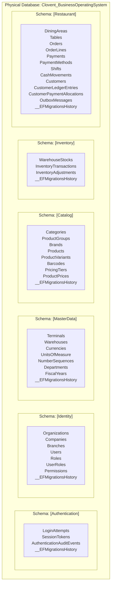
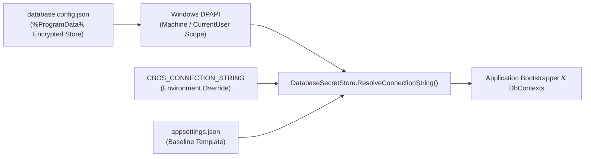

# CBOS Database Architecture & Persistence Model

| Attribute | Details |
| :--- | :--- |
| **Area** | Relational Database & Persistence |
| **Audience** | Database Administrators, Backend Developers, Systems Engineers |
| **Last Reviewed Version** | CBOS 1.2.2 |
| **Status** | **IMPLEMENTED** |
| **Classification** | **PUBLIC-SAFE** |

---

## 1. Physical Architecture: Single Database with Schema Isolation

Clovent Business Operating System (CBOS) relies on exactly **one** physical Microsoft SQL Server database:
$$\mathbf{Clovent\_BusinessOperatingSystem}$$

To enforce Domain-Driven Design (DDD) bounded-context autonomy without incurring the operational overhead of managing multiple physical database files on SQL Server Express, CBOS isolates bounded contexts across **dedicated SQL schemas**:



---

## 2. Dedicated DbContexts & Isolated Migration Histories

Each bounded context maintains its own Entity Framework Core `DbContext`. To prevent cross-context migration locks and collision, each context manages its schema history in a schema-scoped migration table:

| Bounded Context | DbContext Class | SQL Schema | Schema-Scoped Migration Table |
| :--- | :--- | :---: | :--- |
| **Authentication** | `AuthenticationDbContext` | `[Authentication]` | `[Authentication].[__EFMigrationsHistory]` |
| **Identity** | `IdentityDbContext` | `[Identity]` | `[Identity].[__EFMigrationsHistory]` |
| **MasterData** | `MasterDataDbContext` | `[MasterData]` | `[MasterData].[__EFMigrationsHistory]` |
| **Catalog** | `CatalogDbContext` | `[Catalog]` | `[Catalog].[__EFMigrationsHistory]` |
| **Inventory** | `InventoryDbContext` | `[Inventory]` | `[Inventory].[__EFMigrationsHistory]` |
| **Restaurant** | `RestaurantDbContext` | `[Restaurant]` | `[Restaurant].[__EFMigrationsHistory]` |

### Implementation in DbContext Configuration
Every DbContext overrides `OnConfiguring` or is registered with `.MigrationsHistoryTable("__EFMigrationsHistory", schema)`:
```csharp
optionsBuilder.UseSqlServer(connectionString, sqlOptions =>
{
    sqlOptions.MigrationsHistoryTable("__EFMigrationsHistory", "Restaurant");
});
```

---

## 3. Cross-Context Relationships & Foreign Key Policy

- **Strict Zero Cross-Schema Foreign Keys:** Relational foreign keys (`FK_...`) exist **only** within tables of the same SQL schema.
- **Logical References Across Contexts:** When an aggregate in one context references an entity in another, it stores a strongly-typed identifier or Guid:
  - `Order.TerminalId` stores the logical `TerminalId` from `MasterData`.
  - `Order.CashierId` stores the logical `UserId` from `Identity`.
  - `WarehouseStock.VariantId` stores the logical `ProductVariantId` from `Catalog`.
- **Relational Integrity Enforcement:** Referential consistency is enforced by application-layer validators and domain services rather than database cascade rules.

---

## 4. Connection Model & DPAPI Credential Security

CBOS resolves the canonical database connection string key `ConnectionStrings:Default` through `DatabaseSecretStore`:



- **Encryption Standard:** Database connection strings containing SQL authentication credentials are encrypted using Windows DPAPI (`DataProtectionScope.LocalMachine` or `CurrentUser`).
- **Zero Plaintext Credentials:** Plaintext passwords are strictly forbidden in `appsettings.json`.

---

## 5. Runtime Least Privilege vs. Provisioning Roles

CBOS enforces strict database security separation between daily application runtime and administrative provisioning:

| Role / Account | Granted SQL Permissions | Prohibited Roles | Context & Timing |
| :--- | :--- | :--- | :--- |
| **`cbos_app`**<br/>*(Application Runtime)* | `db_datareader`<br/>`db_datawriter`<br/>`GRANT EXECUTE` | `sa`<br/>`sysadmin`<br/>`db_owner`<br/>`db_ddladmin` | Active POS and back-office workstations during standard business operations. Cannot alter tables, add columns, or drop objects. |
| **`cbos_provisioner`**<br/>*(Setup & Upgrade)* | `db_owner` or `sysadmin` (Temporary during setup) | N/A | Executed exclusively by `Clovent.Installer.Provisioner.exe` or `FirstRunWizard` during initial deployment or schema migrations. |

---

## 6. Schema Compatibility Verification

On application startup, `DatabaseSchemaCompatibilityValidator` performs a non-destructive pre-flight check before EF Core builds its service models:
1. Queries each schema's `[<Schema>].[__EFMigrationsHistory]` table.
2. Compares applied migration IDs against the compiled migration IDs in the application assembly.
3. **Outcomes:**
   - `Compatible`: All applied migrations match or exceed expected milestones. Startup proceeds.
   - `DatabaseTooOld`: The database requires migrations. Startup halts and prompts to run the provisioner.
   - `DatabaseNewer`: The database is newer than the client executable. Startup halts to prevent data corruption.
   - `ConnectionFailed`: The SQL instance is unreachable. Prompts the operator with the connection dialog.

---

## 7. Key Classes & Source Traceability

- **Secret Store:** `src/Clovent.Desktop/Configuration/DatabaseSecretStore.cs`
- **Schema Compatibility:** `src/Clovent.Desktop/Commissioning/Database/DatabaseSchemaCompatibilityValidator.cs`
- **Provisioning Service:** `src/Clovent.Desktop/Commissioning/Services/CommissioningProvisioningCoordinator.cs`
- **DbContext Factories:**
  - `src/Clovent.Authentication.Infrastructure/Persistence/AuthenticationDbContextFactory.cs`
  - `src/Clovent.Identity.Infrastructure/Persistence/IdentityDbContextFactory.cs`
  - `src/Clovent.MasterData.Infrastructure/Persistence/MasterDataDbContextFactory.cs`
  - `src/Clovent.Catalog.Infrastructure/Persistence/CatalogDbContextFactory.cs`
  - `src/Clovent.Inventory.Infrastructure/Persistence/InventoryDbContextFactory.cs`
  - `src/Clovent.Restaurant.Infrastructure/Persistence/RestaurantDbContextFactory.cs`

---

## 8. Cross References
- [Domain Data Model](domain-data-model.md)
- [Migrations Guide](migrations.md)
- [SQL Server Deployment Guide](../deployment/sql-server.md)
- [Security Architecture](../security/security-architecture.md)
- [ADR-0001: Single Database Multiple Schemas](../adr/ADR-0001-single-physical-database-multiple-schemas.md)
