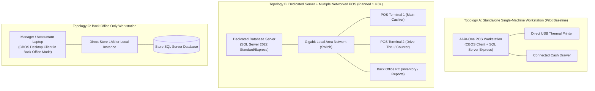

# CBOS Deployment Topologies & Hardware Architecture

| Attribute | Details |
| :--- | :--- |
| **Area** | Infrastructure Architecture & Topology Planning |
| **Audience** | Systems Architects, Network Engineers, Solutions Architects |
| **Last Reviewed Version** | CBOS 1.2.2 |
| **Status** | **FACTUAL BASELINE** |
| **Classification** | **PUBLIC-SAFE** |

---

## 1. Supported Deployment Topologies Overview

CBOS defines physical deployment topologies tailored to business scale and operational maturity:

---

## 2. Detailed Topology Analysis & Maturity Classification

### 2.1 Topology A: Standalone Single-Machine Workstation (1.2.2 Baseline & 1.2.3 Pilot Target)
- **Best Suited For:** Cafes, single-terminal restaurants, food trucks, and retail boutiques.
- **Architecture:** Both Microsoft SQL Server (typically SQL Server Express) and the CBOS Desktop client run on the **same physical computer**.
- **Networking:** Zero external database networking required; connects via local loopback (`localhost`, `127.0.0.1`, or `.\SQLEXPRESS`).
- **Resilience:** Front-of-house operations continue offline in Continuity Mode if SQL Server service halts. On-demand backups created prior to upgrades; daily backups via Windows Task Scheduler.
- **Maturity Status:** **TARGET OF 1.2.3 ATTENDED PILOT HARDENING**.

### 2.2 Topology B: Dedicated Database Server + Networked POS Terminals (Planned CBOS 1.4.0+)
- **Best Suited For:** Multi-station restaurants, busy supermarkets, and multi-lane retail stores.
- **Architecture:**
  - One central machine acts as the **Database Server** running SQL Server (Port 1433 TCP).
  - Multiple client PCs run CBOS Desktop, each registered as an independent `Terminal` in Master Data.
- **Current Operational Boundaries:**
  - In CBOS 1.2.2 / 1.2.3, multiple clients connecting over LAN can read/write to the central database, but **there is NO multi-terminal peer synchronization, NO cross-terminal order handoff, and NO distributed offline failover**.
  - During a database server outage, terminals enter local Continuity Mode independently without peer communication.
- **Maturity Status:** **PLANNED ARCHITECTURE (CBOS 1.4.0+)**. Commercial rollout of multi-terminal topologies requires the concurrency and failover capabilities scheduled for CBOS 1.4.0+.

### 2.3 Topology C: Back Office Workstation
- **Best Suited For:** Store managers, inventory controllers, and accountants managing catalogs, purchase receipts, and financial statements.
- **Architecture:** Client workstation configured to launch directly into **Back Office Mode** (`ShellForm`).
- **Permissions:** Restricted by user roles (`Manager` or `Administrator`). Operational register functions (cash drawers, tender strips) are not initialized on this workstation.
- **Maturity Status:** **FUNCTIONAL BASELINE**.

---

## 3. Network Ports & Firewall Configuration

| Port | Protocol | Source | Destination | Purpose |
| :--- | :---: | :--- | :--- | :--- |
| **1433** | **TCP** | POS Terminals / Back Office | Database Server | Microsoft SQL Server default instance traffic. |
| **1434** | **UDP** | POS Terminals | Database Server | SQL Server Browser service (for named instances, e.g. `SERVER\SQLEXPRESS`). |
| **9100** | **TCP** | POS Terminals | Network Thermal Printers | RAW print spooling protocol for network receipt printers. |

---

## 4. Cross References
- [Installation Guide](installation.md)
- [SQL Server Deployment Guide](sql-server.md)
- [First-Run Commissioning](commissioning.md)
- [Continuity Mode Architecture](../resilience/continuity-mode.md)
- [Canonical Engineering Roadmap](../roadmap/engineering-roadmap.md)
