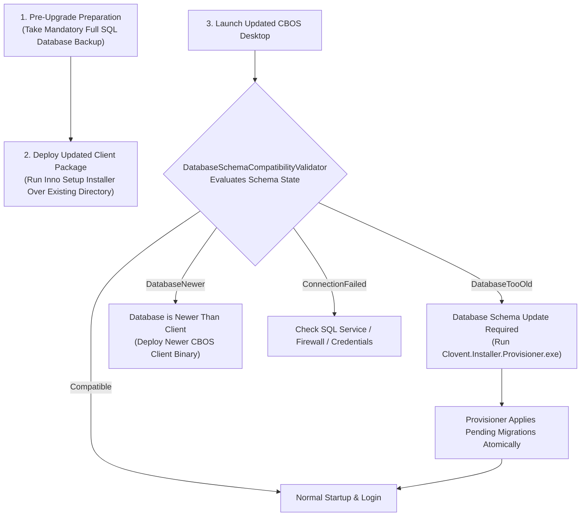

# CBOS Client & Database Upgrade Guide

| Attribute | Details |
| :--- | :--- |
| **Area** | Workstation & Database Maintenance |
| **Audience** | Systems Engineers, Database Administrators, Field Support |
| **Last Reviewed Version** | CBOS 1.2.2 |
| **Status** | **PROCEDURAL STANDARD** |
| **Classification** | **PUBLIC-SAFE** |

---

## 1. Upgrade Architecture & Workflow

Upgrading a production CBOS installation requires synchronizing application binaries on POS/back-office workstations with schema migrations on the Microsoft SQL Server database.



---

## 2. Pre-Upgrade Checklist & Database Backup

> [!CAUTION]
> **MANDATORY PRE-UPGRADE BACKUP:**
> Always produce a verified full database backup before running installers or applying schema migrations. In CBOS 1.2.2, automated pre-upgrade backup snapshotting is **PLANNED**; therefore, administrators **must execute a manual SQL Server backup** prior to upgrading.

### Manual SQL Server Backup Command
Run in PowerShell (or SQL Server Management Studio):

```powershell
sqlcmd -S "localhost\SQLEXPRESS" -E -Q "BACKUP DATABASE [Clovent_BusinessOperatingSystem] TO DISK = 'C:\Backups\CBOS_PreUpgrade_$(Get-Date -Format 'yyyyMMdd_HHmmss').bak' WITH INIT, STATS = 10;"
```

---

## 3. Application Binary Upgrade

1. Ensure all instances of `Clovent.Desktop.exe` are closed on the workstation.
2. Run the updated setup installer (e.g. `Clovent.BusinessOperatingSystem-1.2.2-Setup.exe`).
3. The installer overwrites binaries in `C:\Program Files\Clovent\Business Operating System\`.
4. **Configuration Preservation:** Existing DPAPI-encrypted connection strings (`database.config.json`), software licenses (`clovent.lic`), and local POS settings (`pos_settings.json`) are preserved automatically.

---

## 4. Database Schema Migration Execution

When the updated client launches, `DatabaseSchemaCompatibilityValidator` compares assembly migration IDs against the database's `[<Schema>].[__EFMigrationsHistory]` tables.

If migrations are pending, the application presents:
`"Database Schema Update Required: Database schema is older than the application..."`

### Executing Migrations with `Clovent.Installer.Provisioner.exe`
Run the provisioner tool bundled in the installation directory as Administrator:

```powershell
cd "C:\Program Files\Clovent\Business Operating System"
.\Clovent.Installer.Provisioner.exe --migrate
```

The provisioner:
- Connects using elevated setup credentials or Windows Authentication.
- Identifies unapplied migrations across all six bounded contexts.
- Executes pending migrations within an isolated transaction.
- Verifies migration history parity and exits with code `0`.

---

## 5. Upgrade Limitations & Known Boundaries

1. **No In-App Automated Schema Downgrade:**
   If a client upgrade is rolled back, the database schema is not automatically downgraded. Restoring the pre-upgrade `.bak` file is required to revert database state.
2. **Multi-Terminal Fleet Synchronization:**
   In Topology B (Networked POS), all terminal workstations must be updated to the same minor/patch version to prevent schema version mismatch errors.

---

## 6. Cross References
- [Installation Guide](installation.md)
- [Database Migrations Guide](../database/migrations.md)
- [Backup & Restore Procedures](../operations/backup-and-restore.md)
- [Support Runbook: Schema Mismatch](../support/runbooks/schema-mismatch.md)
