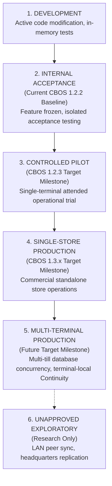

# CBOS Product Readiness Levels & Evidence Standards

| Attribute | Details |
| :--- | :--- |
| **Area** | Release Qualification & Commercial Governance |
| **Audience** | Leadership, Product Management, QA, Operations |
| **Last Reviewed Version** | CBOS 1.2.2 |
| **Status** | **PERMANENT STANDARD** |
| **Classification** | **PUBLIC-SAFE** |

---

## 1. Executive Purpose

To prevent overstated maturity claims, software builds in the Clovent Business Operating System must qualify against strictly defined **Product Readiness Levels**.

> [!IMPORTANT]
> **MILESTONE TARGETS VS. ACHIEVED READINESS:**
> A version number (e.g., `1.2.3`, `1.3.0`) is a planned release milestone target, not an automatic grant of operational or commercial readiness. **No version number automatically confers pilot readiness or General Availability status.** Readiness levels are earned solely by satisfying every defined qualification gate and producing verifiable runtime evidence.

---

## 2. Product Readiness Hierarchy

### Level 1: DEVELOPMENT
- **Scope:** Active feature authoring, refactoring, and prototype development.
- **Evidence Requirement:** Debug compilation clean, component unit tests passing.
- **Commercial Standing:** Strictly non-deployable.

### Level 2: INTERNAL ACCEPTANCE (Current CBOS 1.2.2 Baseline)
- **Scope:** Feature freeze across planned milestone scope. Validation of core bounded-context architecture and structural contracts.
- **Evidence Requirement:**
  - Full solution compilation clean in `Debug` and `Release` modes.
  - Automated unit and integration test suite passing with 100% workstation isolation.
  - Clean Windows Sandbox installation and launch qualification. (Note: CBOS 1.2.2 clean-machine acceptance is marked as **PENDING** unless actual runtime acceptance evidence is supplied; a frozen baseline designation is not a passed qualification gate).
  - ReleaseGuard hygiene scan passing (`0` exit code).
- **Commercial Standing:** **INTERNAL BASELINE ONLY**. Not certified for customer pilot, not approved for paid commercial deployments.

### Level 3: CONTROLLED PILOT (CBOS 1.2.3 Target Milestone)
- **Scope:** Attended, single-terminal operational trial in a friendly/monitored live store environment under vendor supervision.
- **Evidence Requirement:**
  - Level 2 criteria satisfied.
  - Zero database schema migrations (schema remains frozen at 1.2.2 baseline).
  - All critical hardening tasks resolved and verified against source: TASK-01 (RBAC & Manager Elevation Hardening), TASK-02 (PIN Throttling + Development Seed Protection), TASK-03 (Financial Rounding Contract), TASK-04 (BalanceEpsilon Elimination + Completed Void Restriction), TASK-05 (Payment Idempotency + Credit-Limit Approval), TASK-06 (Business Day Close Aggregation), TASK-07 (Outbox Processor Startup), TASK-08 (Continuity Replay + Receipt Snapshot Repair), TASK-09 (DB Config Precedence + Atomic Critical Config Writes), and TASK-10 (Authenticode / Release Verification Pipeline).
  - Real Microsoft SQL Server validation verified under concurrent load.
  - Authenticode code signing bounded to first-party deliverables (explicitly including `Clovent.Installer.Provisioner.exe`, `Clovent.Desktop.exe`, approved first-party DLLs, and final installer) with verified SHA-256 installer hash.
  - Attended operator training and support runbooks validated.
- **Commercial Standing:** Permitted only for monitored, attended single-terminal trial operations under vendor supervision once all gate criteria are satisfied.

### Level 4: SINGLE-STORE PRODUCTION (CBOS 1.3.x Target Milestone)
- **Scope:** Standalone unattended commercial production for single-terminal stores.
- **Evidence Requirement:**
  - Level 3 criteria satisfied.
  - Formal compensating Refund and Return domain implemented and verified.
  - High-DPI UI validated across diverse hardware displays.
  - Concurrency-safe number sequencing and Order/Table locking validated on real SQL Server.
  - Structured diagnostics and automated maintenance/backup procedures verified with documented restore drills.
- **Commercial Standing:** Commercially deployable for single-terminal store profiles once qualification gates are achieved.

### Level 5: MULTI-TERMINAL PRODUCTION (Future Target Milestone)
- **Scope:** Concurrent multi-terminal store deployments with distributed POS tills connected to a shared SQL Server instance.
- **Architectural Boundary:** Continuity Mode remains strictly terminal-local and protected via machine-bound DPAPI. Distributed peer-to-peer LAN continuity synchronization and headquarters replication are **unapproved proposals** and are not part of accepted roadmap scope. Multi-branch isolation and branch-scoped numbering remain future targets.
- **Evidence Requirement:**
  - Level 4 criteria satisfied.
  - Multi-till shared database concurrency and locking verified under stress.
  - Cross-terminal order handoff (retaining lease/heartbeat/fencing as the recommended design direction, subject to implementation validation) and table transfer concurrency verified.
  - High-concurrency SQL Server stress testing establishing bounded, observable concurrency acceptance criteria, safe retry/failure behavior, and financial integrity under load.
- **Commercial Standing:** Commercially deployable for multi-terminal retail and restaurant environments once gates are satisfied.

### Unapproved Proposals (Not Accepted Scope)
- **LAN Peer Continuity Synchronization:** Unapproved proposal. Local Continuity Mode is strictly terminal-local with machine-bound DPAPI journal protection.
- **Headquarters / Multi-Branch Replication:** Unapproved proposal. Enterprise multi-store chain replication is an exploratory research topic, not an approved product commitment.

---

## 3. Truthful Runtime Evidence Standards

All technical reports, commit summaries, and qualification documents must cite evidence strictly using standardized terms:

| Standard Evidence Term | Permitted Usage | Prohibited Usage |
|---|---|---|
| **`STATIC SOURCE CONFIRMED`** | Verified via AST, code inspection, or text analysis. | Claiming runtime execution or bug fix verification without testing. |
| **`AUTOMATED TEST VALIDATED`** | Test executed and passed in test runner. | Claiming live Windows or SQL Server behavior if run against fakes. |
| **`REAL SQL SERVER VALIDATED`** | Executed against an explicitly isolated Microsoft SQL Server instance. | Claiming SQL Server compatibility based on in-memory SQLite tests. |
| **`LIVE UI EXECUTED`** | Interactively launched and operated on physical/virtual screen. | Stating this for unit tests, reflection, headless runners, or `DrawToBitmap`. |
| **`LIVE UI NOT EXECUTED`** | Standard reporting when interactive UI was not executed on a display. **Must not imply headless validation occurred.** | Omitting UI status when claiming UI changes are complete. |
| **`VISUAL STUDIO DESIGNER UI EXECUTED`** | Form opened in active Visual Studio Designer host. | Claiming this based on compile tests or CodeDom inspection. |
| **`VISUAL STUDIO DESIGNER UI NOT EXECUTED`** | Form was not opened in Visual Studio Designer. **Must not imply design-time validation occurred.** | Claiming designer compatibility without verification. |
| **`CLEAN MACHINE ACCEPTED`** | Tested in pristine Windows Sandbox or clean VM without dev tools. **CBOS 1.2.2 clean-machine acceptance is marked as PENDING unless actual runtime acceptance evidence is supplied.** | Claiming clean install based on developer workstation execution or frozen baseline status. |
| **`EXTERNAL INTEGRATION VALIDATED`** | Validated against live third-party cloud/hardware service. | Claiming integration readiness based on test simulation gateways. |
