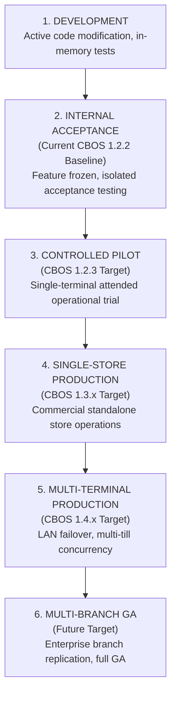

# CBOS Product Readiness Levels & Evidence Standards

| Attribute | Details |
| :--- | :--- |
| **Area** | Release Qualification & Commercial Governance |
| **Audience** | Leadership, Product Management, QA, Operations |
| **Last Reviewed Version** | CBOS 1.2.2 |
| **Status** | **PERMANENT STANDARD** |
| **Classification** | **PUBLIC-SAFE** |

---

## 1. Executive Purpose

To prevent overstated maturity claims, software builds in the Clovent Business Operating System must qualify against strictly defined **Product Readiness Levels**. A build or milestone may not claim commercial or pilot readiness merely because automated unit tests pass in-memory.

---

## 2. Product Readiness Hierarchy

### Level 1: DEVELOPMENT
- **Scope:** Active feature authoring, refactoring, and prototype development.
- **Evidence Requirement:** Debug compilation clean, component unit tests passing.
- **Commercial Standing:** Strictly non-deployable.

### Level 2: INTERNAL ACCEPTANCE (Current CBOS 1.2.2 Baseline)
- **Scope:** Feature freeze across planned milestone scope. Validation of core bounded-context architecture and structural contracts.
- **Evidence Requirement:**
  - Full solution compilation clean in `Debug` and `Release` modes.
  - Automated unit and integration test suite passing with 100% workstation isolation.
  - Clean Windows Sandbox installation and launch qualification.
  - ReleaseGuard hygiene scan passing (`0` exit code).
- **Commercial Standing:** **INTERNAL BASELINE ONLY**. Not certified for customer pilot, not approved for paid commercial deployments.

### Level 3: CONTROLLED PILOT (CBOS 1.2.3 Target)
- **Scope:** Attended, single-terminal operational trial in a friendly/monitored live store environment.
- **Evidence Requirement:**
  - Level 2 criteria satisfied.
  - All critical hardening tasks resolved (admin username bypass eliminated, manager elevation fail-closed, brute-force PIN protection, payment idempotency, centralized financial rounding, Day Close correctness, completed-order void prohibition, atomic configuration writes).
  - Real Microsoft SQL Server validation verified under concurrent load.
  - Authenticode code signing verified.
  - Attended operator training and support runbooks validated.
- **Commercial Standing:** Permitted for monitored single-terminal trial operations under vendor supervision.

### Level 4: SINGLE-STORE PRODUCTION (CBOS 1.3.x Target)
- **Scope:** Standalone unattended commercial production for single-terminal stores.
- **Evidence Requirement:**
  - Level 3 criteria satisfied.
  - Formal compensating Refund and Return domain implemented and verified.
  - High-DPI UI validated across diverse hardware displays.
  - Concurrency-safe number sequencing and Order/Table locking validated on real SQL Server.
  - Automated maintenance and backup scripts verified with documented restore drills.
- **Commercial Standing:** Commercially deployable for single-terminal store profiles.

### Level 5: MULTI-TERMINAL PRODUCTION (CBOS 1.4.x Target)
- **Scope:** Concurrent multi-terminal store deployments with distributed POS tills and kitchen display systems.
- **Evidence Requirement:**
  - Level 4 criteria satisfied.
  - Multi-terminal LAN failover and local peer continuity synchronization validated.
  - Cross-terminal order handoff and table transfer concurrency verified.
  - High-concurrency SQL Server stress testing verified without deadlocks.
- **Commercial Standing:** Commercially deployable for multi-terminal retail and restaurant environments.

### Level 6: MULTI-BRANCH GA (Future Target)
- **Scope:** Full enterprise multi-store chain deployment with central headquarters data replication and multi-branch consolidation.
- **Evidence Requirement:**
  - Multi-branch data replication and consolidation architecture verified.
  - Enterprise disaster recovery drills documented and validated.
- **Commercial Standing:** General Availability (GA) enterprise product.

---

## 3. Truthful Runtime Evidence Standards

All technical reports, commit summaries, and qualification documents must cite evidence strictly using standardized terms:

| Standard Evidence Term | Permitted Usage | Prohibited Usage |
|---|---|---|
| **`STATIC SOURCE CONFIRMED`** | Verified via AST, code inspection, or text analysis. | Claiming runtime execution or bug fix verification without testing. |
| **`AUTOMATED TEST VALIDATED`** | Test executed and passed in test runner. | Claiming live Windows or SQL Server behavior if run against fakes. |
| **`REAL SQL SERVER VALIDATED`** | Executed against real Microsoft SQL Server instance. | Claiming SQL Server compatibility based on in-memory SQLite tests. |
| **`LIVE UI EXECUTED`** | Interactively launched and operated on physical/virtual screen. | Stating this for unit tests, reflection, headless runners, or `DrawToBitmap`. |
| **`LIVE UI NOT EXECUTED`** | Standard reporting when tests ran without interactive UI. | Ommitting UI status when claiming UI changes are complete. |
| **`VISUAL STUDIO DESIGNER UI EXECUTED`** | Form opened in active Visual Studio Designer host. | Claiming this based on compile tests or CodeDom inspection. |
| **`CLEAN MACHINE ACCEPTED`** | Tested in pristine Windows Sandbox or clean VM without dev tools. | Claiming clean install based on developer workstation execution. |
| **`EXTERNAL INTEGRATION VALIDATED`** | Validated against live third-party cloud/hardware service. | Claiming integration readiness based on test simulation gateways. |
