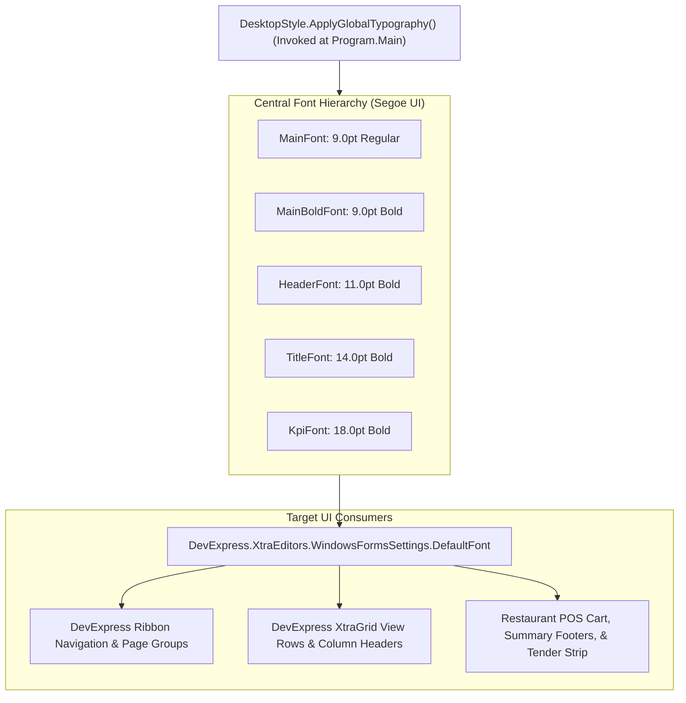

# CBOS UI Typography & High-DPI Engineering Standard

| Attribute | Details |
| :--- | :--- |
| **Area** | User Interface Engineering & High-DPI Scaling |
| **Audience** | Frontend Developers, Desktop Engineers, QA Engineers |
| **Last Reviewed Version** | CBOS 1.2.2 |
| **Status** | **IMPLEMENTED & STANDARDIZED** |
| **Classification** | **PUBLIC-SAFE** |

---

## 1. High-DPI Target Workstation Baseline

CBOS is engineered for modern desktop environments ranging from standard counter registers to high-density 4K touch monitors:
- **Baseline Resolution:** 1920×1080 resolution at **200%–250% Windows scaling** (`DeviceDpi` ~192 to 240).
- **Secondary Validated Modes:** 1366×768 @ 100%, 1920×1080 @ 100%, 1920×1080 @ 150%, 2560×1440 @ 150%, and 3840×2160 @ 200%.
- **High-DPI Configuration:**
  - `<ApplicationHighDpiMode>PerMonitorV2</ApplicationHighDpiMode>` in `Clovent.Desktop.csproj`.
  - Windows Forms `AutoScaleMode` is disabled (`AutoScaleMode.None`) to prevent WinForms from multiplying coordinates; DevExpress vector rendering engines handle display DPI dynamically.

---

## 2. Centralized Typography Scale (`DesktopStyle.cs`)

To eliminate hardcoded font definitions and mismatched sizes across ribbons, grids, and modal dialogs, CBOS centralizes all typography in `src/Clovent.Desktop/Forms/Base/DesktopStyle.cs`:



---

## 3. Dimensional Standards & Sizing Constants

All filter toolbars, search boxes, and buttons adhere to standardized dimensional constants defined in `DesktopStyle.cs`:

| UI Element | Baseline Dimension (96 DPI) | High-DPI Runtime Behavior |
| :--- | :--- | :--- |
| **Standard Toolbar Height** | `DesktopStyle.ToolbarControlHeight` = 30px | Scaled via `DesktopDpi.Scale(30, control)` |
| **Standard Control Gap** | `DesktopStyle.ControlGap` = 8px | Preserves consistent visual rhythm |
| **Small Button Width** | `ButtonWidthSmall` = 80px | Used for "Clear", "Close", "Reset" |
| **Medium Button Width** | `ButtonWidthMedium` = 100px | Used for "Search", "Filter", "Export" |
| **Large Button Width** | `ButtonWidthLarge` = 130px | Used for "Add New", "Save", "Submit" |
| **Search Box Width** | `DesktopStyle.SearchBoxWidth` = 220px | Accommodates full SKU / customer search terms |
| **EntityPicker Logical Width** | 210px–260px | Displays full warehouse/branch names without truncation |

---

## 4. Layout Container Guidelines: Eliminating Clipping

1. **TableLayoutPanel Over FlowLayoutPanel for Toolbars:**
   Filter toolbars must use single-row `TableLayoutPanel` with explicit column widths or `AutoSize`. Wrapping `FlowLayoutPanel` causes toolbar buttons to wrap below the grid boundary on high-DPI scaling.
2. **Vertical Centering:**
   Companion labels must have `Anchor = AnchorStyles.Left` to center vertically against editors.
3. **GridView Header Clipping Prevention:**
   Wrap column sizing adjustments in `BeginUpdate()` and `EndUpdate()`. Calculate minimum column widths using:
   ```csharp
   int minWidth = TextRenderer.MeasureText(caption, font).Width + glyphPadding;
   ```
   Set `ColumnAutoWidth = true` to eliminate unnecessary horizontal scrollbars on full-screen grids.

---

## 5. Cross References
- [WinForms Designer Safety](winforms-designer-safety.md)
- [Coding Guidelines](coding-guidelines.md)
- [Display Settings](../configuration/display-settings.md)
- [ADR-004: Responsive POS Layout](../architecture/adr/ADR-004-Responsive-POS-Layout.md)
