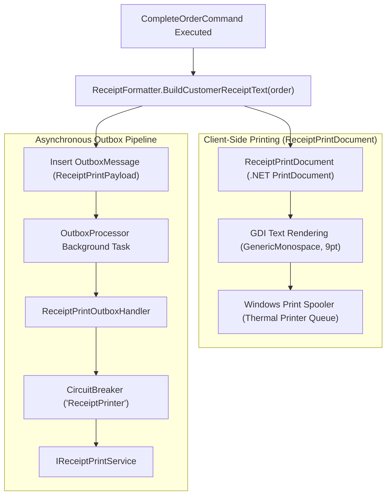

# CBOS Receipt & Kitchen Printing Architecture

| Attribute | Details |
| :--- | :--- |
| **Area** | Hardware Peripherals & Document Generation |
| **Audience** | Hardware Integrators, Desktop Engineers, QA, Field Support |
| **Last Reviewed Version** | CBOS 1.2.2 |
| **Status** | **CURRENT GDI IMPLEMENTED / DIRECT ESC/POS PLANNED** |
| **Classification** | **PUBLIC-SAFE** |

---

## 1. Architectural Overview & Printing Pipeline

Receipt printing in hospitality environments must be reliable, fast, and immune to device errors. In CBOS, printing is divided into two operational pipelines:
1. **Interactive Client Printing (Immediate Customer Receipt):** Executed directly on the POS client thread using .NET's built-in `PrintDocument` via `ReceiptPrintDocument.cs`.
2. **Asynchronous Outbox Printing (Secondary Copies / Kitchen / Audit):** Dispatched asynchronously via the Transactional Outbox pattern (`ReceiptPrintOutboxHandler.cs` and `IReceiptPrintService.cs`), ensuring that physical printer errors (paper jams, buffer full, powered off) never lock the cashier's checkout screen.

---

## 2. Current Implementation: Plain-Text GDI Rendering

### 2.1 The `ReceiptPrintDocument` Engine
Located in `src/Clovent.Desktop/Restaurant/Orders/ReceiptPrintDocument.cs`:
- **Underlying Mechanism:** Inherits directly from `System.Drawing.Printing.PrintDocument`.
- **Text Rendering:** Renders plain text line-by-line using GDI text rendering (`Graphics.DrawString`) with `FontFamily.GenericMonospace` at 9 points.
- **Hardware Agnostic:** Works transparently with any thermal printer installed as a standard Windows print queue (e.g. Epson TM-T88, Star Micronics TSP100, Bixolon, generic POS-58/POS-80 drivers).
- **Automatic Pagination:** Measures line heights against `MarginBounds`; paginates cleanly if a large banquet receipt exceeds a single page boundary.

### 2.2 Reporting & Back-Office Document Generation
Back-office reports (Shift Summary, End of Day, Inventory Stock Ledger, Customer Statements) utilize **DevExpress Reporting** (`DevExpress.XtraReports`). These produce high-fidelity vector PDF documents or standard A4/Letter printouts with full corporate branding.

---

## 3. Asynchronous Outbox Isolation & Error Behavior

When an order is completed:
1. An outbox message with `ReceiptPrintPayload` is atomically enqueued into `[Restaurant].[OutboxMessages]`.
2. `ReceiptPrintOutboxHandler` invokes `IReceiptPrintService.PrintReceiptAsync()`.
3. **Printer Jam / Power Loss:** If the printer goes offline or times out, the handler throws an exception.
4. **Circuit Breaker Action:** After 5 consecutive printer errors, the circuit breaker opens to prevent spooler lockup.
5. **Retry & Health Indication:** The message is rescheduled with exponential backoff. The **Operations Health Center** turns yellow/red, alerting the store manager to check the printer paper roll.

---

## 4. Planned Evolution: Direct ESC/POS Driver Engine

| Feature | CBOS 1.2.2 Current State | Planned Future Release |
| :--- | :--- | :--- |
| **Driver Interface** | Windows Print Queue via GDI `PrintDocument`. | Direct raw byte ESC/POS streaming via TCP sockets and USB virtual COM. |
| **Hardware Cutting** | Handled by Windows printer driver post-print hook. | Explicit ESC/POS pulse and paper cut command bytes (`GS V 66 0`). |
| **Cash Drawer Kick** | Handled by printer driver drawer kick setting. | Direct ESC/POS drawer kick pulse command (`ESC p 0 25 250`). |

---

## 5. Key Classes & Source Traceability

- **POS Print Document:** `src/Clovent.Desktop/Restaurant/Orders/ReceiptPrintDocument.cs`
- **Receipt Text Formatter:** `src/Clovent.Desktop/Restaurant/Orders/ReceiptFormatter.cs`
- **Outbox Print Handler:** `src/Clovent.Restaurant.Application/Outbox/Handlers/ReceiptPrintOutboxHandler.cs`
- **Print Service Abstraction:** `src/Clovent.Restaurant.Application/Printing/IReceiptPrintService.cs`
- **Grid Print Service:** `src/Clovent.Desktop/Forms/Base/GridReportingPrintService.cs`

---

## 6. Cross References
- [Restaurant POS Architecture](../pos/pos-architecture.md)
- [Transactional Outbox Architecture](../architecture/transactional-outbox.md)
- [Operations Health Monitoring](../operations/operations-health.md)
- [Support Runbook: Printer Failure](../support/runbooks/printer-failure.md)
