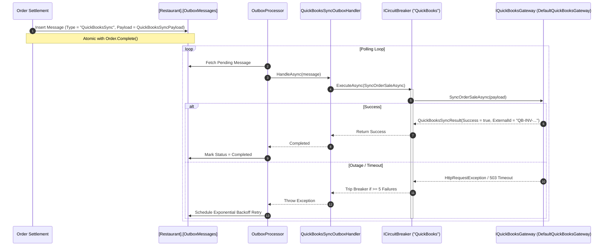

# CBOS QuickBooks Accounting Integration

| Attribute | Details |
| :--- | :--- |
| **Area** | External Accounting & General Ledger Integration |
| **Audience** | Integration Engineers, Financial Controllers, Support |
| **Last Reviewed Version** | CBOS 1.2.2 |
| **Status** | **ARCHITECTURE IMPLEMENTED / PRODUCTION GATEWAY PLANNED** |
| **Classification** | **PUBLIC-SAFE** |

---

## 1. Executive Notice: Current Implementation vs. Production Status

> [!IMPORTANT]
> **STATUS SEPARATION:**
> - **Implemented Architecture:** The Transactional Outbox pipeline, domain payload contracts (`QuickBooksSyncPayload`), asynchronous handler (`QuickBooksSyncOutboxHandler`), circuit breaker protection, and retry logic are **100% implemented and tested**.
> - **Production Integration Status:** In CBOS 1.2.2, external QuickBooks API communication is backed by `DefaultQuickBooksGateway`, an in-memory simulated gateway designed for fault tolerance verification and circuit breaker testing.
> - **Planned Evolution:** Direct cloud communication with the production QuickBooks Online / Desktop REST API via OAuth2 and Intuit SDKs is **PLANNED FOR A FUTURE RELEASE**.

---

## 2. Integration Architecture via Transactional Outbox

To guarantee that accounting sync failures never block cashiers during checkout, QuickBooks synchronization is decoupled from front-of-house transactions using the Transactional Outbox pattern:



---

## 3. Outbox Payload Contract (`QuickBooksSyncPayload`)

The payload serialized into the `OutboxMessage` captures all accounting data required to build a balanced external general ledger entry:

```csharp
public sealed record QuickBooksSyncPayload(
    Guid OrderId,
    string OrderNumber,
    DateTimeOffset CompletedAtUtc,
    string BranchCode,
    string? CustomerName,
    string? CustomerTaxId,
    decimal Subtotal,
    decimal DiscountAmount,
    decimal ServiceCharge,
    decimal TaxAmount,
    decimal TotalAmount,
    IReadOnlyList<QuickBooksLineItemDto> Lines,
    IReadOnlyList<QuickBooksPaymentDto> Payments);
```

### 3.1 Mapping Responsibilities
- **Customer Mapping:** If an order has an associated customer, the payload includes the customer name and tax ID. The gateway resolves or creates the corresponding QuickBooks Customer record. If counter sale, maps to a default "POS Counter Customer".
- **Invoice Creation:** Translates order lines into QuickBooks Sales Receipts or Invoices with sales tax line items.
- **Payment Application:** Maps CBOS payments (Cash, Card) to corresponding QuickBooks Undeposited Funds or Bank Clearing accounts.
- **Rounding Handling:** Fractional cents (differences below `0.005m`) map to a standard "POS Rounding Difference" expense/income account.

---

## 4. Fault Handling & Circuit Breaker Protection

- **Circuit Breaker Key:** `"QuickBooks"` via `ICircuitBreakerRegistry.GetOrCreate("QuickBooks")`.
- **Fast-Failing:** If QuickBooks Online is unreachable, the circuit breaker opens after 5 failures. Subsequent messages fast-fail immediately without consuming network thread pools.
- **Dead-Letter Handling:** After reaching the retry threshold, messages transition to `DeadLetter` and trigger an alert on the **Operations Health Center** screen.

---

## 5. Key Classes & Source Traceability

- **Outbox Handler:** `src/Clovent.Restaurant.Application/Outbox/Handlers/QuickBooksSyncOutboxHandler.cs`
- **Gateway Interface:** `src/Clovent.Restaurant.Application/QuickBooks/IQuickBooksGateway.cs`
- **Default Gateway Implementation:** `src/Clovent.Restaurant.Application/QuickBooks/DefaultQuickBooksGateway.cs`
- **Payload DTO:** `src/Clovent.Restaurant.Application/Outbox/Dtos/OutboxPayloads.cs`

---

## 6. Cross References
- [Transactional Outbox Architecture](../architecture/transactional-outbox.md)
- [Operations Health Monitoring](../operations/operations-health.md)
- [Support Runbook: Outbox Stalled](../support/runbooks/outbox-stalled.md)
