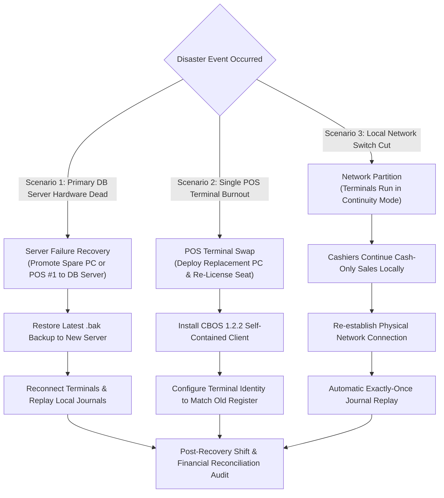

# CBOS Disaster Recovery Planning & Business Continuity

| Attribute | Details |
| :--- | :--- |
| **Area** | Business Continuity & Catastrophic Failure Recovery |
| **Audience** | Chief Technology Officers, IT Directors, Support Leads |
| **Last Reviewed Version** | CBOS 1.2.2 |
| **Status** | **PROCEDURAL STANDARD** |
| **Classification** | **PUBLIC-SAFE** |

---

## 1. Disaster Recovery Objectives

The CBOS Disaster Recovery (DR) plan establishes recovery procedures for high-impact failure scenarios (server hardware crashes, disk failures, ransomware attacks, and store power outages):

- **Recovery Point Objective (RPO):**
  - Normal SQL Server Backups: **1 Hour** (with hourly scheduled diff/transaction logs) or **24 Hours** (with daily standard backups).
  - Front-of-House POS Sales: **Near Zero (0 Seconds)** — Offline emergency sales are preserved in the local encrypted `continuity_journal.dat` on each POS terminal.
- **Recovery Time Objective (RTO):**
  - Standalone Terminal Swap: **< 15 Minutes** (deploy replacement PC, restore DB backup, re-bind terminal).
  - Database Server Failure: **< 30 Minutes** (restore backup to secondary server or promote secondary workstation).

---

## 2. Disaster Recovery Scenarios & Execution

---

## 3. Scenario 1: Primary Database Server Hardware Failure

When the dedicated database server experiences an unrecoverable hardware failure:
1. **Identify Replacement Host:** Select an on-site back-office PC or spare workstation with Windows 10/11 Pro or Windows Server.
2. **Install SQL Server:** Install Microsoft SQL Server Express 2022 (or Standard). Enable TCP/IP on Port 1433 and configure firewall rules.
3. **Restore Database:** Copy the latest backup archive (`CBOS_Full_*.bak`) and execute the restore script via `sqlcmd`.
4. **Provision Accounts:** Ensure `cbos_app` user exists with `db_datareader`, `db_datawriter`, and `EXECUTE` privileges.
5. **Re-Point Terminal Clients:** On each POS terminal, launch CBOS holding `Shift` or launch `DatabaseConnectionDialog` to update the server hostname.
6. **Replay Offline Journals:** As each POS terminal reconnects to the newly restored server, `ContinuityCoordinator` automatically reads local `continuity_journal.dat` files, verifies HMAC signatures, and replays emergency cash transactions.

---

## 4. Scenario 2: Individual POS Register Hardware Failure

When an individual POS register hardware unit burns out (power supply, motherboard):
1. **Physical Swap:** Deploy a replacement Windows 10/11 workstation.
2. **Install CBOS Client:** Run `Clovent.BusinessOperatingSystem-1.2.2-Setup.exe`.
3. **Terminal Binding:** In `%LOCALAPPDATA%\Clovent\pos_settings.json` or during setup, bind the new machine to the existing register code (e.g. `REG-01`).
4. **License Re-Issuance:** Because commercial licenses are hardware-bound (`MachineFingerprint`), contact Clovent licensing support to generate a replacement `.lic` file for the new machine fingerprint, or activate the 30-day evaluation trial temporarily to resume immediate trading.
5. **Damaged Drive Journal Extraction:** If the failed PC was operating in Continuity Mode before hardware death, mount the drive externally to copy `C:\ProgramData\Clovent\BusinessOperatingSystem\continuity_journal.dat` to prevent losing un-replayed cash sales.

---

## 5. Post-Recovery Financial & Reconciliation Audit

Following any disaster recovery restore:
1. **Audit Uncounted Shifts:** Open Back Office -> Restaurant -> Shifts. Reconcile any shifts that were active during the outage.
2. **Inspect Replayed Journal Logs:** Confirm on the **Operations Health Center** that all offline continuity transactions replayed successfully with zero dead-letter errors.
3. **Run End of Day Report:** Generate the daily sales summary and compare total physical cash counted in drawers against recorded register sales.

---

## 6. Cross References
- [Backup & Restore Procedures](backup-and-restore.md)
- [Operations Health Monitoring](operations-health.md)
- [Continuity Mode Architecture](../resilience/continuity-mode.md)
- [Software Licensing](../security/licensing.md)
