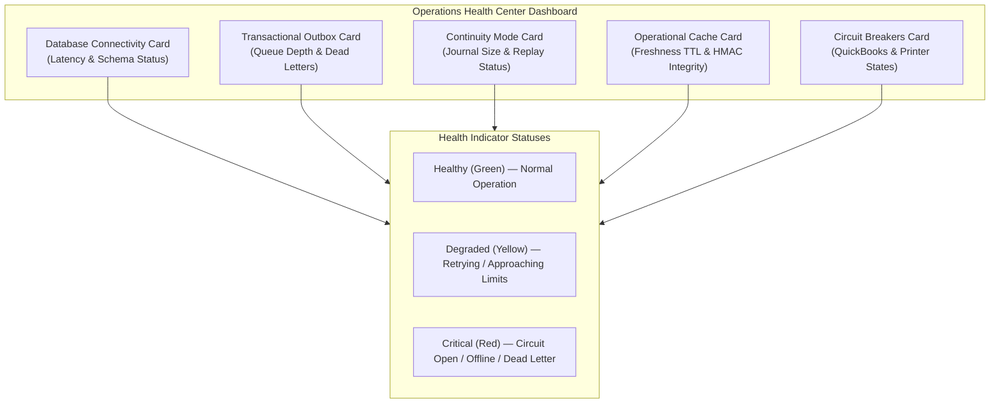

# CBOS Operations Health Monitoring

| Attribute | Details |
| :--- | :--- |
| **Area** | Workstation Health & Operational Observability |
| **Audience** | Store Managers, Systems Administrators, Support Technicians |
| **Last Reviewed Version** | CBOS 1.2.2 |
| **Status** | **IMPLEMENTED** |
| **Classification** | **PUBLIC-SAFE** |

---

## 1. Operations Health Center Overview

The **Operations Health Center** (`OperationsHealthDialog.cs` / `SupportDiagnosticsForm.cs`) provides real-time operational visibility into core subsystem health directly from POS and Back Office workstations:
- Access via: Top navigation health badge on `RestaurantPosForm`, Back Office toolbar, or `--diagnostics` command-line switch.
- Purpose: Provide cashiers and store managers with immediate, color-coded diagnostic awareness without requiring SQL Server Management Studio or server access.

---

## 2. Health Monitoring Cards Reference

### 2.1 Database Connectivity Card
- **Monitored Metric:** Active round-trip SQL Server ping and latency (ms).
- **Green:** Connected, latency < 50ms, schema version compatible.
- **Yellow:** Latency > 150ms (network congestion or database locking).
- **Red:** Disconnected / socket error (POS transitions to Continuity Mode).

### 2.2 Transactional Outbox Card
- **Monitored Metrics:** Total pending messages, in-progress count, retry backoff backlog, and dead-letter count.
- **Green:** Queue depth < 20 messages, 0 dead-letter messages.
- **Yellow:** Queue depth between 20 and 100 messages (transient retry backoff).
- **Red:** Queue depth > 100 messages or `DeadLetterCount > 0` (requires administrator inspection).

### 2.3 Continuity Mode & Emergency Journal Card
- **Monitored Metrics:** Current operating mode (`Online` vs `Continuity`), pending offline journal entry count, and replay status.
- **Green:** Online, 0 pending emergency journal entries.
- **Yellow:** Replaying pending offline sales into central SQL Server.
- **Red:** Operating in Emergency Continuity Mode (Cash-only selling active).

### 2.4 Operational Cache Card
- **Monitored Metrics:** Cache file timestamp, TTL remaining (hours), and HMAC signature verification.
- **Green:** Cache valid, TTL > 6 hours remaining, HMAC signature verified.
- **Yellow:** Cache TTL < 6 hours remaining (refresh recommended).
- **Red:** Cache expired (`TTL <= 0`) or HMAC signature invalid (`Tampered`).

### 2.5 Circuit Breakers Card
- **Monitored Metrics:** States of registered circuit breakers:
  - `QuickBooks`: `Closed` (Normal), `HalfOpen` (Probing), `Open` (Trip).
  - `ReceiptPrinter`: `Closed` (Normal), `Open` (Paper out / disconnected).
- **Green:** All circuits `Closed`.
- **Yellow:** One or more circuits in `HalfOpen` probe mode.
- **Red:** One or more circuits `Open` (external integration currently suspended).

---

## 3. Current Implementation vs. Future Observability

| Feature | CBOS 1.2.2 Current State | Planned Future Evolution |
| :--- | :--- | :--- |
| **Dashboard Display** | Interactive desktop dialog (`OperationsHealthDialog.cs`). | Cloud telemetry portal aggregating multi-store health metrics. |
| **Alerting** | Visual UI badge color change (Green / Yellow / Red). | Automated email / webhook alerts on dead-letter or circuit trip. |
| **Metrics Collection** | Local periodic timer poll (30-second interval). | OpenTelemetry metrics and structured Prometheus exporter. |

---

## 4. Key Classes & Source Traceability

- **Health Form:** `src/Clovent.Desktop/Diagnostics/SupportDiagnosticsForm.cs`
- **Circuit Breaker Registry:** `src/Clovent.Platform/CircuitBreakers/CircuitBreakerRegistry.cs`
- **Outbox Processor:** `src/Clovent.Restaurant.Infrastructure/Outbox/OutboxProcessor.cs`
- **Continuity Coordinator:** `src/Clovent.Desktop/Restaurant/Services/ContinuityCoordinator.cs`
- **Cache Store:** `src/Clovent.Restaurant.Infrastructure/Continuity/ProtectedOperationalCacheStore.cs`

---

## 5. Cross References
- [Transactional Outbox Architecture](../architecture/transactional-outbox.md)
- [Continuity Mode Architecture](../resilience/continuity-mode.md)
- [Support Runbook: Outbox Stalled](../support/runbooks/outbox-stalled.md)
