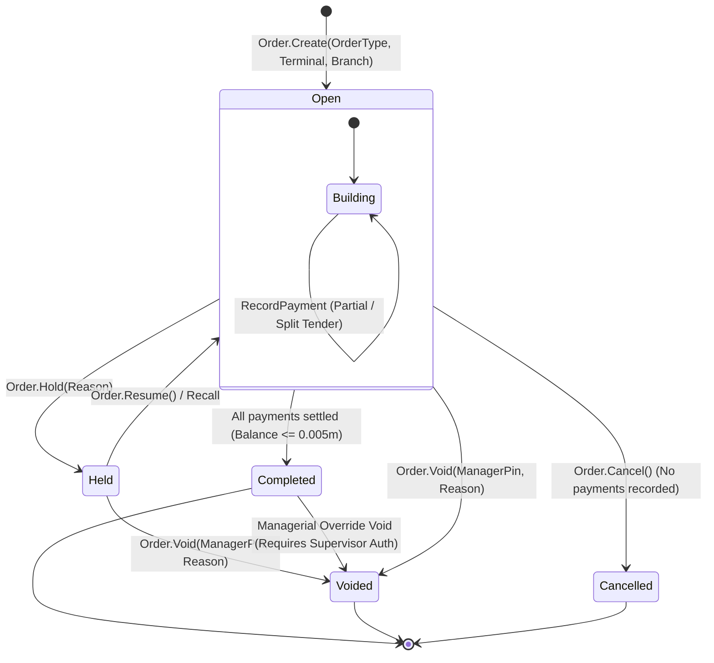

# CBOS Order Lifecycle & Workflow State Machine

| Attribute | Details |
| :--- | :--- |
| **Area** | Restaurant Operations & Sales Workflow |
| **Audience** | Backend Engineers, QA Engineers, Support Technicians |
| **Last Reviewed Version** | CBOS 1.2.2 |
| **Status** | **SOURCE-VERIFIED** |
| **Classification** | **PUBLIC-SAFE** |

---

## 1. Order Status State Machine

The lifecycle of a customer order in the `Restaurant` bounded context is modeled by the `Order` aggregate root (`src/Clovent.Restaurant/Orders/Order.cs`) and governed by the `OrderStatus` enum (`src/Clovent.Restaurant/Orders/OrderStatus.cs`):

---

## 2. Order States Reference

### 2.1 `Open`
- **Definition:** The active working state. Lines, quantities, modifiers, discounts, and payments may be continuously added, adjusted, or removed.
- **Allowed Operations:**
  - `AddLine(ProductVariantId, Quantity, UnitPrice)`
  - `UpdateLineQuantity(OrderLineId, NewQuantity)`
  - `OverrideLinePrice(OrderLineId, NewPrice, ManagerPin)`
  - `VoidLine(OrderLineId, Reason)`
  - `ApplyDiscount(DiscountType, Amount)`
  - `ApplyServiceCharge(Percentage)`
  - `AssignTable(TableId)`
  - `AssignCustomer(CustomerId)`
  - `SendToKitchen()` -> Generates kitchen tickets for unprinted lines.
  - `RecordPayment(PaymentMethodId, Amount)` -> Adds tender records.

### 2.2 `Held`
- **Definition:** Temporarily suspended order. Occurs when a dining party changes tables, steps away from the counter to review their order, or a drive-thru vehicle is pulled forward.
- **Allowed Operations:**
  - `Order.Resume()` returns the order to `Open` state for modification or settlement.
  - `Order.Void()` with managerial justification.

### 2.3 `Completed`
- **Definition:** Fully paid and finalized check.
- **Completion Trigger:** Automatically achieved when `PaidAmount + OnAccountAmount >= TotalAmount` within a half-cent tolerance (`BalanceEpsilon = 0.005m`).
- **Post-Completion Invariants:** No new order lines or payment adjustments can be added.
- **Outbox Side Effects:** Triggers generation of `QuickBooksSync`, `ReceiptPrint`, and `InventoryPosting` messages in the Transactional Outbox.

### 2.4 `Voided`
- **Definition:** Invalidated order. Can occur from `Open`, `Held`, or as an exceptional managerial override on an already `Completed` order.
- **Audit Rules:** Requires mandatory manager authorization and free-text justification reason. Historical records remain in the database for financial audit inspection; rows are never physically deleted.

### 2.5 `Cancelled`
- **Definition:** Abandoned order discarded before any payment was recorded (e.g. customer walked away before paying at the counter).
- **Rule:** Permitted only if zero payments have been posted to the check.

---

## 3. Critical Notice on Returns & Refunds

> [!WARNING]
> **REFUND DOMAIN NOT YET IMPLEMENTED**
>
> In CBOS 1.2.2, a dedicated **Refund / Return Aggregate** is **NOT** implemented in the domain layer.
> - While open orders can be cancelled and completed checks can be voided via managerial authorization, customer return slips, credit vouchers, partial item returns against completed orders, and refund tender transactions are not currently modeled in the codebase.
> - **Operational Workaround:** Cashiers void the errant order under managerial elevation or post manual inventory adjustments.
> - **Roadmap Status:** A formal Refund & Return domain aggregate is planned for a future milestone. Do not present refund features as available in current production deployments.

---

## 4. Kitchen Ticket Dispatching

When an order in the `Open` state has new prepared items added, the cashier executes `Send to Kitchen`:
1. Collects unprinted order lines belonging to kitchen-routed categories.
2. Creates an immutable `KitchenTicket` record.
3. Formats course tickets (Appetizer, Main, Dessert) with line-level chef notes.
4. Kitchen tickets are dispatched to the kitchen display / ticket printer via the Transactional Outbox.

---

## 5. Key Classes & Source Traceability

- **Aggregate Root:** `src/Clovent.Restaurant/Orders/Order.cs`
- **Status Enum:** `src/Clovent.Restaurant/Orders/OrderStatus.cs`
- **Line Entity:** `src/Clovent.Restaurant/OrderLines/OrderLine.cs`
- **Domain Events:** `src/Clovent.Restaurant/Orders/Events/` (`OrderCreated`, `OrderLineAdded`, `OrderPaymentRecorded`, `OrderCompleted`, `OrderVoided`, `OrderCancelled`)
- **Payment Rules:** `src/Clovent.Desktop/Restaurant/Orders/PosPaymentRules.cs`

---

## 6. Cross References
- [Restaurant POS Architecture](pos-architecture.md)
- [Payments & Settlement Architecture](payments.md)
- [Shifts & Cash Management](shifts-and-cash-management.md)
- [Transactional Outbox Architecture](../architecture/transactional-outbox.md)
