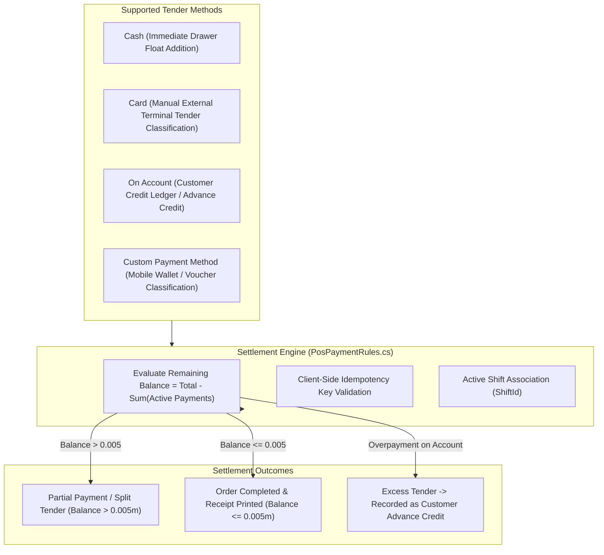

# CBOS Payments & Settlement Architecture

| Attribute | Details |
| :--- | :--- |
| **Area** | Financial Settlement & Tender Processing |
| **Audience** | POS Developers, Payment Engineers, Compliance Auditors, Support |
| **Last Reviewed Version** | CBOS 1.2.2 |
| **Status** | **FACTUAL BASELINE** |
| **Classification** | **PUBLIC-SAFE** |

---

## 1. Settlement Architectural Overview

The payment subsystem in CBOS processes monetary tenders tendered against an active `Order`. Governed by the `Payment` aggregate (`src/Clovent.Restaurant/Payments/Payment.cs`) and `PosPaymentRules` (`src/Clovent.Desktop/Restaurant/Orders/PosPaymentRules.cs`), payments in CBOS are strictly additive, immutable financial records:

---

## 2. Supported Tender Methods

### 2.1 Cash
- **Workflow:** Cashier enters amount tendered or clicks quick-cash denominations (`Exact`, `500`, `1000`, `5000`).
- **Drawer Linkage:** Tendered cash is automatically linked to the active `ShiftId`.
- **Change Calculation:** If tendered cash exceeds the bill total, change returned to the customer is calculated and displayed on screen ($\text{Change} = \text{Cash Tendered} - \text{Net Cash Applied}$). The recorded payment applies the exact required settlement amount.

### 2.2 Card (Debit / Credit) — Manual Tender Classification Only
> [!IMPORTANT]
> **NO DIRECT CARD PROCESSOR INTEGRATION:**
> - CBOS does **not** directly integrate with bank card acquirers, payment processors, or EMV card readers.
> - **Workflow:** The cashier charges the card on a standalone, external merchant payment terminal (EFTPOS/cellular card reader). Upon receiving a successful printed authorization slip, the cashier selects `Card` in CBOS and optionally records the card brand and external terminal approval code.
> - **Compliance Note:** CBOS is **not** PCI-DSS certified and does **not** collect, process, or store cardholder Primary Account Numbers (PAN), CVVs, or track data.

### 2.3 On Account (Customer Credit Sales)
- **Workflow:** Allows trusted corporate or repeat customers to purchase on credit.
- **Credit Limit Verification & Manager Elevation (TASK-05):** Validates that the credit sale does not breach the customer's `CreditLimit`. Exceeding limits requires fail-closed managerial approval (cannot be forged with a bare Boolean).
- **Ledger Posting (Approved Current Behavior):** Posts a debit entry in `[Restaurant].[CustomerLedgerEntries]` increasing the customer's accounts receivable (`OutstandingBalance`). Dual entries and automated advance creation/consumption are unsupported in 1.2.2 and require a separately reviewed financial contract before introduction. Do not introduce new advance-payment functionality.

### 2.4 Split Tender
Split billing in CBOS is an inherent property of the relational data model. An `Order` accumulates multiple `Payment` records (e.g. $20 Cash + $30 Card, or Cash + On Account) until the remaining unpaid balance is settled. (Note: Baseline 1.2.2 uses `BalanceEpsilon = 0.005m`; complete elimination of `BalanceEpsilon` in favor of exact 2-decimal zero-balance settlement is scheduled under **TASK-04: BalanceEpsilon Elimination + Completed Void Restriction**).

---

## 3. Payment Identity Governance & Immutability (TASK-05: Payment Idempotency + Credit-Limit Approval)

To prevent duplicate charges caused by double-clicking payment buttons, rapid cashier inputs, or network retransmissions during high cashier velocity:
1. **Exact Payment Identity Rule:**
   - Generate `PaymentAttemptId` once per intentional payment attempt.
   - Reuse it across retries, retransmissions, and duplicate UI submissions.
   - A genuinely separate intentional payment receives a new ID.
   - Reusing an ID with conflicting payment details must be rejected.
   - *(Do not prescribe a new schema for this documentation task).*
2. **Persistence Boundary Enforcement:** Handlers and database configurations enforce uniqueness and idempotency constraints on active payments.
3. **Immutable Financial Facts vs. Metadata:** Completed payment records, amounts, tenders, and receipt snapshots are strictly immutable. They are explicitly distinguished from operational metadata updates (such as notes); financial corrections through metadata exceptions are strictly prohibited. Adjustments occur exclusively via compensating entries (compensating transactions correct posted financial effects; unpaid draft cancellation remains possible under domain rules).

---

## 4. Key Classes & Source Traceability

- **Payment Aggregate:** `src/Clovent.Restaurant/Payments/Payment.cs`
- **Payment Method Aggregate:** `src/Clovent.Restaurant/PaymentMethods/PaymentMethod.cs`
- **Payment Presentation Rules:** `src/Clovent.Desktop/Restaurant/Orders/PosPaymentRules.cs`
- **Customer Ledger:** `src/Clovent.Restaurant/Customers/CustomerLedgerEntry.cs`
- **Customer Payment Allocations:** `src/Clovent.Restaurant/Customers/CustomerPaymentAllocation.cs`

---

## 5. Cross References
- [Order Lifecycle Documentation](order-lifecycle.md)
- [Shifts & Cash Management](shifts-and-cash-management.md)
- [Financial Integrity Rules](../../.agents/rules/financial-integrity.md)
- [PDR-0003: Completed Financial Immutability](../product/pdr/PDR-0003-completed-financial-transaction-immutability.md)
- [PDR-0004: Transactional Currency Precision](../product/pdr/PDR-0004-transactional-currency-precision.md)
