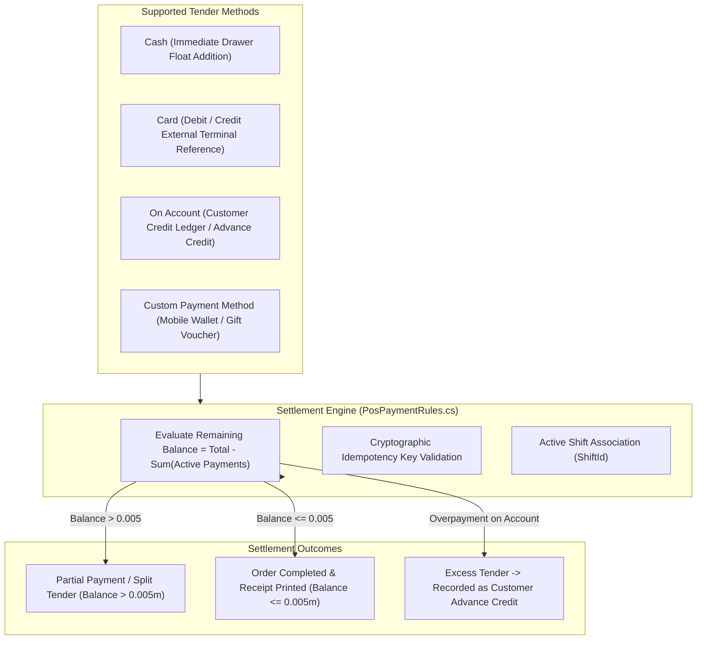

# CBOS Payments & Settlement Architecture

| Attribute | Details |
| :--- | :--- |
| **Area** | Financial Settlement & Tender Processing |
| **Audience** | POS Developers, Payment Engineers, Compliance Auditors, Support |
| **Last Reviewed Version** | CBOS 1.2.2 |
| **Status** | **IMPLEMENTED** |
| **Classification** | **PUBLIC-SAFE** |

---

## 1. Settlement Architectural Overview

The payment subsystem in CBOS processes monetary tenders tendered against an active `Order`. Governed by the `Payment` aggregate (`src/Clovent.Restaurant/Payments/Payment.cs`) and `PosPaymentRules` (`src/Clovent.Desktop/Restaurant/Orders/PosPaymentRules.cs`), payments in CBOS are strictly additive, immutable financial records:

---

## 2. Supported Tender Methods

### 2.1 Cash
- **Workflow:** Cashier enters amount tendered or clicks quick-cash denominations (`Exact`, `500`, `1000`, `5000`).
- **Drawer Linkage:** Tendered cash is automatically linked to the active `ShiftId`.
- **Change Calculation:** If tendered cash exceeds the bill total, change is calculated and displayed on screen; the payment record is saved for the exact bill total (or the overage is recorded as customer advance if account-linked).

### 2.2 Card (Debit / Credit)
- **External Payment Boundary:** CBOS does **not** directly integrate with card merchant acquirers or bank payment SDKs.
- **Workflow:** The cashier charges the card on a standalone, external bank payment terminal (EFTPOS/dial-up/cellular terminal). Upon receiving a successful printed authorization slip, the cashier selects `Card` in CBOS and optionally records the card brand and external terminal approval code.
- **Compliance Note:** CBOS is **not** PCI-DSS certified and does **not** collect, process, or store cardholder Primary Account Numbers (PAN), magnetic stripes, or CVVs.

### 2.3 On Account (Customer Credit Sales)
- **Workflow:** Allows trusted corporate or repeat customers to purchase on credit.
- **Credit Limit Verification:** Validates that the order amount does not breach the customer's `CreditLimit`.
- **Ledger Posting:** Creates a debit entry in `[Restaurant].[CustomerLedgerEntries]` increasing the customer's accounts receivable balance.
- **Advance Balance Consumption:** If the customer holds pre-paid advance credits (`AdvanceBalance > 0`), CBOS consumes advance credits first before extending new credit.

### 2.4 Split Tender
Split billing in CBOS is an inherent property of the relational data model. An `Order` accumulates multiple `Payment` records (e.g. $20 Cash + $30 Card) until the remaining unpaid balance is at or below half a cent (`BalanceEpsilon = 0.005m`).

---

## 3. Payment Idempotency & Immutability

To prevent duplicate charges caused by double-clicking payment buttons or network retransmissions during high cashier velocity:
1. Every payment submission generates a client-side idempotency key (`IdempotencyKey`).
2. The database configuration enforces a unique constraint on active payments by idempotency key.
3. If an identical command is retried, the existing payment record is returned without creating duplicate financial debits.
4. Payments are **immutable**: a payment recorded in error is voided via `Payment.Void()`, setting `IsVoided = true`. Historical records are never deleted.

---

## 4. Key Classes & Source Traceability

- **Payment Aggregate:** `src/Clovent.Restaurant/Payments/Payment.cs`
- **Payment Method Aggregate:** `src/Clovent.Restaurant/PaymentMethods/PaymentMethod.cs`
- **Payment Presentation Rules:** `src/Clovent.Desktop/Restaurant/Orders/PosPaymentRules.cs`
- **Customer Ledger:** `src/Clovent.Restaurant/Customers/CustomerLedgerEntry.cs`
- **Customer Payment Allocations:** `src/Clovent.Restaurant/Customers/CustomerPaymentAllocation.cs`

---

## 5. Cross References
- [Order Lifecycle Documentation](order-lifecycle.md)
- [Shifts & Cash Management](shifts-and-cash-management.md)
- [ADR-002: Integrated Payment Tender Strip](../architecture/adr/ADR-002-Payment-Tender-Strip.md)
- [ADR-005: Customer Credit Workflow](../architecture/adr/ADR-005-Customer-Credit-Workflow.md)
