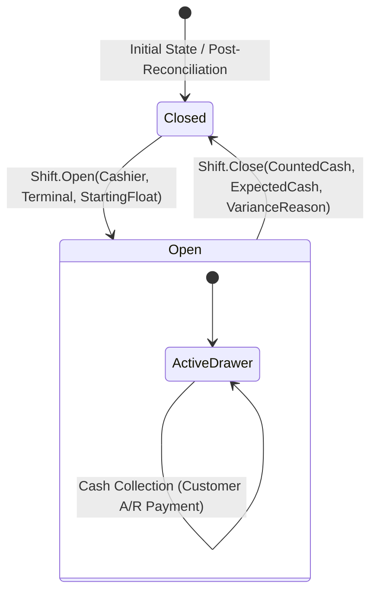

# CBOS Shifts & Cash Drawer Management

| Attribute | Details |
| :--- | :--- |
| **Area** | Cash Management & Till Session Reconciliation |
| **Audience** | Cashiers, Store Managers, Audit Teams, Support |
| **Last Reviewed Version** | CBOS 1.2.2 |
| **Status** | **IMPLEMENTED** |
| **Classification** | **PUBLIC-SAFE** |

---

## 1. Shift Lifecycle Overview

Cash management in CBOS enforces strict accountability for currency physical floats in cash drawers. Each till session is modeled as an aggregate root: `Shift` (`src/Clovent.Restaurant/Shifts/Shift.cs`).

A shift binds a specific **Cashier** to a specific **Terminal**, **Branch**, and **Warehouse** for a bounded operational duration.

---

## 2. Shift Operations Reference

### 2.1 Opening a Shift
- **Trigger:** Initiated upon first cashier sign-in via `IPosEntryGateCoordinator.EnsureShiftAndOpenPosAsync()`.
- **Mandatory Input:** Cashier must count and enter the starting drawer cash float (`StartingCash`).
- **Initial Status:** `ShiftStatus.Open`.
- **Open Shift Invariant:** While the shift is open, `CountedCash` and `CashVariance` are uncalculated (`null`), rendering as `"N/A"` on reports. **Displaying negative or fake variances for active open shifts is strictly forbidden.**

### 2.2 Mid-Shift Cash Movements (`CashMovement`)
During service, currency additions or extractions that do not originate from immediate customer sales must be recorded via `Shift.AddCashMovement()`:
- **`CashIn`:** Drawer float replenishment, coin roll purchases, or bank deposits.
- **`CashOut`:** Safe drops, manager mid-day sweeps, or authorized petty cash disbursements (e.g. ice purchase).
- **Mandatory Fields:** Movement Type, Amount, Business Reason, and Authorizing User ID.

### 2.3 Non-Overlapping Tender & Collection Linking
- **Net Cash Sales:** Net cash applied from sales ($\text{Cash Tendered} - \text{Change}$) during the shift, including the cash portion of every supported split tender (such as Cash plus Card, or Cash plus On Account), without double-counting collections. Tendered cash and change are netted to avoid double-counting. Pure non-cash payments (Card) and the credit portion of sales ("On Account") do not enter drawer cash calculations.
- **Customer Collections:** Cash received from customer debt repayments against credit accounts is linked to the active shift, contributing directly to expected drawer cash.
- **Existing Advance Usage:** Consuming pre-existing customer credit/advance balances is neither drawer cash nor new credit extended ("On Account"); it is strictly excluded from cash drawer reconciliation. Do not introduce new advance-payment functionality.
- **Contract Scope:** Any unresolved mappings or edge-case breakdowns are marked as **TASK-03: Financial Rounding Contract** and **TASK-06: Business Day Close Aggregation** contract work. Day Close in TASK-06 captures real Tax and Discount totals, with Refund = 0 because refunds are explicitly disabled for the pilot, not because missing data is concealed (never use zero to conceal unsupported or missing financial data).

### 2.4 Closing & Reconciling a Shift
When a cashier completes their work period, they initiate **Close Shift**:
1. **Blind Cash Count:** The cashier counts the currency and coins in the drawer and enters `CountedCash`.
2. **System Evaluation of Expected Cash:**
   $$\text{Starting Cash Float} + \text{Cash In} + \text{Net Cash Sales} + \text{Cash Collections} - \text{Cash Out} = \text{Expected Cash}$$
3. **Variance Computation:**
   $$\text{Counted Cash} - \text{Expected Cash} = \text{Variance}$$
   - For open/active shifts where no count has occurred, `CountedCash` and `Variance` must remain `null` / `"N/A"`. Fake negative variances are prohibited.
4. **Mandatory Variance Reason:** If `Variance != 0`, the cashier or supervisor must enter a mandatory explanation before closure is accepted.
5. **Final Status:** Transitions to `ShiftStatus.Closed`. The shift summary receipt prints automatically, and expected/counted/variance totals become immutable financial facts. Operational metadata updates cannot alter financial figures.

---

## 3. Current Limitations

1. **Single Active Shift per Terminal/Cashier:**
   - A cashier can operate only one active shift session per terminal. Concurrent shift sharing (multiple cashiers using the same till simultaneously under different shift records) is prohibited by domain rules.
2. **Offline Shift Opening:**
   - In Continuity Mode (database outage), opening a new shift requires reconnection to central SQL Server to guarantee sequential shift numbering. Terminals operating offline continue utilizing their already-opened shift session.

---

## 4. Key Classes & Source Traceability

- **Shift Aggregate Root:** `src/Clovent.Restaurant/Shifts/Shift.cs`
- **Cash Movement Entity:** `src/Clovent.Restaurant/Shifts/CashMovement.cs`
- **Shift Status Enum:** `src/Clovent.Restaurant/Shifts/ShiftStatus.cs`
- **Shift Repository Interface:** `src/Clovent.Restaurant/Shifts/IShiftRepository.cs`
- **Shift Summary Query:** `src/Clovent.Restaurant.Application/Shifts/Queries/GetShiftSummaryQuery.cs`
- **POS Entry Gate Coordinator:** `src/Clovent.Desktop/Restaurant/Services/PosEntryGateCoordinator.cs`

---

## 5. Cross References
- [Restaurant POS Architecture](pos-architecture.md)
- [Payments & Settlement Architecture](payments.md)
- [Order Lifecycle](order-lifecycle.md)
- [Financial & Reporting Semantics](../../AGENTS.md#7-financial--reporting-semantics)
