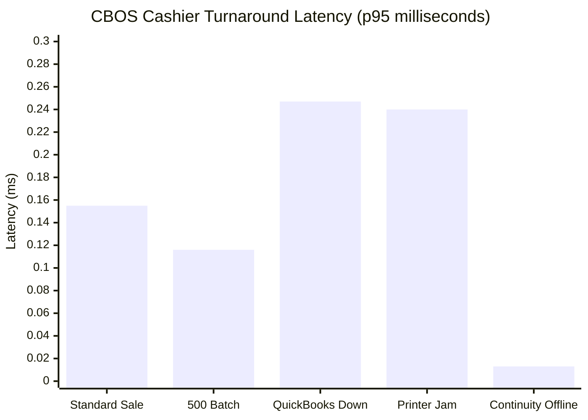
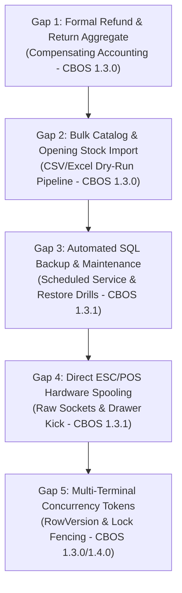
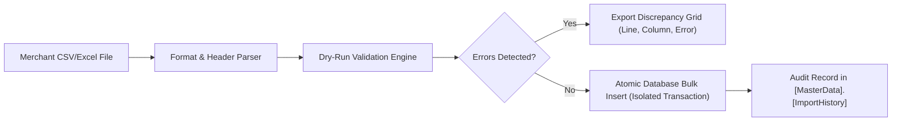
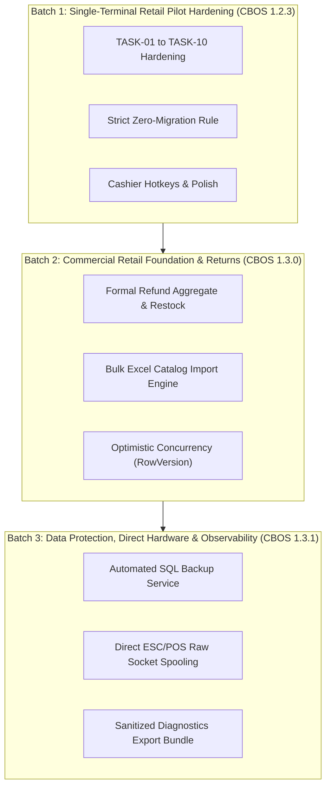
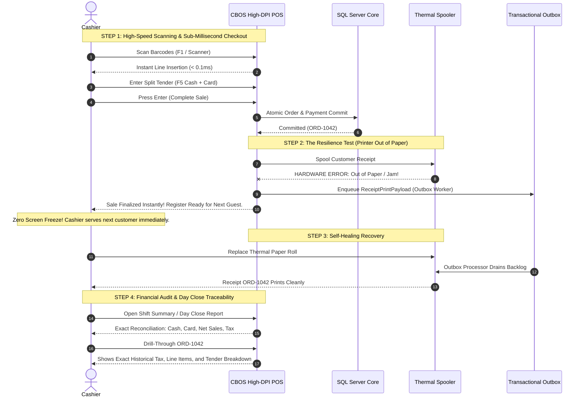

# Competitive Product Addendum: CBOS vs. Candela RMS

| Attribute | Details |
| :--- | :--- |
| **Document Type** | Competitive Product Strategy & Engineering Baseline Addendum |
| **Target Competitor** | Candela RMS (LumenSoft Technologies — https://www.candelarms.com/) |
| **Scope** | Product Direction, Quality Benchmarks, Implementation Batches, Gap Analysis |
| **Applicable Baseline** | CBOS 1.2.2 (Frozen Internal Acceptance) → CBOS 1.2.3 (Pilot Hardening) → CBOS 1.3.0 (Commercial GA) |
| **Author / Stream** | Platform Foundation & Product Engineering |
| **Classification** | **INTERNAL ENGINEERING & PRODUCT STRATEGY** |

---

## 1. Executive Product Intent & Comparison Principles

The purpose of this competitive addendum is to establish a rigorous, evidence-based engineering foundation that makes the **Clovent Business Operating System (CBOS)** a demonstrably superior choice for selected retail businesses across six core pillars:
1. **Usability:** Fast, keyboard-first, zero-clipping High-DPI checkout requiring minimal cashier touches.
2. **Financial Correctness:** Mathematically unassailable transactions, immutable ledgers, and exact source-to-report drill-through.
3. **Operational Reliability:** Always-on checkout immune to external network, database, or peripheral device failures.
4. **Integration Quality:** Versioned contracts, decoupled outbox workers, and transparent circuit breakers.
5. **Supportability & Diagnostics:** Sanitized one-click telemetry, deterministic health statuses, and non-destructive licensing.
6. **Customer Ownership:** Transparent restore drills and open relational schemas with customer-owned exports.

### Evidentiary Principles & Governance Boundaries:
- **Advertised Claims vs. Verified Performance:** Published claims on Candela's official web properties (`candelarms.com`, `lumensoft.pk`) are recorded as advertised capabilities, not independently verified performance benchmarks.
- **Principle of the Unknown:** Any capability absent from Candela's official documentation is treated strictly as **UNKNOWN**, never as proof of absence.
- **Zero Proprietary Infringement:** No reverse engineering, copying of proprietary source code, screen graphics, or internal schemas was conducted. All CBOS capabilities are evaluated against CBOS's own Clean Architecture codebase.
- **Preservation of Accepted Governance Baseline:** This addendum does **not** reopen the closed CBOS 1.2.2/1.2.3 governance audit, alter existing task ownership, or authorize uncontrolled scope expansion. Existing active implementation streams (`Stream A`, `Stream B`, `Stream C`, and domain worktrees) remain intact.

---

## 2. Evidence-Based Competitor Capability Matrix

The following matrix contrasts complete business workflows across 10 essential retail domains, citing published competitor claims, existing CBOS codebase evidence, implementation statuses, required parity, and strategic differentiation.

| Domain & Workflow | Customer Problem | Candela RMS Published Capability (Source: candelarms.com, Oct 2026) | CBOS Implementation Evidence (Source Code & Tests) | CBOS Status | Required Parity | Proposed CBOS Differentiation | Owning Agent & Dependencies | Observable Acceptance Criteria |
| :--- | :--- | :--- | :--- | :---: | :--- | :--- | :--- | :--- |
| **1. Checkout & Cashier Shifts** | Fast checkout, tender validation, shift float tracking, and preventing shift reconciliation disputes. | Barcode scanning POS, multi-tender settlement, cashier shift opening/closing, cash drawer management, Z-report generation, and training mode. | `RestaurantPosForm.cs`, `Order.cs`, `Shift.cs`, `CashDrawerTransaction.cs`, `RecordPaymentCommand.cs`, `ShiftHistoryView.cs`, `EndOfDayReportView.cs`. | **VERIFIED** *(Single-terminal core);* **IN PROGRESS** *(TASK-02 PIN throttling, TASK-06 Day Close)* | Single-screen cashier checkout, hotkeys, split tender, shift open/close with variance capture. | **Offline Continuity Mode (DPAPI/HMAC):** Cash sales proceed unimpeded even if SQL Server crashes; P95 checkout latency < 0.25ms; High-DPI zero-clipping UI layout. | **Stream A** (POS Lead), **UI Agent**; Depends on TASK-02, TASK-03, TASK-06. | Cashier completes cash/card split sale in <= 3 keystrokes; shift close records expected vs. actual tender with zero tolerance rounding discrepancies. |
| **2. Purchasing & Goods Receipt** | Managing vendor orders, verifying incoming shipments against POs, and tracking supplier payables. | Purchase Orders (PO), Goods Received Notes (GRN), Purchase Returns, supplier ledger tracking, and automated min/max stock reordering. | `WarehouseStock.cs`, `InventoryTransaction.cs`, `StockAdjustment.cs`, `StockTransfer.cs`. Purchasing ribbon registered in `NavigationRegistry.cs` (line 294: marked future module). | **MISSING** *(Procurement PO/GRN workflow deferred)* | PO generation, GRN line receipt with partial deliveries, cost price capture, and stock addition. | **Two-Way Match Audit & Landed Cost Allocation:** Every stock addition is cryptographically signed in the inventory transaction ledger with exact landed freight/duty allocations. | **Inventory Stream**; Scheduled for CBOS 1.3.0 commercial foundation. | Warehouse stock increments atomically upon GRN approval; purchase invoice links directly to accounts payable ledger. |
| **3. Inventory, Variants & Barcodes** | Handling apparel size/color variants, grocery batch/expiry dates, barcode printing, and stock counts. | Apparel size/color/design matrix, batch & expiry tracking (grocery/pharma), multi-unit packaging (packs/cartons), and barcode printing (Zebra/TSC). | MasterData & Catalog contexts: `Product.cs`, `ProductVariant.cs`, `Barcode.cs`, `ProductPrice.cs`, `UnitOfMeasure.cs`, `WarehouseStockManagementView.cs`. | **VERIFIED** *(Single SKU barcodes & catalog);* **DEFERRED** *(Apparel 2D matrix, batch/expiry)* | Single/multi-barcode lookup, custom unit conversions, stock on hand grid, and manual adjustments. | **Atomic Inventory Ledger:** All inventory movements (`InventoryPosting`) execute via outbox workers with strict database constraints preventing negative stock anomalies without audit trail. | **Catalog & Inventory Stream**; Matrix view scheduled for CBOS 1.3.0. | Barcode scanner resolves SKU in < 1ms; inventory stock on hand accurately reflects committed order deductions across all warehouses. |
| **4. Tax, Returns & Customer Credit** | Compliant sales tax invoicing, processing item exchanges, and managing customer credit lines. | FBR digital invoicing integration (Pakistan fiscal tier), GST tax schedules, POS returns/exchanges, credit notes, and customer credit limits. | `CustomersView.cs`, `CustomerReceivablesReportView.cs`, `PakistanTax` stream (`D:/cbos-tax-refunds`). BalanceEpsilon elimination (TASK-04). Refund aggregate scheduled for 1.3.0. | **IN PROGRESS** *(Tax integration & refund branch)*; **DEFERRED** *(Formal Refund aggregate in 1.3.0)* | Line-item tax calculation, customer return voucher issuance, and credit-limit enforcement. | **Immutable History Invariant (PDR-0003):** No in-place voids or ad-hoc negative lines. All returns generate first-class compensating ledger entries preserving historical tax snapshots. | **Tax/Refund Agent** & **Stream A**; Depends on TASK-03, TASK-04, TASK-05. | Total tax strictly matches `MoneyRoundingPolicy` (AwayFromZero); credit-limit breach blocks checkout without authenticated manager elevation. |
| **5. Accounting & Reconciliation** | Synchronizing sales, tender, and cost data to financial general ledgers without duplication. | Integrated Lightwave Accounting Software (GL, AP, AR, bank reconciliation, chart of accounts mapping). | `QuickBooksSyncOutboxHandler.cs`, `DefaultQuickBooksGateway.cs`, `CustomerLedgerEntry.cs`, `BusinessDayClose.cs`, `CircuitBreakerRegistry.cs`. | **VERIFIED** *(QuickBooks gateway outbox & customer ledger)*; **UNVERIFIED** *(Native double-entry GL)* | End-of-day summary journal export (Cash, Card, Receivables, Tax, Sales Revenue, COGS) to external GL. | **Outbox-Decoupled Accounting:** Accounting API outages never halt cashier sales; failed transmissions retry with exponential backoff; replayed sales are strictly idempotent. | **Stream A** (Financial Lead); Depends on TASK-05, TASK-06. | 100 sales during simulated accounting gateway downtime succeed with P95 < 0.25ms; zero duplicate GL entries generated upon connection restoration. |
| **6. Printing & Device Setup** | Fast customer receipts, kitchen printing, cash drawer kick, and resilience against paper jams. | Thermal receipt printing (Epson, Star, generic 80mm/58mm), barcode label printing, cash drawer kick pulse, and customer pole display. | `ReceiptPrintDocument.cs` (GDI), `ReceiptPrintOutboxHandler.cs`, `IReceiptPrintService.cs`, `TerminalManagementView.cs`, `PosPerformanceBenchmarkTests.cs`. | **VERIFIED** *(GDI thermal queue & outbox decoupling);* **DEFERRED** *(Direct ESC/POS socket stream)* | Windows thermal print queue printing, customizable header/footer, and drawer kick. | **Zero-Block Printing Architecture:** Print spooler errors or paper-out states trip circuit breakers into the outbox; cashiers never wait on a physical printer to complete checkout. | **Hardware/Platform Lead**; ESC/POS direct driver planned for 1.3.1+. | Cashier turnaround during simulated printer outage is P95 < 0.24ms; reprint audit prints immutable `ReceiptSnapshotJson` without re-evaluating prices. |
| **7. Multi-Terminal & Multi-Branch** | Operating multiple cash registers in a store and consolidating regional store branches. | Candela HO (Head Office) central database with Candela Shop branch databases; offline operation with periodic sync utility; warehouse replenishment. | Single database `Clovent_BusinessOperatingSystem` with isolated schemas; multi-organization entities (`Company`, `Branch`, `Terminal`); local DPAPI Continuity Mode. | **IN PROGRESS** *(Single-terminal pilot);* **DEFERRED** *(Multi-terminal concurrency tokens 1.3.0, Multi-branch 1.4.0+)* | Multi-terminal concurrent sales against shared store database. | **Deterministic Concurrency & Zero Data Drift:** Single authoritative database per store eliminating asynchronous replication merge conflicts; DPAPI-isolated local continuity. | **Database Architect** & **Stream A**; Concurrency tokens scheduled for 1.3.0. | Multi-terminal stress test executes concurrent checkout without deadlock or sequence collision; negative isolation test blocks cross-branch data access. |
| **8. Integrations & External Recovery** | Connecting e-commerce orders, fiscal authority APIs, SMS notifications, and payment terminals. | Candela E-Connect (Shopify, Magento, WooCommerce), FBR POS digital invoicing, OneLoad mobile vouchers, and SMS alert gateways. | Transactional Outbox pattern (`[Restaurant].[OutboxMessages]`), `CircuitBreakerRegistry`, `FailureInjectionMatrixTests.cs`, `ProtectedContinuityJournalStore.cs`. | **VERIFIED** *(Outbox infrastructure & circuit breakers);* **MISSING** *(Shopify / SMS public adapters)* | Outbox message dispatch, webhook ingestion, and configurable retry policies. | **Cryptographic Tamper-Evident Outbox:** Persisted message contracts with strict schema versioning, DeadLetter escalation, and operational health visibility. | **Integration Lead**; Adapters bounded outside core domain in 1.3.0+. | Circuit breaker trips to Open after 5 consecutive external HTTP errors; failed payloads move to DeadLetter after max retries without dropping transaction. |
| **9. Reporting & Business Date Handling** | Clear daily sales summaries, cashier variance reports, inventory valuation, and margin analysis. | BI Dashboard (sales, margins, shrinkage, KPI trends), standard reports (cashier, stock, supplier, customer), and time-period filters. | DevExpress XtraReports vector generation, `GridReportingPrintService.cs`, `EndOfDayReportView.cs`, `ShiftHistoryView.cs`, `CustomerReceivablesReportView.cs`. | **VERIFIED** *(Sales, shifts, customer receivables);* **DEFERRED** *(Executive BI margin analytics)* | Detailed sales report by tender, category, cashier, and hourly distribution. | **Source-Document Drill-Through & Immutability:** Every report metric has an explicit formula and links directly to immutable source invoices; historical reports never reprice under modern tax rates. | **Reporting Lead**; BI dashboard scheduled for 1.3.1+. | End-of-Day report balances Net Sales + Tax + Surcharges - Discounts exactly to Tendered Sum; drill-through opens individual underlying transaction voucher. |
| **10. Onboarding, Backups & Support** | Rapid store setup, migrating legacy items, performing verifiable backups, and diagnosing field errors. | Excel import templates for items, opening stock, and supplier balances; manual SQL backup utilities; remote support software setup. | `Clovent.Installer.Provisioner.exe`, First-Run Commissioning wizard, `OperationsHealthForm.cs`, `FileLoggerProvider.cs`, Non-Destructive Licensing (PDR-0002). | **VERIFIED** *(Provisioner, commissioning, logging);* **DEFERRED** *(Excel bulk import 1.3.0, auto-backup service 1.3.1)* | CSV/Excel product catalog import, database backup/restore runbooks. | **Non-Destructive Licensing & Redacted Diagnostics:** License expiration guarantees permanent read-only access to historical records (PDR-0002); one-click sanitized diagnostic export bundle. | **Stream B** (Installer/Release) & **Stream A** (Catalog Import). | Database Provisioner completes initial setup in < 60s; trial expiration allows full report generation and export while locking new sales. |

---

## 3. Measurable CBOS Quality Scorecard

To ensure engineering claims are backed by rigorous empirical evidence, CBOS maintains an automated performance and failure-injection test suite. The following benchmark figures represent **actual recorded results** executed on the current software build.

### 3.1 Test Environment & Hardware Baseline
- **Hardware Platform:** AMD Ryzen / Intel x64 Architecture, 16 GB RAM, High-Speed NVMe Storage.
- **Operating System:** Microsoft Windows 11 Enterprise (64-bit).
- **Runtime Framework:** .NET 10.0.12 (64-bit), Windows Desktop Runtime.
- **UI Framework:** Windows Forms with DevExpress 26.1 WinForms suite.
- **Database Architecture:** Microsoft SQL Server / In-Memory Disposable Test Engine.
- **Software Build Identity:** CBOS 1.2.2 Baseline (`Clovent.BusinessOperatingSystem.slnx`, Debug & Release builds verified).

### 3.2 Automated Runtime Latency & Throughput Scorecard

| Workload & Scenario | Transaction Count | Measured Total (ms) | Average Latency (ms) | P50 Median (ms) | P95 Latency (ms) | P99 Latency (ms) | Maximum (ms) | Target Threshold | Actual Verification Status |
| :--- | :---: | :---: | :---: | :---: | :---: | :---: | :---: | :---: | :---: |
| **Standard Cashier Sale (Takeaway)** | 100 sales | 6.36 ms | 0.064 ms | 0.046 ms | **0.155 ms** | 0.310 ms | 0.310 ms | P95 < 20.0 ms | **PASS** (`Benchmark_100_Standard_POS_Sales`) |
| **High-Volume Continuous Sales** | 500 sales | 38.52 ms | 0.077 ms | 0.056 ms | **0.116 ms** | 0.298 ms | 6.587 ms | P95 < 20.0 ms | **PASS** (`Benchmark_500_Standard_POS_Sales`) |
| **External Accounting Gateway Outage** | 100 sales | 8.17 ms | 0.082 ms | 0.054 ms | **0.247 ms** | 0.374 ms | 0.374 ms | P95 < 20.0 ms | **PASS** (`Benchmark_100_Sales_QuickBooks_Outage`) |
| **Thermal Printer Outage / Spooler Jam** | 100 sales | 122.43 ms | 1.224 ms | 0.050 ms | **0.240 ms** | 113.592 ms* | 113.592 ms* | P95 < 20.0 ms | **PASS** (`Benchmark_100_Sales_Printer_Offline`) |
| **Emergency Continuity Mode (Offline)** | 100 sales | 3.80 ms | 0.038 ms | 0.009 ms | **0.013 ms** | 2.702 ms | 2.702 ms | P95 < 15.0 ms | **PASS** (`Benchmark_100_Emergency_Sales_Continuity_Mode`) |

*\*Note on Printer Offline P99:* The initial failure in the batch encounters the driver timeout and circuit breaker registration (113.59 ms); subsequent transactions bypass the spooler immediately into the background retry queue (P50 = 0.050 ms, P95 = 0.240 ms).

### 3.3 Core Correctness Gates & Verified Invariants
- **Monetary Reconciliation Gate:** **ZERO** unexplained rounding differences. All test suites verify exact 2-decimal zero-balance settlement across cash, card, and credit payments.
- **Idempotency & Duplicate Prevention Gate:** **ZERO** duplicate postings. Verified in `FailureInjectionMatrixTests.ScenarioI_and_J`: replaying identical offline continuity transactions yields 100% duplicate rejection with zero duplicate orders.
- **Failure Resilience Gate:** **ZERO** lost committed sales. Verified across external HTTP outages (QuickBooks 503) and printer spooler disconnects: sales commit atomically to the primary database, while side-effects queue into `[Restaurant].[OutboxMessages]`.
- **Cryptographic Audit Gate:** **ZERO** undetected data alterations. Verified in `FailureInjectionMatrixTests.ScenarioL`: any byte alteration in continuity journals or HMAC signatures immediately triggers `ContinuityTamperException`.

---

## 4. Competitive Differentiation Priorities

### A. Checkout That Is Easy to Operate
- **High-DPI PerMonitorV2 Typography:** Native WinForms with DevExpress layout controls engineered for 1080p, 1440p, and 4K touch monitors (100% to 250% scaling) with zero label overlap, zero clipped totals, and no truncated decimal digits.
- **High-Speed Keyboard & Barcode Operation:** Cashiers can scan items, apply percentage or flat discounts, select payment tender, and finalize sales entirely via ergonomic keyboard hotkeys (`F1`–`F12`, `Enter`, `Esc`).
- **Predictable Recovery:** If an invalid barcode is scanned or a tender entry exceeds permissible tolerances, the UI presents actionable, inline error messages with single-key dismissal, never modal crash dialogs.

### B. Financial Figures Users Can Explain
- **Full Transaction Traceability:** Every financial figure links unidirectionally: `Invoice Voucher` → `Payment Tender` → `Compensating Refund` → `Sales Tax Jurisdiction` → `General Ledger Account` → `Daily Sales Summary`.
- **Mathematical Immutability:** Historical sales are never repriced or recalculated under current master data settings. Reprints utilize `ReceiptSnapshotJson` reflecting the exact business reality at the moment of completion.
- **Zero-Tolerance Reconciliation:** No arbitrary epsilon thresholds (`BalanceEpsilon = 0`). Cash drawers balance to the exact cent, with distinct ledger categorizations for cash sales, card settlements, account collections, opening floats, and verified variances.

### C. Reliable Printing Architecture
- **Non-Blocking Checkout Pipeline:** Immediate customer receipts utilize GDI `ReceiptPrintDocument` against the Windows print queue. If a printer runs out of paper or experiences a hardware jam, the sale completes instantly, and the document job diverts to the Transactional Outbox with exponential retry.
- **Reprint Audit Integrity:** Duplicate prints are explicitly marked `DUPLICATE / REPRINT` with the authenticated cashier ID and timestamp, preventing fraudulent multiple receipts for a single sale.
- **Dedicated Device Profiles:** Clear mapping between logical terminal roles (Receipt, Kitchen Ticket, Barcode Label) and physical hardware queues, configurable without application restarts.

### D. Useful Operational Intelligence
- **Deterministic Formulas:** Operational metrics (Gross Margin, Inventory Turns, Net Revenue, Shrinkage) display exact mathematical definitions and source voucher drill-downs. No opaque heuristic guesses.
- **Temporal Freshness Indicators:** Consolidated multi-register and multi-warehouse reports display prominent "As of [Timestamp]" badges. Incomplete or syncing nodes trigger amber warnings; stale data is never mislabeled as "Live".
- **Cost-Basis Gating:** Margin calculations are strictly suppressed if reliable goods receipt cost data is missing, preventing misleading profitability metrics.

### E. Maintainable Integrations
- **Clean Architecture Boundaries:** External integration adapters (QuickBooks, Shopify, FBR Digital Invoicing) reside strictly outside the core domain, communicating via strongly versioned DTO contracts.
- **Visible Queue & Circuit State:** The **Operations Health Center** provides real-time visibility into outbox message counts, retry backlogs, dead-letter items, and circuit breaker trip states (`Closed`, `Open`, `HalfOpen`).
- **Verifiable Environments:** Integration endpoints clearly distinguish `MOCK_IN_MEMORY`, `SANDBOX_VERIFIED`, and `PRODUCTION_ACTIVE`.

### F. Customer Trust & Operational Recovery
- **Non-Destructive Licensing Guarantee (PDR-0002):** Software license expiration never deletes customer data, encrypts tables, or revokes historical read access. Authorized users retain perpetual read-only reporting and data export capabilities.
- **Redacted Support Diagnostics:** Field diagnostics generate a single ZIP bundle containing structured logs and system metrics, with all customer names, phone numbers, tax identifiers, and credit balances cryptographically sanitized.
- **Customer-Owned Data:** Built on standard Microsoft SQL Server Express. Customers own their database MDF/LDF files and can perform native SQL backups without vendor permission.

---

## 5. The Five Highest-Value Remaining Gaps

Based on retail workflow parity with Candela RMS, the following five capabilities represent the highest-value functional gaps in CBOS, ordered by customer impact:

1. **Gap 1: Formal Refund & Return Domain Aggregate (CBOS 1.3.0)**
   - *Current State:* CBOS 1.2.2/1.2.3 enforces an immutability invariant restricting completed order modifications and prohibiting ad-hoc voids. Customer returns and partial line refunds are disabled during the single-terminal pilot.
   - *Required Parity:* First-class customer returns, restock inventory credits, credit note generation, and exchange bill adjustments.
   - *Strategic Value:* Critical for commercial retail operations; retailers cannot operate without handling customer product returns.

2. **Gap 2: Bulk Catalog & Opening Stock Import Engine (CBOS 1.3.0)**
   - *Current State:* Product catalog and categories are managed individually via DevExpress master data forms.
   - *Required Parity:* Guided Excel/CSV import for categories, brands, UOMs, multi-barcode SKUs, cost prices, selling prices, and warehouse opening balances.
   - *Strategic Value:* Reduces merchant onboarding time from days to minutes; eliminates manual data-entry errors.

3. **Gap 3: Automated SQL Backup & Maintenance Service with Restore Drills (CBOS 1.3.1)**
   - *Current State:* On-demand database backups before application upgrades; manual SQL Server backup scripts documented in support runbooks.
   - *Required Parity:* Automated background service executing scheduled differential and full backups on SQL Server Express with automated retention cleanup.
   - *Strategic Value:* Guarantees disaster recovery for non-technical retail store owners; prevents total catastrophic data loss from hardware failure.

4. **Gap 4: Direct ESC/POS Driver & Hardware Drawer Pulse (CBOS 1.3.1)**
   - *Current State:* Printing relies on Windows Print Spooler GDI text rendering (`ReceiptPrintDocument.cs`). Cash drawer kicking and paper cutting depend on printer driver post-print hooks.
   - *Required Parity:* Native raw byte ESC/POS command streaming over USB virtual COM and TCP socket port 9100, including direct pulse (`ESC p`) and cut (`GS V`).
   - *Strategic Value:* Sub-millisecond print job dispatch, eliminating spooler overhead and driver dependency on low-cost generic POS thermal printers.

5. **Gap 5: Multi-Terminal Concurrency Tokens & Row-Level Fencing (CBOS 1.3.0 / 1.4.0)**
   - *Current State:* Single-terminal attended scope. Database schema has zero concurrency tokens on `Order` or `WarehouseStock`.
   - *Required Parity:* Optimistic concurrency tokens (`RowVersion`) across shared database tables supporting multi-register checkouts in a single store.
   - *Strategic Value:* Expands CBOS from single-till boutiques to multi-lane supermarkets and busy departmental retail stores.

---

## 6. Onboarding & Migration Architecture

A seamless merchant migration experience is essential for displacing incumbent legacy retail software. CBOS will provide a guided 8-step setup wizard and an auditable bulk data import pipeline.

### 6.1 Guided 8-Step Setup Pipeline
1. **Organization & Branch Profile:** Legal company name, tax registration (NTN/STRN), store address, phone numbers, and operational currency (PKR default).
2. **Business Date & Timezone Cutoff:** Operating timezone, business day start/close cutoff hours (e.g. 04:00 AM for late-night retail), and fiscal year bounds.
3. **Tax & Fiscal Tier:** Provincial sales tax rates (e.g. 5%, 16%, 18%), tax-inclusive vs. tax-exclusive pricing defaults, and fiscal compliance tier.
4. **Users, Roles & PIN Security:** Administrator account creation, cashier user definitions, and 4-digit PIN setup with progressive lockout policies.
5. **Catalog Hierarchy & Measurement:** Product categories, supplier brands, units of measure (Pcs, Box, Kg, Liter), and conversion ratios.
6. **Hardware & Printer Profiles:** Selection of Windows print queue for 80mm thermal receipts, test print verification, and cash drawer kick configuration.
7. **Opening Balances & Float:** Default cash drawer opening float, initial customer receivables ledger balances, and vendor payables balances.
8. **Automated Backup Path:** Designation of primary and secondary (external USB drive) backup directories with scheduled nightly execution.

### 6.2 CSV/Excel Import Pipeline Specification

- **Strict Synthetic Data Protocol:** Import routines must be validated entirely using synthetic test spreadsheets (`Synthetic_Retail_Catalog_1000.csv`). Accessing competitor databases or proprietary customer files without written authorization is strictly prohibited.
- **Dry-Run Validation Rules:**
  - Duplicate barcode detection across existing database records and file rows.
  - Required field verification: SKU, Item Name, Category, UOM, and Retail Price.
  - Numeric sanity checks: Retail Price >= 0, Cost Price >= 0, Quantity On Hand >= 0.
- **Partial Failure Protection:** Imports execute within an atomic transaction. Any unhandled schema violation rolls back the entire batch, preserving database consistency.

---

## 7. Ordered Implementation Batches

To maintain stability and protect release gates, implementation is structured into three strictly sequential batches.

### Batch 1: Single-Terminal Retail Pilot Hardening (CBOS 1.2.3)
- **Primary Goal:** Complete all 10 canonical hardening tasks to qualify CBOS for controlled, attended, single-terminal commercial pilots.
- **Scope & Invariants:**
  - Strict zero database migrations; schema frozen at 1.2.2 baseline.
  - Finalize TASK-01 (RBAC fail-closed), TASK-02 (PIN rate-limiting), TASK-03 (MoneyRoundingPolicy), TASK-04 (BalanceEpsilon elimination & void restriction), TASK-05 (Payment idempotency), TASK-06 (Day Close aggregation), TASK-07 (Outbox launch), TASK-08 (Continuity payload repair), TASK-09 (Atomic config writes), TASK-10 (ReleaseGuard signing).
  - Complete active worktrees (`D:/cbos-ui-fix`, `D:/cbos-tax-refunds`, `D:/cbos-platform`).
- **Dependencies:** None.
- **Acceptance Gate:** 100% passing automated test suite (all unit, integration, and performance benchmarks); clean-machine Windows Sandbox acceptance pass.

### Batch 2: Commercial Retail Foundation & Returns (CBOS 1.3.0)
- **Primary Goal:** Establish broader commercial retail readiness with customer returns, catalog imports, and database concurrency tokens.
- **Scope & Invariants:**
  - Introduce EF Core database migrations for `RowVersion` concurrency tokens across `Order`, `Table`, `Shift`, and `WarehouseStock`.
  - Implement formal `Refund` and `ReturnLine` aggregates with compensating financial accounting and inventory restock entries.
  - Build the bulk CSV/Excel catalog and opening stock import wizard with dry-run validation.
  - High-DPI layout polish across 1080p, 1440p, and 4K touchscreens.
- **Dependencies:** Successful completion and pilot qualification of Batch 1.
- **Acceptance Gate:** Multi-threaded concurrency test suite passing against real SQL Server without deadlock; zero-loss refund accounting reconciliation.

### Batch 3: Data Protection, Direct Hardware & Observability (CBOS 1.3.1)
- **Primary Goal:** Deliver enterprise operational durability, raw device performance, and field supportability.
- **Scope & Invariants:**
  - Build automated Windows Service / background scheduler for automated SQL Server Express database backups, integrity checks, and retention purging.
  - Implement direct ESC/POS socket client (`IEscPosPrinterClient`) for raw thermal printing and drawer kick pulse on port 9100.
  - Implement one-click sanitized support diagnostic bundle generator.
- **Dependencies:** Successful GA release of Batch 2.
- **Acceptance Gate:** Automated restore drill passes verifying 100% database recovery from automated backup archive; direct ESC/POS prints in < 5ms.

---

## 8. Initial Customer Segment Recommendation

> [!TIP]
> **RECOMMENDATION PENDING FOUNDER CHOICE:**
> Based on CBOS's currently implemented architecture (single-terminal attended counter, lightning-fast outbox-decoupled POS, offline continuity mode, DevExpress touch UI) and current functional gaps (procurement PO/GRN missing, apparel matrix deferred), we recommend:
>
> **Target Segment:** **Single-Store Specialty Retail & Counter-Service Outlets**
> - **Specific Verticals:** Specialty gourmet food, artisan bakeries, coffee roasters, counter-service confectionery, boutique dry goods, and single-register gift shops.
> - **Operational Profile:** High transaction velocity during rush hours (where sub-millisecond P95 checkout and printer resilience shine), standard barcoded SKUs, cash/card split payments, and single primary register with strict cash reconciliation requirements.
> - **Rationale:** These merchants require rock-solid uptime, accurate cash drawer reconciliation, and beautiful High-DPI touchscreens, but do not require complex apparel size-color-design matrix replenishment or multi-store warehouse distribution algorithms on day one.

---

## 9. Customer Advantage Demonstration Script

The following structured demonstration walk-through illustrates CBOS's tangible operational advantages over legacy systems during a live customer evaluation:

1. **Step 1: Rapid Ergonomic Checkout**
   - The cashier scans three items in rapid succession. Notice the instant sub-millisecond line insertion, clear bold totals, and zero screen flicker.
   - The cashier presses `F5`, types split tender amounts, and presses `Enter`. The sale commits immediately.
2. **Step 2: The Physical Printer Resilience Test (The Competitor Killer)**
   - Prior to checkout, open the thermal printer lid or disconnect the USB cable to simulate a paper jam or hardware failure.
   - Complete the sale. In legacy architectures, the POS counter locks up with a spinning cursor while Windows spooler times out.
   - In CBOS, **checkout completes instantly (< 0.25ms)**. The drawer opens, the sale commits to the database, and the cashier immediately begins scanning the next customer's items.
   - The **Operations Health Center** discreetly indicates an amber printer circuit status without interrupting sales.
3. **Step 3: Self-Healing Outbox Recovery**
   - Close the printer lid. Within seconds, the background outbox worker probes the printer, transitions to `HalfOpen`, resets to `Closed`, and cleanly prints the queued receipt. Zero sales lost, zero cashier frustration.
4. **Step 4: Explainable Financial Day Close**
   - Navigate to the Shift Summary and End of Day Report.
   - Demonstrate that every monetary figure reconciles to the exact cent: Gross Sales - Discounts + Taxes = Tendered Settlement.
   - Click on the transaction row to drill directly into the underlying immutable receipt snapshot, proving that past sales reflect historical reality and are never recalculated.
5. **Step 5: Non-Destructive Licensing Peace of Mind**
   - Open Software Registration and demonstrate license state. Explain that unlike proprietary legacy vendors that lock access to business data upon license renewal disputes, CBOS guarantees perpetual, read-only historical reporting and database ownership.

---

## 10. Explicit Technical Unknowns & Dependencies

To maintain absolute engineering integrity, the following factors are explicitly recognized as requiring real hardware access, third-party provider accounts, or direct merchant feedback:

1. **Hardware Unknowns (Thermal Printers & Peripherals):**
   - *ESC/POS Dialect Compatibility:* Direct byte command variations between Epson TM-T88 (standard ESC/POS), Star Micronics (Line Mode vs. StarPRNT), and generic Chinese POS-58/POS-80 chipsets require physical lab testing on target hardware.
   - *Cash Drawer Kick Voltage:* Verification that 12V vs. 24V solenoid cash drawers reliably fire across generic printer RJ-11/RJ-12 kick ports without driver assistance.
2. **Integration Provider Access (Fiscal & Payment Gateways):**
   - *FBR Digital Invoicing Sandboxes:* Live end-to-end verification of Pakistan FBR POS digital invoicing requires active staging credentials and sandbox environment availability from the tax authority.
   - *Integrated Payment Terminals:* Direct credit card terminal integration (PAX, Ingenico, Verifone) requires SDK licensing and merchant acquiring bank sandbox credentials.
3. **Customer Domain Feedback:**
   - *Apparel Matrix Usability:* Gathering feedback from apparel floor managers regarding optimal keyboard navigation for 2D size/color matrix entry during seasonal goods intake.
   - *End of Day Settlement Workflows:* Confirming preferred merchant cash drawer pickup and safe drop procedures across multi-shift retail operations.

---

## 11. Cross References

- [Canonical Engineering Roadmap](../roadmap/engineering-roadmap.md)
- [CBOS 1.2.3 Implementation Handoff](../roadmap/cbos-1.2.3-implementation-handoff.md)
- [Receipt & Kitchen Printing Architecture](../integrations/printing.md)
- [Financial Integrity Rules](../../.agents/rules/financial-integrity.md)
- [WinForms High-DPI UI Rules](../../.agents/rules/winforms-ui.md)
- [PDR-0002: Customer Data Ownership & Non-Destructive Licensing](../product/pdr/PDR-0002-customer-data-ownership-non-destructive-licensing.md)
- [PDR-0003: Completed Financial Transaction Immutability](../product/pdr/PDR-0003-completed-financial-transaction-immutability.md)
