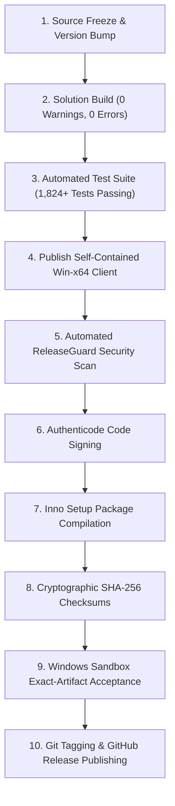

# CBOS Canonical Release Process

| Attribute | Details |
| :--- | :--- |
| **Area** | Release Engineering & Governance |
| **Audience** | Release Managers, Build Engineers, QA Leads |
| **Last Reviewed Version** | CBOS 1.2.2 |
| **Status** | **CANONICAL STANDARD** |
| **Classification** | **PUBLIC-SAFE** |

---

## 1. Canonical Release Engineering Lifecycle

To guarantee software integrity, reproducible builds, and tamper prevention, releases in CBOS follow a strict 10-phase sequence.

> [!CRITICAL]
> **NEVER TAG BEFORE ARTIFACT CERTIFICATION:**
> A Git release tag must point to the **exact commit** that generated the certified release package. Never create a Git tag and then modify binaries or release notes afterward.



---

## 2. Phase-by-Phase Release Execution

### Phase 1: Source Freeze
- All pull requests for the milestone must be merged.
- No new features or refactorings are permitted; working tree must be 100% clean.

### Phase 2: Solution Build
Compile both configurations from root:
```powershell
dotnet build Clovent.BusinessOperatingSystem.slnx -c Debug
dotnet build Clovent.BusinessOperatingSystem.slnx -c Release
```
- Must succeed with **0 warnings** and **0 errors**.

### Phase 3: Complete Automated Test Suite
```powershell
dotnet test Clovent.BusinessOperatingSystem.slnx -c Release
```
- Must pass with 100% success rate (1,824+ passing, 0 failed).

### Phase 4: Publish Self-Contained Client
```powershell
dotnet publish src\Clovent.Desktop\Clovent.Desktop.csproj `
    -c Release -r win-x64 --self-contained true `
    -o artifacts\release\Clovent.BusinessOperatingSystem-win-x64
```

### Phase 5: Automated Security Scan (ReleaseGuard)
```powershell
powershell -ExecutionPolicy Bypass -File tools\ReleaseGuard\ScanReleasePackage.ps1 `
    -ReleaseDir artifacts\release\Clovent.BusinessOperatingSystem-win-x64
```
- Must report `Exit Code: 0 (PASS)`.

### Phase 6: Authenticode Code Signing
Sign all shipping executables and DLLs with the official corporate certificate:
```powershell
signtool sign /tr http://timestamp.digicert.com /td sha256 /fd sha256 /a `
    artifacts\release\Clovent.BusinessOperatingSystem-win-x64\Clovent.Desktop.exe
```

### Phase 7: Compile Inno Setup Production Installer
```powershell
& "C:\Program Files (x86)\Inno Setup 6\ISCC.exe" installer\Clovent.BusinessOperatingSystem.iss
```
- Compiles `Clovent.BusinessOperatingSystem-1.2.2-Setup.exe`.
- Sign the compiled setup executable with `signtool`.

### Phase 8: Generate SHA-256 Checksums
```powershell
Get-FileHash -Algorithm SHA256 artifacts\release\Clovent.BusinessOperatingSystem-1.2.2-Setup.exe |
    Format-List > artifacts\release\SHA256SUMS.txt
```

### Phase 9: Windows Sandbox Exact-Artifact Acceptance
Execute the manual acceptance script (see [windows-sandbox-acceptance.md](../testing/windows-sandbox-acceptance.md)) inside Windows Sandbox using the **exact installer generated in Phase 7**.

### Phase 10: Git Tagging & GitHub Release Publishing
Once Sandbox acceptance is certified:
```powershell
git tag -a v1.2.2 -m "Release: CBOS 1.2.2 Production Baseline"
git push origin v1.2.2
```
Publish the release on GitHub attaching `Clovent.BusinessOperatingSystem-1.2.2-Setup.exe` and `SHA256SUMS.txt`.

---

## 3. Cross References
- [Release Checklist](release-checklist.md)
- [Versioning Policy](versioning.md)
- [Artifact Policy](artifact-policy.md)
- [ReleaseGuard Documentation](releaseguard.md)
- [Windows Sandbox Acceptance](../testing/windows-sandbox-acceptance.md)
