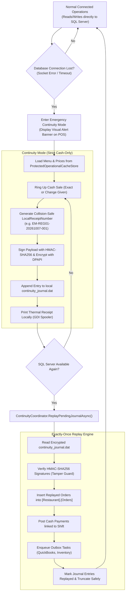

# CBOS Emergency Continuity Mode

| Attribute | Details |
| :--- | :--- |
| **Area** | High Availability & Fault-Tolerant Operations |
| **Audience** | Systems Architects, Site Reliability Engineers, Support Technicians |
| **Last Reviewed Version** | CBOS 1.2.2 |
| **Status** | **IMPLEMENTED & VALIDATED** |
| **Classification** | **PUBLIC-SAFE** |

---

## 1. Architectural Purpose & Activation Triggers

In high-volume retail and restaurant environments, unexpected database unavailability—caused by local network disconnects, server hardware reboots, or network switch outages—cannot halt customer checkout. Halting the line turns away paying diners and damages business reputation.

**Continuity Mode** is the emergency operating mode of CBOS:
- **Activation Trigger:** Automatically activates when the primary SQL Server database connection throws connection timeouts or socket failures during order entry or navigation.
- **Goal:** Enable POS terminals to continue ringing up customer orders, printing physical receipts, and accepting cash tender without interruptions.

---

## 2. Operational Policy in Continuity Mode

To protect enterprise financial and inventory integrity during an outage, Continuity Mode operates under strict domain invariants:

### 2.1 Cash-Only Policy
- **Allowed Tender:** **Cash transactions only**.
- **Blocked Operations:**
  - Customer On-Account credit sales (blocked to prevent credit limit breaches).
  - Customer advance credit deductions (blocked because balance is unverified).
  - Order line price overrides and custom discounts.
  - Voiding completed past orders.
  - Back-office administration, menu editing, and shift closures.

### 2.2 Collision-Safe Identifiers (`LocalReceiptNumber`)
Orders generated offline cannot query the central `NumberSequence` in SQL Server. Instead, they receive a deterministic local receipt number incorporating the machine code, date, and incremental local counter:
$$\mathbf{EM\text{-}\{TerminalCode\}\text{-}\{yyyyMMdd\}\text{-}\{Counter\}}$$
This format guarantees zero primary-key conflicts when orders are replayed into SQL Server alongside orders from other registers.

---

## 3. Cryptographic Journal Protection

Offline transactions are saved locally via `ProtectedContinuityJournalStore` (`src/Clovent.Restaurant.Infrastructure/Continuity/ProtectedContinuityJournalStore.cs`):
- **Path:** `%ProgramData%\Clovent\BusinessOperatingSystem\continuity_journal.dat`
- **Encryption:** Windows DPAPI (`DataProtectionScope.LocalMachine`), ensuring the file cannot be read if copied to an unauthorized PC.
- **Integrity Validation:** Each journal entry includes an HMAC-SHA256 digital signature computed across the transaction payload. If an operator attempts out-of-band hex editing, the replayer detects signature mismatch and halts replay with an audit alarm.

---

## 4. Exactly-Once Replay & Recovery

When database connectivity returns, `ContinuityCoordinator` initiates automatic recovery:
1. Validates cryptographic signatures of all pending journal entries.
2. Begins an atomic EF Core transaction in SQL Server.
3. Inserts each offline transaction as a completed `Order` and `Payment`.
4. Enqueues corresponding `InventoryPosting` and `QuickBooksSync` messages into the `OutboxMessages` table.
5. Commits the transaction and safely clears or archives the local journal.

---

## 5. Current Validated Behavior vs. Architectural Roadmap

| Capability | Current Status (CBOS 1.2.2) | Architectural Roadmap |
| :--- | :--- | :--- |
| **Single-Terminal Cash Journal** | **VALIDATED & TESTED** | N/A |
| **DPAPI + HMAC Protection** | **VALIDATED & TESTED** | N/A |
| **Exactly-Once Replay Engine** | **VALIDATED & TESTED** | N/A |
| **Multi-Terminal LAN Failover** | **NOT IMPLEMENTED** | Multi-register local SQLite mesh sync planned for future release. |

---

## 6. Key Classes & Source Traceability

- **Continuity Coordinator:** `src/Clovent.Desktop/Restaurant/Services/ContinuityCoordinator.cs`
- **Protected Journal Store:** `src/Clovent.Restaurant.Infrastructure/Continuity/ProtectedContinuityJournalStore.cs`
- **Business Rules:** `src/Clovent.Restaurant.Application/Continuity/ContinuityBusinessRules.cs`
- **Exceptions:** `src/Clovent.Restaurant/Continuity/ContinuityExceptions.cs`

---

## 7. Cross References
- [Operational Cache Architecture](operational-cache.md)
- [ADR-0004: Continuity Mode](../adr/ADR-0004-continuity-mode.md)
- [ADR-0005: Local Operational Cache](../adr/ADR-0005-local-operational-cache.md)
- [Support Runbook: Continuity Mode](../support/runbooks/continuity-mode.md)
