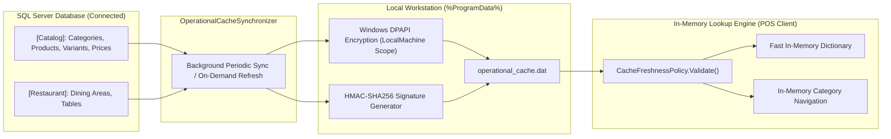

# CBOS Local Operational Cache Architecture

| Attribute | Details |
| :--- | :--- |
| **Area** | Local Data Protection & Offline Catalog Engine |
| **Audience** | Frontend Engineers, Systems Architects, Security Reviewers |
| **Last Reviewed Version** | CBOS 1.2.2 |
| **Status** | **IMPLEMENTED & VALIDATED** |
| **Classification** | **PUBLIC-SAFE** |

---

## 1. Architectural Purpose

To enable POS terminals to take orders during database outages (Continuity Mode), the workstation must possess local knowledge of categories, products, prices, barcodes, and dining tables. 

The **Local Operational Cache** (`ProtectedOperationalCacheStore.cs`) provides a secure, encrypted, and tamper-resistant local replica of the minimum essential catalog dataset required to conduct sales.

---

## 2. Cached vs. Excluded Data Scope

To protect customer privacy and prevent uncollectible debt, CBOS strictly limits what data is cached locally:

| Category | In Cache? | Detailed Entities & Rationale |
| :--- | :---: | :--- |
| **Menu Categories** | **YES** | Category tree, display names, sort orders. Enables left-rail POS navigation. |
| **Products & Variants** | **YES** | Parent products, variants, SKUs, barcode mappings. Enables item discovery and scanning. |
| **Active Prices & Taxes** | **YES** | Active pricing tiers, tax profiles, variant price matrices. Enables accurate bill calculation. |
| **Dining Areas & Tables** | **YES** | Table numbers, capacities, dining areas. Enables table selection in Dine-In mode. |
| **Customer A/R Ledgers** | **NO** | Excluded. Prevents extending credit while customer balances cannot be verified against central DB. |
| **Historical Orders** | **NO** | Excluded. Protects sensitive transaction history from offline physical inspection. |
| **User Administration** | **NO** | Excluded. Prevents privilege elevation or credential cracking from local files. |

---

## 3. Cryptographic Protection & Integrity Verification

Local operational cache files reside at:
`%ProgramData%\Clovent\BusinessOperatingSystem\operational_cache.dat`

The cache implements a dual cryptographic security model:
1. **Confidentiality:** The serialized JSON payload is encrypted using Windows DPAPI (`DataProtectionScope.LocalMachine`). The file cannot be decrypted on other computers.
2. **Integrity & Authenticity:** An HMAC-SHA256 signature is calculated over the raw payload and embedded in the file metadata. Any manual alteration of the file immediately invalidates the signature.

---

## 4. Freshness Policy & Tamper Invalidation

The cache freshness lifecycle is governed by `CacheFreshnessPolicy` (`src/Clovent.Restaurant/Continuity/CacheFreshnessPolicy.cs`):
- **Time-to-Live (TTL):** Standard operational cache lifetime is configured to 24 hours.
- **Clock Rollback Protection:** The policy checks that current system time is strictly after the cache creation timestamp.
- **Invalid Cache Behavior:**
  - If the HMAC signature fails -> `CacheValidationStatus.Tampered`.
  - If the cache exceeds its TTL -> `CacheValidationStatus.Expired`.
  - If the clock was rolled back -> `CacheValidationStatus.ClockRollbackDetected`.
  - **Fail-Safe Response:** If the cache is invalid or expired, Continuity Mode is immediately halted with a warning dialog. The register refuses to conduct sales using corrupt or obsolete data.

---

## 5. Synchronization Lifecycle

- **Initial Hydration:** Populated during First-Run Commissioning.
- **Continuous Background Refresh:** The `OperationalCacheSynchronizer` runs a background task during normal connected operations, rebuilding and re-signing the cache whenever catalog updates are detected or at scheduled intervals.
- **Terminal Scoping:** Each terminal stores its own cache file locally; no inter-workstation file sharing is required.

---

## 6. Key Classes & Source Traceability

- **Cache Store:** `src/Clovent.Restaurant.Infrastructure/Continuity/ProtectedOperationalCacheStore.cs`
- **Cache Synchronizer:** `src/Clovent.Restaurant.Application/Continuity/OperationalCacheSynchronizer.cs`
- **Freshness Policy:** `src/Clovent.Restaurant/Continuity/CacheFreshnessPolicy.cs`
- **Validation Status:** `src/Clovent.Restaurant/Continuity/CacheValidationStatus.cs`
- **Cache Payload Entities:** `src/Clovent.Restaurant/Continuity/CachedEntities.cs`

---

## 7. Cross References
- [Continuity Mode Architecture](continuity-mode.md)
- [ADR-0005: Local Operational Cache](../adr/ADR-0005-local-operational-cache.md)
- [Security Architecture](../security/security-architecture.md)
