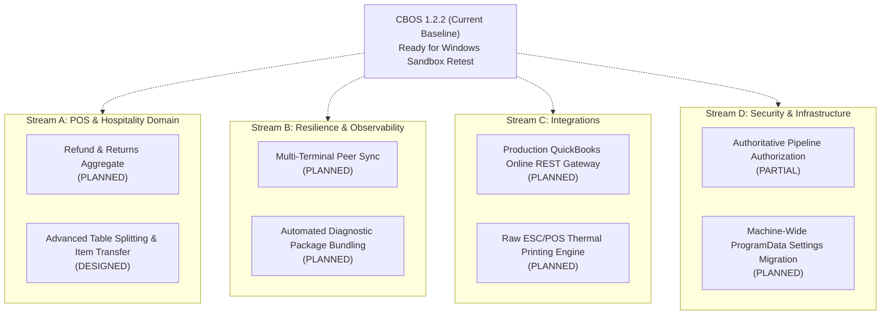

# CBOS Engineering Roadmap

| Attribute | Details |
| :--- | :--- |
| **Area** | Strategic Engineering & Release Planning |
| **Audience** | Product Management, Engineering Leadership, Stakeholders |
| **Last Reviewed Version** | CBOS 1.2.2 |
| **Status** | **PENDING CANONICAL ROADMAP SYNCHRONIZATION** |
| **Classification** | **PUBLIC-SAFE** |

---

## 1. Executive Notice

> [!IMPORTANT]
> **SYNCHRONIZATION NOTICE:**
> A dedicated roadmap synchronization agent is actively preparing the canonical engineering roadmap for CBOS post-1.2.2. To prevent conflicting commitments or duplicating stale recommendations, this document establishes the structural framework and records confirmed architectural milestones. Formal sequencing, sprint allocations, and milestone targets will be merged directly upon canonical roadmap synchronization.

---

## 2. Baseline Status: CBOS 1.2.2 Frozen Release

Release 1.2.2 represents a frozen engineering milestone undergoing final Windows Sandbox acceptance testing:
- **Core Architecture:** Clean Architecture across 6 bounded contexts on .NET 10 and Microsoft SQL Server.
- **Resilience Engine:** Local Operational Cache, DPAPI/HMAC emergency cash journal, and Transactional Outbox.
- **Desktop UI:** Windows Forms with DevExpress 26.1 in PerMonitorV2 High-DPI mode with unified typography.
- **Licensing & Provisioning:** Single-file database provisioner, First-Run Commissioning Wizard, and asymmetric RSA-2048 offline licensing.
- **Verification Evidence:** 1,824 automated unit/integration tests passing cleanly with 100% workstation test isolation.

---

## 3. High-Priority Architectural Workstreams (Framework Outline)

The following areas represent confirmed technical directions identified in architectural reviews, pending canonical timeline synchronization:

### 3.1 Point of Sale Domain Evolution
- **Refund & Return Aggregate:** Formal domain modeling of customer returns, credit notes, and return-to-stock workflows.
- **Table Splitting & Seat Management:** Enhanced visual seat-based billing for multi-guest dining.

### 3.2 Resilience & Local Continuity
- **Multi-Terminal LAN Failover:** Exploration of local SQLite/peer sync during extended multi-day network partitions.
- **Diagnostic Bundling:** One-click automated export of sanitized logs, system health, and outbox state for support teams.

### 3.3 Integrations & Hardware
- **Production QuickBooks Gateway:** Evolution of the current Outbox message contract to connect with live QuickBooks Online via OAuth2 and Intuit REST APIs.
- **Direct ESC/POS Driver:** Direct TCP socket and USB raw byte thermal printing bypassing the Windows GDI print spooler.

### 3.4 Security & Administration
- **Authoritative Pipeline Authorization:** Completion of MediatR `IPipelineBehavior` authorization filters across all domain commands.
- **Machine-Wide Configuration:** Migration of `pos_settings.json` and `company_display_settings.json` to machine-wide `%ProgramData%`.

---

## 4. Canonical Roadmap Synchronization Status

This document will be updated with exact version numbers, release schedules, and resource commitments once the canonical engineering roadmap is synchronized into the repository.

---

## 5. Cross References
- [Known Limitations](../known-limitations.md)
- [System Architecture](../architecture/system-architecture.md)
- [Transactional Outbox](../architecture/transactional-outbox.md)
- [Continuity Mode](../resilience/continuity-mode.md)
