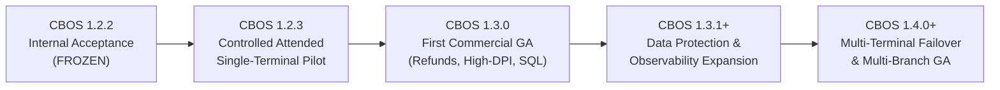

# CBOS Canonical Engineering Roadmap

| Attribute | Details |
| :--- | :--- |
| **Area** | Strategic Engineering & Release Planning |
| **Audience** | Product Management, Engineering Leadership, Stakeholders |
| **Last Reviewed Version** | CBOS 1.2.2 |
| **Status** | **CANONICAL BASELINE** |
| **Classification** | **PUBLIC-SAFE** |

---

## 1. Executive Product Status & Roadmap Overview

The Clovent Business Operating System (CBOS) follows a phased, evidence-driven product maturity lifecycle.

> [!IMPORTANT]
> **AUTHORITATIVE CURRENT MATURITY STATUS:**
> - **CBOS 1.2.2** is a **FROZEN INTERNAL ACCEPTANCE BASELINE ONLY**.
> - It is **NOT** paid-pilot ready, **NOT** commercial GA, and **NOT** production-certified.
> - Deploying CBOS 1.2.2 in customer production or charging pilot fees is strictly prohibited until the 1.2.3 hardening milestones are completed and certified.

---

## 2. Milestone Detailed Roadmap

### 2.1 CBOS 1.2.2 — Frozen Internal Acceptance Baseline
- **Standing:** Feature-frozen internal baseline undergoing qualification testing.
- **Scope Included:**
  - Clean Architecture across 6 bounded contexts (.NET 10, DevExpress 26.1 WinForms).
  - Single physical database architecture with isolated context schemas.
  - Asymmetric RSA-2048 offline licensing engine.
  - Emergency Continuity Mode with encrypted DPAPI/HMAC journal.
  - Transactional Outbox pattern with background handler infrastructure.
  - First-Run Commissioning and Single-File Database Provisioner.
- **Boundaries & Known Status:**
  - Single-terminal attended scope only.
  - Manual card payment recording only; no integrated card processing.
  - Simulated QuickBooks integration gateway.
  - On-demand database backup before upgrades; no automated background maintenance service.
  - Internal acceptance testing baseline; not approved for customer deployments.

---

### 2.2 CBOS 1.2.3 — Controlled Attended Single-Terminal Pilot Hardening
- **Standing:** Targeted hardening release for attended, single-terminal customer pilots.
- **Key Deliverables & Remediation Focus:**
  1. **Administrative Privilege Bypass Elimination:** Remove literal username checks (`admin`/`administrator`) in `AdministrativePrivilegeChecker`; enforce authenticated role authorization exclusively.
  2. **Manager Elevation Fail-Closed:** Ensure `ManagerAuthorizationForm` fails closed if authorization services are unreachable or unconfigured.
  3. **Brute-Force PIN Throttling:** Implement rate limiting, progressive delays, and lockout protection for interactive PIN-only sign-in.
  4. **Payment Idempotency Enforcement:** Enforce unique idempotency keys at the database persistence layer to prevent duplicate charges during rapid cashier clicks.
  5. **Centralized Financial Rounding Policy:** Implement the centralized `MoneyRoundingPolicy` across all calculation paths, resolving the unresolved midpoint rounding decision (AwayFromZero vs ToEven) with explicit stakeholder sign-off.
  6. **Day Close Financial Correctness:** Ensure business day close reconciliations accurately capture all tender breakdowns, expected floats, and cash variance states.
  7. **Completed-Order Void Prohibition:** Formally prohibit completed-order voids and pseudo-refunds during the attended pilot pending the formal Refund aggregate.
  8. **Outbox Automatic Startup:** Ensure continuous background processing begins reliably on application launch without manual trigger.
  9. **Continuity Journal Payload Correction:** Verify encrypted continuity journal payloads capture complete line items, tax breakdowns, and customer notes for loss-free reconciliation.
  10. **Receipt Snapshot Durability:** Ensure immutable `ReceiptSnapshotJson` is captured consistently across all order types at completion time.
  11. **Development Seed Protection:** Ensure sample and test seed tasks are strictly disabled in production builds.
  12. **Database Config Precedence:** Enforce clear precedence between `%ProgramData%` machine config, local user config, and `appsettings.json`.
  13. **Atomic Configuration Writes:** Implement atomic file replacement (temp file write + atomic replace) for local configuration files to prevent corruption during unexpected shutdowns.
  14. **Authenticode Code Signing:** Implement automated code signing and timestamping for executables and installers within the release packaging pipeline.

---

### 2.3 CBOS 1.3.0 — First Broader Commercial Foundation
- **Standing:** General Availability foundation for commercial single-store operations.
- **Key Architectural Features:**
  1. **Formal Refund & Return Domain Aggregate:** First-class modeling of customer returns, partial line returns, credit vouchers, inventory restock credits, and compensating accounting entries.
  2. **High-DPI POS Layout Hardening:** Complete visual polish and layout testing across diverse high-DPI touch monitors (1080p, 1440p, 4K at 150%–250% scaling).
  3. **Real SQL Server Concurrency Testing:** Multi-threaded stress testing and verification against real SQL Server under realistic cashier transaction volume.
  4. **Concurrency-Safe Number Sequences:** Database-backed, gap-free, atomic sequence generation for orders, daily sales, and receipts.
  5. **Optimistic Concurrency Tokens:** Entity-level `RowVersion` concurrency tokens across `Order`, `Table`, `Shift`, and `WarehouseStock` aggregates.
  6. **Catalog Import Hardening:** Robust Excel/CSV bulk product import with validation pipelines and error reporting.
  7. **Rush Mode Consolidation:** Streamlined fast-casual ordering workflows for peak-hour operations.

---

### 2.4 CBOS 1.3.1+ — Data Protection & Observability Expansion
- **Standing:** Operational resilience and enterprise monitoring expansion.
- **Key Deliverables:**
  1. **Automated Maintenance & Backup Service:** Dedicated background service or scheduled tasks providing automated database backups, retention purging, and integrity checks on SQL Server Express.
  2. **Automated Restore Drills:** Verifiable database restore workflows ensuring backup validity.
  3. **Structured Diagnostics & Support Bundle:** Migration to structured JSON logging (Serilog/OpenTelemetry), stack trace capture, and a one-click sanitized diagnostic export tool for field support.
  4. **EF Core SQL Telemetry:** Full `DbCommandInterceptor` command timing and slow-query diagnostics.

---

### 2.5 CBOS 1.4.0+ — Multi-Terminal Failover & Multi-Branch Architecture
- **Standing:** Enterprise distributed deployment platform.
- **Key Capabilities:**
  1. **Multi-Terminal LAN Failover:** Distributed peer-to-peer synchronization or local replicated stores enabling multi-terminal operations during extended network outages.
  2. **Cross-Terminal Order Handoff:** Seamless order retrieval, modification, and settlement across different physical POS terminals and waiter handhelds.
  3. **Multi-Branch Headquarter Replication:** Centralized consolidated reporting, catalog push, and multi-location inventory transfers.
  4. **Enterprise Concurrency:** High-throughput cluster database configurations and branch replication engines.

---

## 3. Product Decision & Policy Tracing

| Decision / Policy | Canonical Policy Reference | Effective Release |
|---|---|---|
| **Cash-Only Continuity Mode** | [PDR-0001](../product/pdr/PDR-0001-continuity-mode-cash-only-policy.md) | CBOS 1.2.2+ |
| **Customer Data Ownership & Non-Destructive Licensing** | [PDR-0002](../product/pdr/PDR-0002-customer-data-ownership-non-destructive-licensing.md) | CBOS 1.2.2+ |
| **Completed Financial Transaction Immutability** | [PDR-0003](../product/pdr/PDR-0003-completed-financial-transaction-immutability.md) | CBOS 1.2.2+ |
| **2-Decimal Transactional Currency Scope** | [PDR-0004](../product/pdr/PDR-0004-transactional-currency-precision.md) | CBOS 1.2.x |
| **Centralized Financial Rounding Policy** | [.agents/rules/financial-integrity.md](../../.agents/rules/financial-integrity.md) | CBOS 1.2.3 |
| **Formal Refund Domain Aggregate** | Architectural Requirement | CBOS 1.3.0 |

---

## 4. Cross References
- [Known Limitations](../known-limitations.md)
- [Product Readiness Levels](../development/readiness-levels.md)
- [Definition of Done](../development/definition-of-done.md)
- [Financial Integrity Rules](../../.agents/rules/financial-integrity.md)
- [Security & Licensing Rules](../../.agents/rules/security.md)
