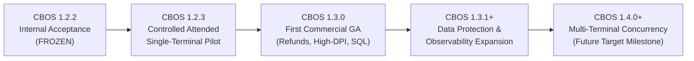

# CBOS Canonical Engineering Roadmap

| Attribute | Details |
| :--- | :--- |
| **Area** | Strategic Engineering & Release Planning |
| **Audience** | Product Management, Engineering Leadership, Stakeholders |
| **Last Reviewed Version** | CBOS 1.2.2 |
| **Status** | **CANONICAL BASELINE** |
| **Classification** | **PUBLIC-SAFE** |

---

## 1. Executive Product Status & Roadmap Overview

The Clovent Business Operating System (CBOS) follows a phased, evidence-driven product maturity lifecycle.

> [!IMPORTANT]
> **AUTHORITATIVE CURRENT MATURITY STATUS & RELEASE TARGET PRINCIPLE:**
> - **CBOS 1.2.2** is a **FROZEN INTERNAL ACCEPTANCE BASELINE ONLY**.
> - It is **NOT** paid-pilot ready, **NOT** commercial GA, and **NOT** production-certified.
> - **Clean-Machine Acceptance Pending:** Clean-machine acceptance for CBOS 1.2.2 is marked as **PENDING** unless actual runtime acceptance evidence is supplied. A frozen baseline designation is NOT a passed qualification gate.
> - Deploying CBOS 1.2.2 in customer production or charging pilot fees is strictly prohibited until the 1.2.3 hardening milestones are completed and certified.
> - **Release Targets vs. Achieved Readiness:** Milestone designations (e.g. `1.2.3`, `1.3.0`) represent planned release targets, not automatic grants of operational or commercial readiness. **No version number automatically confers pilot readiness or GA status.**

---

## 2. Milestone Detailed Roadmap

### 2.1 CBOS 1.2.2 — Frozen Internal Acceptance Baseline
- **Standing:** Feature-frozen internal baseline undergoing qualification testing.
- **Scope Included:**
  - Clean Architecture across 6 bounded contexts (.NET 10, DevExpress 26.1 WinForms).
  - Single physical database architecture with isolated context schemas.
  - Asymmetric RSA-2048 offline licensing engine.
  - Emergency Continuity Mode with encrypted DPAPI/HMAC journal.
  - Transactional Outbox pattern with background handler infrastructure.
  - First-Run Commissioning and Single-File Database Provisioner.
- **Boundaries & Known Status:**
  - Single-terminal attended scope only.
  - Manual card payment recording only; no integrated card processing.
  - Simulated QuickBooks integration gateway.
  - On-demand database backup before upgrades; no automated background maintenance service.
  - Clean-machine acceptance qualification remains PENDING pending verified runtime execution evidence.
  - Internal acceptance testing baseline; not approved for customer deployments.

---

### 2.2 CBOS 1.2.3 — Controlled Attended Single-Terminal Pilot Hardening
- **Standing:** Targeted hardening release for attended, single-terminal customer pilots.
- **Database Schema Invariant:** **Zero database migrations for CBOS 1.2.3.** The database schema remains strictly frozen at the 1.2.2 baseline; concurrency-token adoption belongs to CBOS 1.3.0.
- **Canonical Hardening Tasks & Deliverables:**
  1. **TASK-01: RBAC & Manager Elevation Hardening:** Remove literal username fast-path checks (`admin`/`administrator`) in `AdministrativePrivilegeChecker`; enforce authenticated role authorization exclusively. Ensure `ManagerAuthorizationForm` and action-specific elevation fail closed if authorization services are unreachable, unconfigured, or fail. Pre-login configuration changes require Windows administrator elevation; post-login changes require authenticated application Administrator authorization. Role checks do not bypass filesystem/OS ACLs; missing services or failed checks deny access.
  2. **TASK-02: PIN Throttling + Development Seed Protection:** Implement bounded terminal-level rate limiting, progressive delays, and lockout protection for interactive PIN-only sign-in. Protect development seed startup tasks so they are strictly disabled in production builds, and configuration flags cannot reset existing credentials.
  3. **TASK-03: Financial Rounding Contract:** Implement centralized `MoneyRoundingPolicy` across all calculation paths, recording `MidpointRounding.AwayFromZero` as the selected pilot midpoint direction. Formally define rounding boundaries, tax and discount application ordering, apportionment and allocation algorithms with residual cent handling across line items, and mathematical consistency across online sales, Continuity/replay, receipts, payments, Day Close, and all sale paths (dine-in, takeaway, delivery, split bills, combo pricing). (Do not claim new currency or higher-precision storage support beyond the existing schema).
  4. **TASK-04: BalanceEpsilon Elimination + Completed Void Restriction:** Eliminate half-cent `BalanceEpsilon` tolerance in favor of exact 2-decimal zero-balance financial settlement. Enforce domain and UI blocking for completed-order voids and pseudo-refunds during the attended pilot pending the formal 1.3.0 Refund aggregate; preserve legitimate unpaid/unposted draft cancellation under domain rules.
  5. **TASK-05: Payment Idempotency + Credit-Limit Approval:** Enforce exact payment identity rule: generate `PaymentAttemptId` once per intentional payment attempt, reuse across retries, retransmissions, and duplicate UI submissions; new ID for a genuinely separate payment; reject reuse with conflicting details (without prescribing new schema). Enforce fail-closed managerial credit-limit approval gating (cannot be forged with a bare Boolean).
  6. **TASK-06: Business Day Close Aggregation:** Aggregate business day close with real Tax and Discount totals; record Refund = 0 because refunds are explicitly disabled for the pilot, not because missing data is concealed (never use zero to conceal unsupported or missing financial data). Define non-overlapping settlement and drawer terms, capturing all tender breakdowns, expected floats, and cash variance states without term overlap (net cash sales include the cash portion of every supported split tender, including cash plus On Account, without double-counting collections).
  7. **TASK-07: Outbox Processor Startup:** Ensure continuous background outbox processing begins reliably on application launch without manual trigger (start without opening Operations Health and shut down cleanly).
  8. **TASK-08: Continuity Replay + Receipt Snapshot Repair:** Match Continuity replay producer payloads to Outbox consumer contracts, including required inventory fields to verify replay avoids payload-caused DeadLetter; retain backward compatibility for existing persisted payloads. Preserve immutable sale-time SKU and product-name snapshots (`ReceiptSnapshotJson`) supporting historical reprints, strictly distinguishing completed financial facts from explicitly approved operational metadata updates.
  9. **TASK-09: DB Config Precedence + Atomic Critical Config Writes:** Enforce configuration precedence where commissioned `%ProgramData%` machine configuration takes precedence over local user configuration, limiting `%LocalAppData%` fallback to controlled development/test scenarios. Implement atomic writes targeting Tier-1 database/commissioning configuration using the required sequence: temporary write, validation, flush, and atomic replacement (not expanding into a rewrite of every theme/preference store).
  10. **TASK-10: Authenticode / Release Verification Pipeline:** Implement automated Authenticode code signing pipeline explicitly including `Clovent.Installer.Provisioner.exe`, the desktop executable (`Clovent.Desktop.exe`), approved first-party DLLs (`Clovent.*.dll`), and the final installer, while preserving third-party binaries and signatures. Signing credentials remain external; verify and accept the exact signed and hashed (SHA-256) artifact intended for distribution.

---

### 2.3 CBOS 1.3.0 — First Broader Commercial Foundation
- **Standing:** General Availability foundation for commercial single-store operations. Version numbers are targets, not automatic GA or readiness grants.
- **Key Architectural Features:**
  1. **Formal Refund & Return Domain Aggregate:** First-class modeling of customer returns, partial line returns, credit vouchers, inventory restock credits, and compensating accounting entries.
  2. **High-DPI POS Layout Hardening:** Complete visual polish and layout testing across diverse high-DPI touch monitors (1080p, 1440p, 4K at 150%–250% scaling).
  3. **Real SQL Server Concurrency Testing:** Multi-threaded stress testing and verification against real SQL Server under realistic cashier transaction volume.
  4. **Concurrency-Safe Number Sequences:** Database-backed, concurrency-safe, atomic sequence generation for orders, daily sales, and receipts (replaces unapproved "gap-free" claims; do not invent a gapless numbering requirement).
  5. **Optimistic Concurrency Tokens:** Entity-level `RowVersion` concurrency tokens across `Order`, `Table`, `Shift`, and `WarehouseStock` aggregates (requires schema migrations).
  6. **Catalog Import Hardening:** Robust Excel/CSV bulk product import with validation pipelines and error reporting.
  7. **Rush Mode Consolidation:** Streamlined fast-casual ordering workflows for peak-hour operations.

---

### 2.4 CBOS 1.3.1+ — Data Protection & Observability Expansion
- **Standing:** Operational resilience and enterprise monitoring expansion.
- **Key Deliverables:**
  1. **Automated Maintenance & Backup Service:** Dedicated background service or scheduled tasks providing automated database backups, retention purging, and integrity checks on SQL Server Express. Backup archive technology selection remains future design work.
  2. **Automated Restore Drills:** Verifiable database restore workflows ensuring backup validity.
  3. **Structured Diagnostics & Support Bundle:** Migration to structured JSON logging (candidate proposals include Serilog, OpenTelemetry, or enhanced Microsoft.Extensions.Logging), stack trace capture, and a one-click sanitized diagnostic export tool for field support.
  4. **EF Core SQL Telemetry:** Full `DbCommandInterceptor` command timing and slow-query diagnostics.

---

### 2.5 CBOS 1.4.0+ — Multi-Terminal Concurrency (Future Target Milestone)
- **Standing:** Future multi-terminal deployment platform milestone. Version numbers are targets, not automatic GA or readiness grants; do not convert proposed future capabilities into implementation promises.
- **Architectural Boundary:** Continuity Mode remains strictly terminal-local and protected via machine-bound DPAPI. Distributed peer-to-peer LAN continuity synchronization and headquarters replication remain **unapproved proposals** and are NOT part of accepted roadmap scope. Multi-branch isolation and branch-scoped numbering remain future targets.
- **Key Capabilities:**
  1. **Multi-Terminal Database Concurrency:** Multi-till concurrent database transactions and row-level locking against a shared SQL Server instance.
  2. **Cross-Terminal Order Handoff:** Retains lease/heartbeat/fencing as the recommended design direction, subject to implementation validation, enabling seamless order retrieval, line modification, and settlement across physical POS terminals.
  3. **High-Concurrency Stress Verification:** Multi-register stress testing establishing bounded, observable concurrency acceptance criteria, safe retry/failure behavior, and financial integrity under concurrent store volume.
  4. **Multi-Branch Isolation:** Multi-branch isolation and branch-scoped numbering remain future targets.

#### Unapproved Proposals (Not Accepted Scope)
- **LAN Peer Continuity Synchronization:** Unapproved proposal. Local Continuity Mode is strictly terminal-local with machine-bound DPAPI journal protection.
- **Headquarters / Multi-Branch Replication:** Unapproved proposal. Enterprise multi-store chain replication is an exploratory research topic, not an approved product commitment.

---

## 3. Product Decision & Policy Tracing

| Decision / Policy | Canonical Policy Reference | Effective Release |
|---|---|---|
| **Cash-Only Continuity Mode** | [PDR-0001](../product/pdr/PDR-0001-continuity-mode-cash-only-policy.md) | CBOS 1.2.2+ |
| **Customer Data Ownership & Non-Destructive Licensing** | [PDR-0002](../product/pdr/PDR-0002-customer-data-ownership-non-destructive-licensing.md) | CBOS 1.2.2+ |
| **Completed Financial Transaction Immutability** | [PDR-0003](../product/pdr/PDR-0003-completed-financial-transaction-immutability.md) | CBOS 1.2.2+ |
| **2-Decimal Transactional Currency Scope** | [PDR-0004](../product/pdr/PDR-0004-transactional-currency-precision.md) | CBOS 1.2.x |
| **Centralized Financial Rounding Policy** | [.agents/rules/financial-integrity.md](../../.agents/rules/financial-integrity.md) | CBOS 1.2.3 |
| **Formal Refund Domain Aggregate** | Architectural Requirement | CBOS 1.3.0 |

---

## 4. Cross References
- [Known Limitations](../known-limitations.md)
- [Product Readiness Levels](../development/readiness-levels.md)
- [Definition of Done](../development/definition-of-done.md)
- [Financial Integrity Rules](../../.agents/rules/financial-integrity.md)
- [Security & Licensing Rules](../../.agents/rules/security.md)
