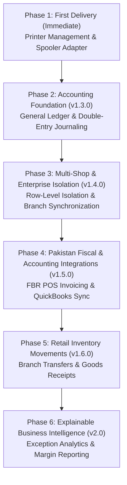

# CBOS Platform Foundation — Ordered Implementation Backlog

| Attribute | Details |
| :--- | :--- |
| **Document Version** | 1.0.0 — Phased Platform Backlog |
| **Baseline Target** | Post-1.2.3 Pilot Release to Version 2.0 |
| **Status** | **APPROVED ARCHITECTURAL ROADMAP** |
| **Classification** | **PUBLIC-SAFE** |

---

## 1. Backlog Phasing Strategy

To preserve stability, maintain the frozen 1.2.3 pilot baseline, and ensure zero premature regressions, platform evolution follows strict dependency-ordered phases:

---

## 2. Phase 1: Printer & Device Management (Implemented in First Delivery)

- [x] **PLAT-PRINT-01: Logical Printer Profiles & Hardware Roles**
  - Implement `PrinterProfile`, `PrinterRole` (Receipt, Kitchen, Bar, Invoice, Label), and `PaperWidth` (58mm, 80mm, A4).
- [x] **PLAT-PRINT-02: Scoped Hardware Routing (`IPrinterRouter`)**
  - Resolve profiles by `(OrganizationId, BranchId, TerminalId, Role)` with negative isolation protection.
- [x] **PLAT-PRINT-03: Windows Spooler Queue Enumeration & Adapter**
  - Enumerate local/network queues using `IWindowsPrinterQueueProvider`; dispatch print jobs via `WindowsSpoolerPrinterAdapter`.
- [x] **PLAT-PRINT-04: Receipt Snapshot Formatter with Multilingual Raster Fallback**
  - 58mm and 80mm column-wrapped receipt rendering consuming immutable `ReceiptSnapshot` records; automatic raster rendering fallback for Urdu/Arabic Unicode typography.
- [x] **PLAT-PRINT-05: Print Job State Machine & Ambiguity Recovery**
  - Lifecycle: `Requested` → `Queued` → `Submitted` → `Confirmed` / `Failed`. Spooler acceptance distinguished from physical print. Non-destructive failure guarantee.
- [x] **PLAT-PRINT-06: Standalone Printer Settings & Authorized Test Print UI**
  - Designer-safe DevExpress settings form with queue selection, profile assignment, test print preview, and explicit authorization prompt.
- [x] **PLAT-CORE-01: Atomic Configuration File Writes (`AtomicFileWriter`)**
  - Temp-flush-replace atomic pattern protecting `%ProgramData%\Clovent\BusinessOperatingSystem\Config\printers.json` against truncation.

---

## 3. Phase 2: Accounting Foundation & Chart of Accounts (CBOS 1.3.0)

*Precondition: CBOS 1.2.3 Pilot acceptance completed; database migrations unlocked for 1.3.0.*

- [ ] **ACC-01: General Ledger Schema & Bounded Context (`[Accounting]` Schema)**
  - Tables: `[Accounting].[Accounts]`, `[Accounting].[FiscalPeriods]`, `[Accounting].[JournalEntries]`, `[Accounting].[JournalLines]`.
  - Isolated migration history: `__EFMigrationsHistory_Accounting`.
- [ ] **ACC-02: Chart of Accounts Entity & Tree Hierarchy**
  - Hierarchical tree structure supporting Assets, Liabilities, Equity, Revenue, Expenses.
  - Normal balance enforcement (Debit vs. Credit) and system account protection.
- [ ] **ACC-03: Default Posting Mappings Configuration**
  - Organization-scoped mapping table binding operational event codes (SaleCash, SaleCard, SaleAR, TaxPayable, Discount, COGS) to specific GL Account IDs.
- [ ] **ACC-04: Double-Entry Balancing & Idempotency Pipeline**
  - MediatR domain event handlers intercepting `OrderCompletedEvent`, `PaymentRecordedEvent`, and `DayCloseCompletedEvent`.
  - Invariant validation: $\sum \text{Debits} == \sum \text{Credits}$ with 0.00 tolerance.
  - Idempotency key pattern: `GL-SOURCE-{SourceDocumentId}`.
- [ ] **ACC-05: Controlled Fiscal Period Closing & Opening Balances**
  - Period states: `Open`, `Closed`, `Locked`.
  - Postings to closed/locked periods rejected fail-closed.
  - Explicit Opening Balance journal voucher workflow.
- [ ] **ACC-06: Dual Accounting Mode Dispatcher**
  - Configuration switch: `BuiltInLedger` vs `ExternalIntegration`.
  - Enforces mutual exclusion to prevent duplicate financial liability recognition.

---

## 4. Phase 3: Multi-Shop & Enterprise Isolation (CBOS 1.4.0)

*Precondition: General Ledger operational; branch pricing schemas ready.*

- [ ] **TEN-01: Global Query Filters & Tenant Resolution Interceptors**
  - EF Core interceptor injecting `TenantId` and `OrganizationId` into every SQL query execution.
  - Verification that parameter manipulation throws `SecurityException`.
- [ ] **TEN-02: Composite Cache Key Architecture**
  - Transition SQLite and in-memory caches to `{TenantId}:{OrgId}:{EntityType}:{Id}` keys.
- [ ] **TEN-03: Branch-Scoped Pricing Books & Catalog Variants**
  - Ability for individual branches to override base prices and taxes while inheriting core master SKU definitions.
- [ ] **TEN-04: Multi-Terminal Store LAN Synchronization**
  - Local TDS connectivity with distributed pessimistic locking for stock reservations.
- [ ] **TEN-05: Negative Isolation Automated Test Suite**
  - Dual-tenant integration tests executing concurrent transactions with identical document numbers, SKUs, and customer codes.

---

## 5. Phase 4: Fiscal E-Invoicing & Accounting Integrations (CBOS 1.5.0)

*Precondition: Multi-shop tenant context verified.*

- [ ] **INT-FBR-01: FBR POS Invoicing Adapter (Pakistan)**
  - Contract: `IFiscalEInvoicingProvider`.
  - Generate FBR cryptographic QR codes containing FBR Invoice Number, NTN, POS ID, and Tax Breakdown.
  - Offline mode: If FBR gateway is unreachable, complete sale with `OfflineFiscalPending` status and queue retry via Outbox.
- [ ] **INT-PROV-01: Provincial Tax Authority Adapters (PRA / SRB / KPRA / BRA)**
  - Specialized reporting adapters complying with Punjab and Sindh provincial revenue authorities.
- [ ] **INT-QB-01: QuickBooks Online (QBO) Integration Adapter**
  - OAuth 2.0 PKCE authentication with DPAPI-encrypted token refresh.
  - Map Day Close summaries to QBO Sales Receipts or Journal Entries.
- [ ] **INT-PAY-01: Integrated EFTPOS Payment Terminal Adapter**
  - Semi-integrated serial/IP protocol. POS sends amount challenge; terminal returns authorization code and masked PAN.
  - PCI DSS compliance: Zero storage of sensitive cardholder authentication data (CVV/PIN).

---

## 6. Phase 5: Retail Inventory Movements (CBOS 1.6.0)

*Precondition: General Ledger COGS and Inventory Asset accounts active.*

- [ ] **INV-01: Multi-Unit of Measure (UOM) & Conversion Factors**
  - Support purchase units (e.g. Carton of 24) converting into stocking/selling units (Pieces/Kilograms).
- [ ] **INV-02: Purchase Orders & Goods Receipt Notes (GRN)**
  - Supplier purchasing workflow; 3-way matching between PO, GRN, and Supplier Invoice.
  - Instant revaluation of inventory asset accounts and accounts payable.
- [ ] **INV-03: Inter-Branch Stock Transfers**
  - Transfer states: `Draft` → `Dispatched` → `InTransit` → `Received` / `Discrepancy`.
  - In-transit inventory account balancing.
- [ ] **INV-04: Physical Stock Audits & Blind Cycle Counts**
  - Cycle count sheets; automatic generation of inventory shrinkage and adjustment journal vouchers.

---

## 7. Phase 6: Explainable Business Intelligence & Analytics (CBOS 2.0)

*Precondition: Full historical dataset across sales, GL, and inventory.*

- [ ] **REP-01: High-Performance Consolidated Analytics Data Mart**
  - Read-optimized reporting projection tables populated asynchronously via domain events.
- [ ] **REP-02: Traceable Formula Metrics Engine**
  - Reusable calculation components with interactive drill-down tooltips displaying source transactional documents.
- [ ] **REP-03: Multi-Dimensional Financial & Operational Reports**
  - Comparative period analysis (Today vs. Yesterday, This Month vs. Last Month).
  - Receivables Aging reports (Current, 30 days, 60 days, 90+ days).
  - Cash variance and till discrepancy exception alerts.
- [ ] **REP-04: Deterministic Exception Analytics**
  - Rule-based alerts for excessive discounts, abnormal voids, margin compression, and cashier drawer irregularities.
- [ ] **REP-05: Scheduled Export & Data Portability**
  - Automated PDF/Excel report delivery via local folder export or email.
