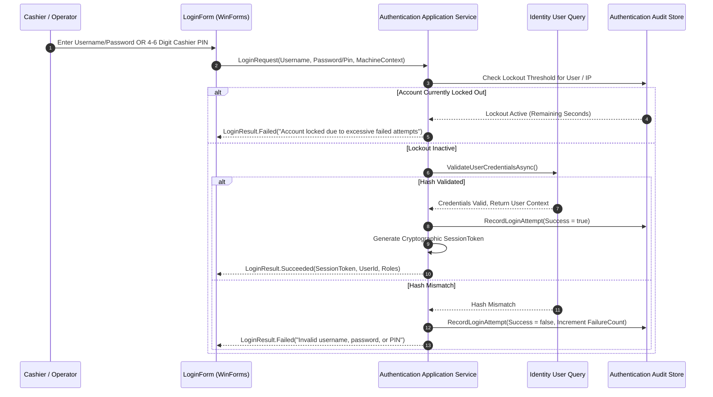

# CBOS Authentication Architecture

| Attribute | Details |
| :--- | :--- |
| **Area** | User Identity, Credential Verification & Sessions |
| **Audience** | Security Engineers, Identity Architects, Backend Developers |
| **Last Reviewed Version** | CBOS 1.2.2 |
| **Status** | **IMPLEMENTED** |
| **Classification** | **PUBLIC-SAFE** |

---

## 1. Authentication Subsystem Overview

Authentication in CBOS is managed by two coordinating bounded contexts:
- **`Clovent.Authentication`:** Owns session token lifecycle (`SessionToken`), login attempt auditing (`LoginAttempt`), brute-force lockout rules, and authentication audit logs (`AuthenticationAuditEvent`).
- **`Clovent.Identity`:** Owns user identity records (`User`), cryptographic password hashes, and cashier PIN hashes.

---

## 2. Supported Authentication Mechanisms

### 2.1 Username & Password Authentication
- **Primary Use Case:** Back-office administrative access, store managers, and initial system commissioning.
- **Hashing Standard:** Passwords are hashed using cryptographic one-way hashing with an individual, cryptographically random salt per user. Plaintext passwords are never stored in memory or persisted to disk.

### 2.2 Cashier Quick PIN Authentication
- **Primary Use Case:** High-speed cashier login at the POS front-of-house register.
- **Workflow:** Cashiers enter a 4-to-6 digit numeric PIN on the touch numpad.
- **Storage:** Stored as an independently salted cryptographic hash (`PinCodeHash`) in `[Identity].[Users]`. PIN codes are completely decoupled from password hashes.

---

## 3. Account Lockout & Brute-Force Protection

- **Tracking:** Every failed login attempt is recorded in `[Authentication].[LoginAttempts]`.
- **Lockout Policy:** 5 consecutive failed login attempts within a 15-minute window lock the user account for 15 minutes.
- **Audit Logging:** Every attempt records client machine hostname, IP address, timestamp, and failure reason in `[Authentication].[AuthenticationAuditEvents]`.

---

## 4. First-Run Administrator Provisioning

During initial installation (Phase 6 of First-Run Commissioning):
1. The wizard verifies that zero administrator accounts currently exist in the database.
2. The initial administrator account (username, password, contact email) is created with the `Administrator` system role.
3. **Single-Use Enforcement:** The commissioning endpoint immediately deactivates. Future administrative accounts can only be created by an authenticated administrator within the Back Office User Management view.

---

## 5. Known Security Gaps & Planned Remediation

### 5.1 Biometric & RFID / Magnetic Card Login
- **Status:** **KNOWN LIMITATION**.
- **Current State:** Only keyboard/touch numeric PIN and password authentication are supported. Fast employee card swipe (magnetic stripe MSR) or RFID badge tap is not currently implemented.
- **Status:** **REMEDIATION PLANNED FOR FUTURE RELEASE**.

### 5.2 Multi-Factor Authentication (MFA)
- **Status:** **KNOWN LIMITATION**.
- **Current State:** CBOS operates in offline-first, local-network environments; time-based one-time password (TOTP) or SMS MFA is not currently integrated into the desktop login shell.
- **Status:** **REMEDIATION PLANNED FOR CLOUD-CONNECTED HYBRID RELEASES**.

---

## 6. Key Classes & Source Traceability

- **Login Service:** `src/Clovent.Desktop/Login/LoginService.cs`
- **Login UI:** `src/Clovent.Desktop/Login/LoginForm.cs`
- **User Aggregate:** `src/Clovent.Identity/Users/User.cs`
- **Session Token:** `src/Clovent.Authentication/SessionTokens/SessionToken.cs`
- **Login Attempt:** `src/Clovent.Authentication/LoginAttempts/LoginAttempt.cs`
- **Audit Event:** `src/Clovent.Authentication/Audit/AuthenticationAuditEvent.cs`

---

## 7. Cross References
- [Security Architecture](security-architecture.md)
- [Authorization & RBAC](authorization.md)
- [Threat Model](threat-model.md)
- [First-Run Commissioning](../deployment/commissioning.md)
