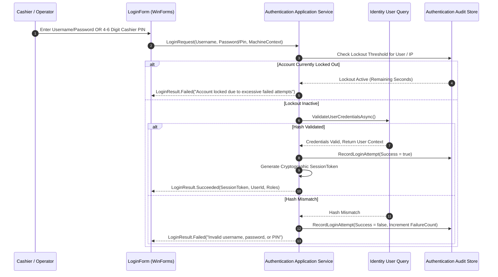

# CBOS Authentication Architecture

| Attribute | Details |
| :--- | :--- |
| **Area** | User Identity, Credential Verification & Sessions |
| **Audience** | Security Engineers, Identity Architects, Backend Developers |
| **Last Reviewed Version** | CBOS 1.2.2 |
| **Status** | **FACTUAL BASELINE** |
| **Classification** | **PUBLIC-SAFE** |

---

## 1. Authentication Subsystem Overview

Authentication in CBOS is managed by two coordinating bounded contexts:
- **`Clovent.Authentication`:** Owns session token lifecycle (`SessionToken`), login attempt auditing (`LoginAttempt`), brute-force lockout rules, and authentication audit logs (`AuthenticationAuditEvent`).
- **`Clovent.Identity`:** Owns user identity records (`User`), cryptographic password hashes, and cashier PIN hashes.

---

## 2. Supported Authentication Mechanisms

### 2.1 Username & Password Authentication
- **Primary Use Case:** Back-office administrative access, store managers, and initial system commissioning.
- **Hashing Standard:** Passwords are hashed using cryptographic one-way hashing with an individual, cryptographically random salt per user (PBKDF2 with SHA-256). Plaintext passwords are never stored in memory or persisted to disk.

### 2.2 Cashier Quick PIN Authentication
- **Primary Use Case:** High-speed cashier login at the POS front-of-house register.
- **Workflow:** Cashiers enter a 4-to-6 digit numeric PIN on the touch numpad without typing a username.
- **Resolution:** Because PIN-only sign-in arrives without a username identifier, `LoginService` resolves the user by scanning candidate hashes against stored PIN hashes (`ResolveUserByPinAsync`). PIN uniqueness across users is enforced at creation time.
- **Storage:** Stored as an independently salted cryptographic hash in `[Identity].[UserCredentials]`.

---

## 3. Account Lockout & Known Brute-Force Limitations

### 3.1 Username/Password Account Lockout (Implemented)
- Every failed password login attempt against a recognized username records an entry in `[Authentication].[LoginAttempts]`.
- 5 consecutive failed login attempts within a 15-minute evaluation window trigger account lockout via `IIdentityUserService.LockUserAsync()`.

### 3.2 Interactive PIN Brute-Force Throttling Gap (Known Gap — Targeted 1.2.3)
> [!WARNING]
> **KNOWN GAP IN 1.2.2 — TARGETED FOR 1.2.3 HARDENING:**
> - In CBOS 1.2.2, when an incorrect PIN is submitted in PIN-only mode, no matching `User` is resolved. The system records `LoginAttempt` with `UserId = null` and outcome `UserNotFound`.
> - Because lockout policies evaluate failures against a known `UserId`, failed PIN attempts do **not** increment per-user failure counters or lock user accounts.
> - Furthermore, no terminal-level rate limiting or progressive exponential backoff is currently implemented in `LoginForm`.
> - **Roadmap Hardening:** Implementation of terminal-level PIN attempt throttling, bounded brute-force delays, and temporary terminal lockout is scheduled as a mandatory deliverable in CBOS 1.2.3.

---

## 4. First-Run Administrator Provisioning

During initial installation (Phase 6 of First-Run Commissioning):
1. The wizard verifies that zero administrator accounts currently exist in the database.
2. The initial administrator account (username, password, contact email) is created with the `Administrator` system role.
3. **Single-Use Enforcement:** The commissioning endpoint immediately deactivates. Future administrative accounts can only be created by an authenticated administrator within the Back Office User Management view.

---

## 5. Other Known Security Boundaries

### 5.1 Biometric & RFID / Magnetic Card Login
- **Current State:** Only keyboard/touch numeric PIN and password authentication are supported. Fast employee card swipe (magnetic stripe MSR) or RFID badge tap is not currently implemented.
- **Status:** **PLANNED FOR FUTURE HARDWARE EXPANSION**.

### 5.2 Multi-Factor Authentication (MFA)
- **Current State:** CBOS operates in offline-first, local-network environments; time-based one-time password (TOTP) or SMS MFA is not currently integrated into the desktop login shell.
- **Status:** **PLANNED FOR CLOUD-CONNECTED HYBRID RELEASES**.

---

## 6. Key Classes & Source Traceability

- **Login Service:** `src/Clovent.Desktop/Login/LoginService.cs`
- **Login UI:** `src/Clovent.Desktop/Forms/Identity/LoginForm.cs`
- **User Aggregate:** `src/Clovent.Identity/Users/User.cs`
- **User Credentials Aggregate:** `src/Clovent.Authentication/Credentials/UserCredentials.cs`
- **Login Attempt:** `src/Clovent.Authentication/LoginAttempts/LoginAttempt.cs`
- **Lockout Policy:** `src/Clovent.Authentication/Lockouts/LockoutPolicy.cs`

---

## 7. Cross References
- [Security Architecture](security-architecture.md)
- [Authorization & RBAC](authorization.md)
- [Threat Model](threat-model.md)
- [Known Limitations](../known-limitations.md)
- [Canonical Engineering Roadmap](../roadmap/engineering-roadmap.md)
