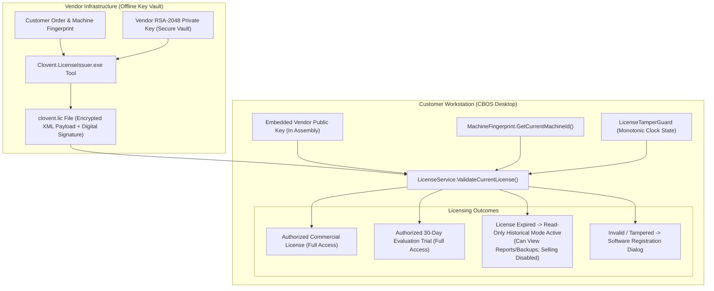

# CBOS Software Licensing Architecture

| Attribute | Details |
| :--- | :--- |
| **Area** | Software Licensing, Anti-Tamper & Entitlements |
| **Audience** | License Issuers, Systems Engineers, Compliance Reviewers |
| **Last Reviewed Version** | CBOS 1.2.2 |
| **Status** | **IMPLEMENTED & VALIDATED** |
| **Classification** | **PUBLIC-SAFE** |

---

## 1. Architectural Overview & Design Philosophy

Clovent Business Operating System (CBOS) operates in diverse physical environments, including air-gapped retail basements, rural branches, and network-isolated corporate stores. Consequently, licensing cannot depend on real-time internet connectivity, cloud license servers, or recurring online activation heartbeats.

CBOS implements an **Offline Asymmetric Cryptographic Licensing Architecture** (`src/Clovent.Desktop/Licensing/LicenseService.cs`):
- **Cryptographic Engine:** Asymmetric RSA-2048 with SHA-256 (`clovent-2026-v2`).
- **Key Separation:** The public verification key is embedded directly into the client desktop assembly. The private signing key resides strictly outside customer environments in secure vendor facilities (`%USERPROFILE%\.clovent\keys\`) and is utilized exclusively by the internal licensing tool (`Clovent.LicenseIssuer`).
- **Hardware Binding:** Commercial licenses are cryptographically locked to the host workstation's hardware signature.
- **Tamper Protection:** Monitored via DPAPI-protected state files (`license_guard.dat` and `trial.state`) with anti-rollback clock tracking.
- **Non-Destructive Expiration:** Expired licenses preserve full read-only access to historical sales, financial reports, and backups while blocking new commercial sales. Customer data is never deleted, encrypted, or ransomed.

---

## 2. License Payload Structure & Verification

A valid license file (`clovent.lic`) consists of a serialized XML/JSON document signed with the vendor's private key:
- **`LicenseId` (`Guid`):** Unique serial identifier.
- **`CustomerId` (`string`):** Registered account identifier.
- **`CompanyName` (`string`):** Legal business name.
- **`MachineId` (`string`):** Cryptographic hardware fingerprint.
- **`ValidFrom` & `ValidTo` (`DateTimeOffset`):** Licensed operational date window.
- **`AllowedSeats` (`int`):** Licensed concurrent workstation count.
- **`FeatureFlags` (`string[]`):** Entitled modules (e.g., `RestaurantPos`, `AdvancedInventory`, `QuickBooksOutbox`).
- **`Signature` (`string`):** Base64-encoded RSA-2048 SHA-256 cryptographic signature.

### Verification Steps in `LicenseService.cs`:
1. **Signature Verification:** Verifies that `Signature` matches the payload bytes using the embedded public key. If modified by even one bit, returns `LicenseStatus.InvalidSignature`.
2. **Hardware Binding Match:** Evaluates `MachineFingerprint.GetCurrentMachineId()` against `MachineId`. If mismatched, returns `LicenseStatus.MachineMismatch`.
3. **Monotonic Clock Check:** `LicenseTamperGuard.VerifyAndUpdateClock()` verifies that the system clock has not been rolled backward. If rollback is detected, returns `LicenseStatus.ClockTampered`.
4. **Expiration Check:** Compares UTC time against `ValidTo`.

---

## 3. Evaluation Trial Mode Lifecycle

For new deployments without an active commercial license:
- **Duration:** 30-day evaluation trial.
- **State Store:** Managed by `TrialStateManager` in `%ProgramData%\Clovent\BusinessOperatingSystem\trial.state` encrypted via Windows DPAPI.
- **Anti-Clock-Rollback:** The trial state records highest observed timestamp. Rolling back the computer clock immediately invalidates the trial.
- **Commercial Upgrade:** When a commercial license is installed, `TrialStateManager.RecordCommercialLicenseInstalled()` idempotently transitions state.

---

## 4. Non-Destructive Expiration Policy & RBAC Enforcement

In adherence to ethical enterprise software governance:
- **Data Sovereignty & Access Preservation:** Expiry must never destroy data or remove authorized historical access. Customer financial records and audit histories are never deleted, corrupted, or encrypted upon expiration.
- **Authentication & RBAC Remain Enforced:** Authentication and role-based access control (RBAC) remain strictly enforced at all times. Unauthenticated access is denied; user logins and role permissions continue to govern historical data access and database backup operations.
- **Accepted Policy vs. Source Behavior:**
  - *Accepted Policy (PDR-0002):* When a license or evaluation trial expires, CBOS transitions to Read-Only Historical Mode. Operators and accountants can view historical sales reports, inspect audit logs, and execute database backups, while creating new orders, processing payments, or adding inventory transactions is strictly gated.
  - *Source-Verified Expiry Behavior (1.2.2 Baseline):* In the 1.2.2 baseline source code (`Program.cs`), an expired license issues an informational warning dialog alerting the operator to read-only mode and proceeds to normal authentication without destroying data. An expiry warning alone does not establish read-only transaction gating; this is recorded as a known gap without implementing or assigning new release scope.

---

## 5. Key Classes & Source Traceability

- **Verification Service:** `src/Clovent.Desktop/Licensing/LicenseService.cs`
- **Hardware Fingerprint:** `src/Clovent.Desktop/Licensing/MachineFingerprint.cs`
- **Tamper Guard:** `src/Clovent.Desktop/Licensing/LicenseTamperGuard.cs`
- **Trial State Manager:** `src/Clovent.Desktop/Licensing/TrialStateManager.cs`
- **Registration Form:** `src/Clovent.Desktop/Licensing/SoftwareRegistrationForm.cs`
- **Vendor Issuer Tool:** `Tools/LicenseIssuer/Program.cs`

---

## 6. Cross References
- [Security Architecture](security-architecture.md)
- [ADR-0008: Offline RSA License Validation](../adr/ADR-0008-offline-rsa-license-validation.md)
- [First-Run Commissioning](../deployment/commissioning.md)
- [Support Runbook: License Issues](../support/runbooks/license-issue.md)
