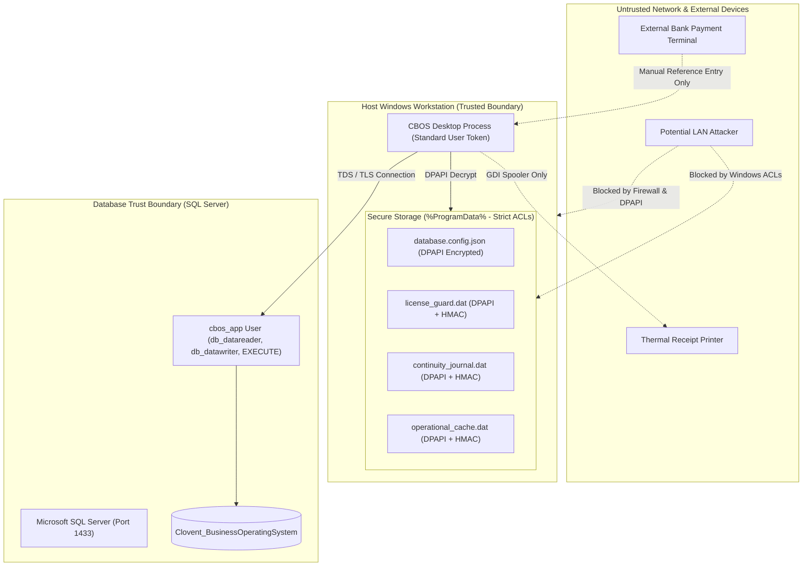

# CBOS Security Architecture & Trust Boundaries

| Attribute | Details |
| :--- | :--- |
| **Area** | Security Engineering & Trust Models |
| **Audience** | Security Officers, Systems Architects, Compliance Auditors |
| **Last Reviewed Version** | CBOS 1.2.2 |
| **Status** | **IMPLEMENTED** |
| **Classification** | **PUBLIC-SAFE** |

---

## 1. Enterprise Security Overview

Clovent Business Operating System (CBOS) is engineered around defence-in-depth principles:
- **Least Privilege Execution:** Both operating system processes and database connections execute with minimal required permissions.
- **Strong Cryptographic Foundations:** Asymmetric RSA-2048 for offline licensing, Windows DPAPI for machine secrets, and HMAC-SHA256 for local journal/cache integrity.
- **Zero Shipped Credentials:** Production releases exclude default credentials, test passwords, and development configuration files.
- **Non-Destructive Expiration:** Expired licenses preserve full read-only access to historical data for legal and accounting compliance; customer records are never held hostage.

---

## 2. Trust Boundaries & Data Flow

---

## 3. Cryptographic Primitives & Storage Security

| Cryptographic Mechanism | Implementation | Application in CBOS |
| :--- | :--- | :--- |
| **Windows DPAPI** | `ProtectedData.Protect` (`LocalMachine` / `CurrentUser` Scope) | Encrypts SQL Server connection strings in `database.config.json`, trial state files, and local emergency cash journals. Keys are tied to the host machine DPAPI master key. |
| **HMAC-SHA256** | `HMACSHA256` with host machine key | Generates tamper-evident digital signatures over the local operational cache and offline continuity journals. Detects out-of-band byte modifications. |
| **RSA-2048 with SHA-256** | `RSA.Create()` with PKCS#1 padding | Verifies software licenses (`clovent-2026-v2`). The public key is embedded in client code; the private key is held strictly offline by the vendor. |
| **Password Hashing** | Cryptographic hash with unique per-user salt | Hashes operator passwords and cashier PIN codes in `[Identity].[Users]`. |

---

## 4. Workstation File System Security (`ProgramDataAclManager`)

On application startup, `ProgramDataAclManager` verifies and enforces restrictive Windows Discretionary Access Control Lists (DACLs) on `%ProgramData%\Clovent\`:
- **Local Administrators:** Full Control (`FileSystemRights.FullControl`).
- **Authenticated Users:** Read / Execute / Write to application data (`FileSystemRights.Modify` scoped to sub-items).
- **Anonymous / Network / Guest:** Strictly prohibited (`AccessControlType.Deny`).

---

## 5. Least Privilege Relational Access

Application runtime accounts (`cbos_app`) are granted minimal operational permissions:
- **Granted:** `db_datareader`, `db_datawriter`, `GRANT EXECUTE` on stored procedures.
- **Prohibited:** `sa`, `sysadmin`, `db_owner`, `db_ddladmin`.
- **Enforcement:** DDL operations (creating tables, dropping columns, altering schemas) cannot be performed by active desktop clients and must be executed by DBA maintenance tools or `Clovent.Installer.Provisioner.exe`.

---

## 6. Payment Security & PCI Disclaimer

- **Payment Card Data:** CBOS does **not** collect, process, or store credit/debit card numbers (PAN), expiration dates, or CVVs. Card transactions are authorized on external merchant payment terminals, with only the tender type and optional reference recorded.
- **Certification Statement:** CBOS is **not** PCI-DSS certified, nor does it require certification as it does not participate in the cardholder data environment (CDE).

---

## 7. ReleaseGuard Automated Security Gate

Prior to packaging releases, the automated scanner script `tools/ReleaseGuard/ScanReleasePackage.ps1` verifies:
- Zero source files (`*.cs`, `*.csproj`, `*.sln`, `*.slnx`).
- Zero debug symbol databases (`*.pdb`).
- Zero development settings files (`appsettings.Development.json`).
- Zero active customer licenses (`clovent.lic`, `*development*.lic`).
- Zero private keys (`*.key`, `*.pem`, `*.pfx`).
- Zero database backup files (`*.bak`).

---

## 8. Cross References
- [Authentication Architecture](authentication.md)
- [Authorization & RBAC](authorization.md)
- [Software Licensing Architecture](licensing.md)
- [Threat Model](threat-model.md)
- [ReleaseGuard Documentation](../release/releaseguard.md)
