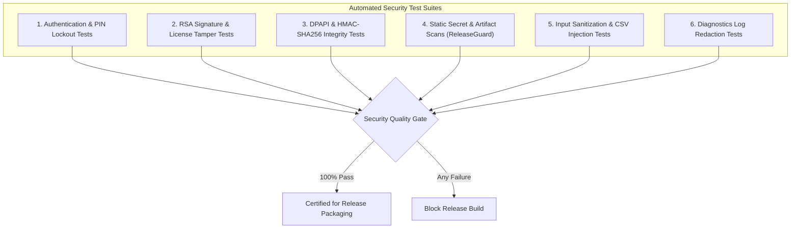

# CBOS Security Testing & Validation Standards

| Attribute | Details |
| :--- | :--- |
| **Area** | Security Verification, Penetration Testing & Cryptographic Auditing |
| **Audience** | Security Auditors, QA Engineers, Compliance Reviewers |
| **Last Reviewed Version** | CBOS 1.2.2 |
| **Status** | **PROCEDURAL STANDARD** |
| **Classification** | **PUBLIC-SAFE** |

---

## 1. Security Verification Scope

Security testing in CBOS verifies that defensive controls, cryptographic boundaries, and authorization checks cannot be bypassed by malicious actors or curious employees:

---

## 2. Security Test Areas Reference

### 2.1 Cashier PIN & Brute-Force Lockout
- **Test Focus:** Verifies that rapid invalid PIN submissions are throttled.
- **Verification:** Submitting 5 consecutive incorrect PIN codes within 15 minutes locks the user account, rejecting subsequent attempts even if the correct PIN is provided.

### 2.2 License Tampering & Signature Forgery
- **Test Focus:** Verifies that modified `.lic` files fail validation immediately.
- **Verification:** Altering a single character in the license XML payload or Base64 signature triggers `LicenseStatus.InvalidSignature`.
- **Clock Rollback Verification:** Adjusting system timestamps backwards triggers `LicenseStatus.ClockTampered`.

### 2.3 Local Cache & Continuity Journal Tampering
- **Test Focus:** Injects corrupted byte sequences into `operational_cache.dat` and `continuity_journal.dat`.
- **Verification:** The replayer and cache loader recompute HMAC-SHA256 signatures; corrupted files trigger `CacheValidationStatus.Tampered`, refusing to conduct sales or replay altered payments.

### 2.4 Pre-Release Secret Scanning (ReleaseGuard)
- **Script:** `tools\ReleaseGuard\ScanReleasePackage.ps1`.
- **Verification:** Scans distribution folders for forbidden regex patterns: private keys (`BEGIN RSA PRIVATE KEY`), connection passwords, unencrypted tokens, and development configs.

### 2.5 Input Sanitization & CSV / Formula Injection
- **Test Focus:** Enters formula characters (`=`, `+`, `-`, `@`) in customer names and product descriptions.
- **Verification:** When exported to Excel/CSV, formula prefixes are escaped with single quotes to prevent code execution in spreadsheet applications.

### 2.6 Diagnostic Log Sanitization
- **Test Focus:** Inspects generated `cbos-*.log` files after executing login, payment, and startup routines.
- **Verification:** Asserts that passwords, PIN hashes, and full credit card details are absent from all log records.

---

## 3. Cross References
- [Threat Model](../security/threat-model.md)
- [Security Architecture](../security/security-architecture.md)
- [Software Licensing Architecture](../security/licensing.md)
- [ReleaseGuard Documentation](../release/releaseguard.md)
