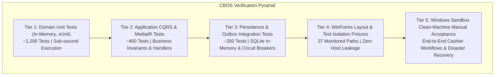

# CBOS Enterprise Testing Strategy

| Attribute | Details |
| :--- | :--- |
| **Area** | Quality Assurance & Verification Architecture |
| **Audience** | QA Engineers, Test Automation Developers, SREs |
| **Last Reviewed Version** | CBOS 1.2.2 |
| **Status** | **CANONICAL STANDARD** |
| **Classification** | **PUBLIC-SAFE** |

---

## 1. Testing Pyramid & Verification Tiers

Quality engineering in CBOS combines fast, deterministic unit test execution with isolated integration tests and strict manual Windows Sandbox acceptance gates:

---

## 2. Test Classification Reference

### 2.1 Domain Unit Tests (`Clovent.<Context>.Tests`)
- **Scope:** Aggregate roots, entities, value objects, and domain events.
- **Characteristics:** Zero database dependencies, zero file I/O, sub-millisecond execution. Tests business rules (e.g. `OrderLineQuantityChanged`, `ShiftStatus` transitions, `Currency` decimal clamping).

### 2.2 Application CQRS Tests (`Clovent.<Context>.Application.Tests`)
- **Scope:** MediatR command and query handlers, business rule validators, and DTO mappings.
- **Fakes:** Utilizes in-memory fake repositories (`FakeOutboxRepository`, `FakeContinuityJournalStore`) to test workflow coordination.

### 2.3 Persistence & Atomicity Integration Tests (`Clovent.<Context>.Infrastructure.Tests`)
- **Scope:** EF Core model mapping, shadow property binding, value converters, and outbox atomicity.
- **Provider Scope:** SQLite in-memory (`Microsoft.EntityFrameworkCore.Sqlite`) is an available fast-test provider for isolated test runs without requiring a live SQL Server instance, but is not mandatory for all tests. Tests requiring Microsoft SQL Server must execute against explicitly isolated, disposable databases or throwaway test environments, and must never touch customer or developer operational databases or configurations.

### 2.4 WinForms Layout & Structural Tests
- **Scope:** Verifies that form control hierarchies, docking styles, anchors, and fonts match `DesktopStyle` standards.
- **Important Distinction:**
  > [!WARNING]
  > **AUTOMATED LAYOUT TESTS ARE NOT LIVE UI VALIDATION:**
  > Automated structural tests, reflection inspectors, and `Control.DrawToBitmap` captures verify programmatic object properties only. They do **not** validate GPU rendering, touch responsiveness, visual clipping across physical displays, or real cashier usability. Live validation requires physical display execution.

### 2.5 Workstation Filesystem Test Isolation
- **Scope:** Guarantees that automated test suites **never** create, modify, or delete host workstation configuration files in `%LOCALAPPDATA%\Clovent` or `%ProgramData%\Clovent`.
- **Validation:** `WorkstationStartupVerificationTests` monitors 37 host paths before and after test execution, verifying 100% hash parity (0 created, 0 deleted, 0 modified).

### 2.6 Failure Injection & Circuit Breaker Tests
- **Scope:** Simulates printer outages (`SetSimulatedOutage(true)`) and QuickBooks network drops to verify circuit breaker trip states, exponential backoff, and dead-letter queues.

---

## 3. Verification Claims Policy (Strict)

When reporting testing status in release notes and PRs:
- **`LIVE UI EXECUTED`:** State **only** if the Windows application was interactively launched and exercised on a physical or virtual display.
- **`LIVE UI NOT EXECUTED`:** Mandatory when interactive execution on a display was not performed. **This terminology must NOT imply that headless validation occurred.**
- **`VISUAL STUDIO DESIGNER UI EXECUTED`:** State **only** if the form was interactively loaded and edited in the Visual Studio Designer.
- **`VISUAL STUDIO DESIGNER UI NOT EXECUTED`:** Mandatory when form was not opened inside the interactive Visual Studio Designer. **Does not imply design-time execution or headless validation.**

---

## 4. Cross References
- [Test Execution Guide](running-tests.md)
- [Windows Sandbox Acceptance](windows-sandbox-acceptance.md)
- [Performance Testing](performance.md)
- [Security Testing](security-testing.md)
