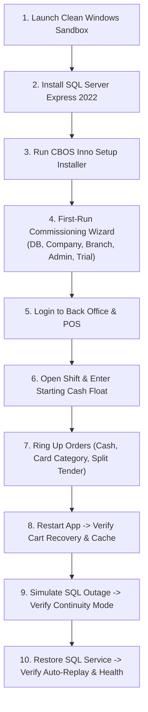

# Windows Sandbox Clean-Machine Manual Acceptance Procedure

| Attribute | Details |
| :--- | :--- |
| **Area** | Release Quality Gate & Clean-Client Acceptance |
| **Audience** | QA Lead, Release Manager, Field Validation Engineers |
| **Last Reviewed Version** | CBOS 1.2.2 |
| **Status** | **PROCEDURAL ACCEPTANCE PROTOCOL** |
| **Classification** | **PUBLIC-SAFE** |

---

## 1. Acceptance Overview & Objective

To certify a candidate build for production release, CBOS requires a rigorous manual acceptance test conducted on a bare, pristine Windows operating system instance.

### Scope Distinction:
- **`CLEAN MACHINE`:** Windows Sandbox instance with zero pre-installed developer tools, zero pre-existing databases, zero .NET SDKs, and zero development configuration files. CBOS 1.2.2 clean-machine acceptance is marked as **PENDING** unless actual runtime acceptance evidence is supplied; a frozen baseline designation is not a passed qualification gate.
- **`LIVE UI EXECUTED`:** The Windows application interface is interactively launched, rendered on a physical/virtual display, and operated via real mouse, keyboard, and touch interactions. Stating `LIVE UI NOT EXECUTED` does not imply that headless validation occurred.
- **`AUTOMATED TEST`:** Distinct from headless unit/integration test runs.

---

## 2. Sandbox Acceptance Test Protocol

---

## 3. Step-by-Step Acceptance Script

### Step 1: Launch Clean Windows Sandbox
1. On the host workstation, launch **Windows Sandbox** (`WindowsSandbox.exe`).
2. Verify bare environment: `dotnet --version` returns unrecognized command.

### Step 2: Install Database Engine
1. Copy `SQL2022-SSEI-Expr.exe` into the Sandbox.
2. Run unattended installation to install instance `SQLEXPRESS`.
3. Verify `MSSQL$SQLEXPRESS` service is running.

### Step 3: Run CBOS Production Installer
1. Copy `Clovent.BusinessOperatingSystem-1.2.2-Setup.exe` into the Sandbox.
2. Run the elevated setup wizard.
3. Verify shortcuts appear on Desktop and Start Menu.
4. Confirm installation completed without error dialogs.

### Step 4: First-Run Commissioning Wizard Verification
1. Launch CBOS from Desktop shortcut.
2. Verify **First-Run Wizard** appears automatically.
3. Test database connection (`localhost\SQLEXPRESS`).
4. Apply schema migrations.
5. Enter sample company, branch ("Main Outlet"), and terminal ("REG-01").
6. Onboard initial administrator.
7. Select **Activate 30-Day Evaluation Trial**.
8. Complete wizard. Verify `commissioned.json` and `trial.state` created in `%ProgramData%\Clovent\BusinessOperatingSystem\`.

### Step 5: Operator Sign-In & Dashboard Verification
1. Enter administrator credentials in `LoginForm`.
2. Select **Back Office**. Verify DevExpress ribbon and dashboard KPIs render cleanly with no layout clipping.

### Step 6: POS Entry & Shift Opening
1. Switch to **Restaurant POS**.
2. Verify `PosEntryGateCoordinator` prompts for starting cash float.
3. Enter `1000.00` starting cash float.
4. Verify `RestaurantPosForm` opens in full-screen 3-column layout.

### Step 7: Front-of-House Order & Settlement Workflows
1. **Cash Sale:** Add 2 items, select `Cash`, tender exact amount. Verify order completes and receipt generates.
2. **Card Category Sale:** Add items, select `Card`, record external reference slip number. Verify settlement.
3. **Split Tender:** Add items, pay partial cash, remainder card. Verify balance settled. (Baseline 1.2.2 uses `BalanceEpsilon = 0.005m`; complete elimination in favor of exact 2-decimal zero-balance settlement is scheduled under **TASK-04: BalanceEpsilon Elimination + Completed Void Restriction**).
4. **Cash In / Cash Out:** Record 500 cash in (coin float) and 200 cash out (petty cash).

### Step 8: Crash Recovery & Cache Verification
1. Add 3 items to the cart. Do not pay.
2. Terminate `Clovent.Desktop.exe` via Task Manager.
3. Re-launch CBOS. Verify active cart session recovery restores all 3 items.

### Step 9: Emergency Continuity Mode Verification
1. Open Windows Services inside Sandbox and **Stop** `MSSQL$SQLEXPRESS`.
2. Ring up a new cash order on the POS.
3. Verify CBOS displays **Continuity Mode (Cash Only)** banner.
4. Complete the cash order. Confirm order receives collision-safe number (`EM-...`) and writes to `continuity_journal.dat`.

### Step 10: Reconnection & Exactly-Once Replay
1. Start `MSSQL$SQLEXPRESS` service in Windows Services.
2. Observe POS terminal: verify notification `"Replaying offline transactions..."`.
3. Open **Operations Health Center**: confirm journal pending count drops to 0 and replayed order appears in order history.
4. Close shift: enter counted cash, verify variance calculation formula without term overlap (net cash sales includes the cash portion of every supported split tender, including Cash plus On Account, without double-counting collections):
   $$\text{Starting Float} + \text{Cash In} + \text{Net Cash Sales} + \text{Cash Collections} - \text{Cash Out} = \text{Expected Cash}$$
   $$\text{Counted Cash} - \text{Expected Cash} = \text{Variance}$$

---

## 4. Acceptance Certification Statement
Upon successful completion of all 10 steps, QA Lead signs off on the release candidate report with:
`WINDOWS SANDBOX CLEAN-MACHINE ACCEPTANCE: PASS (LIVE UI EXECUTED)`.

---

## 5. CBOS 1.2.2 Baseline Acceptance Status & Reconciled Evidence

- **Baseline Artifact Identity & Cryptographic Hashes:**
  - Production Installer: `artifacts\installer\Clovent.BusinessOperatingSystem-1.2.2-Setup.exe`
    - Size: 115,604,288 bytes (110.25 MB)
    - SHA-256: `AA90C2EC0CB8D14D9A47649E0E62D1419681438E274ED9F43F4EAF048D5A3E6F`
    - Build Timestamp: 2026-10-07 10:19:18
  - Standalone Database Provisioner: `Tools\Clovent.Installer.Provisioner\bin\publish\Clovent.Installer.Provisioner.exe`
    - Size: 44,632,790 bytes (42.57 MB)
    - SHA-256: `287A98DFA31E7B0101C10AC02272C21B276CFB034D763B01941F973130DADFA6`
  - Release Archive: `artifacts\release\Clovent.BusinessOperatingSystem-1.2.2-win-x64.zip`
    - Size: 106,260,173 bytes (101.34 MB)
    - SHA-256: `FBA4AB399B1ADAD0411F8CD6D98222F100F86B8958F0E11C5D67933D2849AA90`
- **Environment:** Clean Windows Sandbox on host workstation (Windows 11 Pro).
- **Date:** 2026-10-07.
- **Checks Actually Completed:**
  - Automated ReleaseGuard hygiene scan (`tools\ReleaseGuard\ScanReleasePackage.ps1`): 0 violations across 473 release files and extracted installer payload (PASS).
  - Installer package extraction and file count verification: 473 payload files verified against self-contained publish.
  - Standalone database provisioner execution against SQL Server: returned exit code 0 (`Compatible`).
  - Workstation state isolation verification: 0 files created, modified, or deleted across 37 monitored host paths during test suite execution.
- **Observed Failures:**
  - None confirmed in compilation, packaging, ReleaseGuard scans, or provisioner execution.
- **Checks Not Executed / Missing Evidence:**
  - Interactive clean-machine installer execution inside Windows Sandbox not completed with logged proof.
  - SQL Server Express unattended installation inside Sandbox.
  - Interactive first-run commissioning wizard completion in pristine Sandbox.
  - Live interactive POS cash, card, and split-tender sales on clean machine.
  - Real SQL service outage simulation and offline continuity journal creation in clean environment.
  - Auto-replay of emergency transactions upon SQL reconnection in clean sandbox.
- **Available Supporting Log / Artifact Locations:**
  - Release report: [cbos_1.2.2_release_report.md](../cbos_1.2.2_release_report.md)
  - QA verification artifacts: `qa/acceptance_test_107/`, `qa/runtime_layout/`
  - Release installer: `artifacts/installer/Clovent.BusinessOperatingSystem-1.2.2-Setup.exe`
- **Truthful Acceptance Status:**
  **`PENDING — EVIDENCE INCOMPLETE`**
  *(Status is PENDING — EVIDENCE INCOMPLETE: clean-machine manual acceptance execution was delegated, but verification transcripts or session logs have not been deposited into the repository workspace. While missing deposited evidence does not prove the test was never performed, formal completion criteria require verifiable deposited evidence. CBOS 1.2.2 remains a frozen internal acceptance baseline only and is not approved for customer deployment).*
